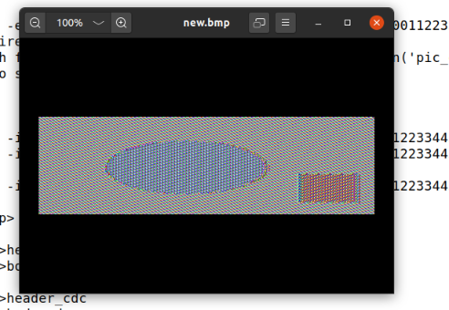
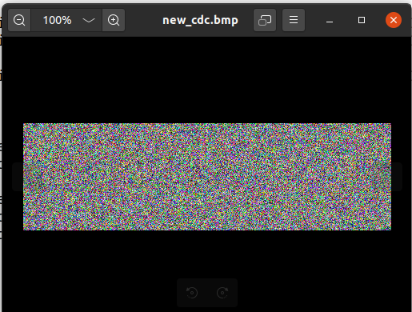
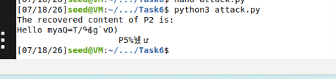
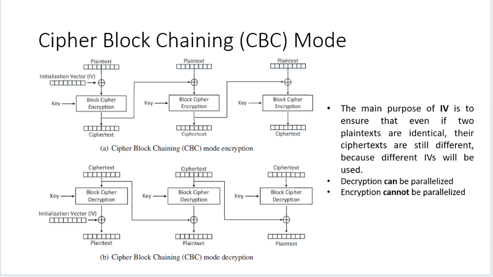

# 2 Lab Environment
cd ~/Desktop
cd Labsetup
$docker-composebuild           #Buildthecontainerimage
$docker-composeup           #Startthecontainer
$docker-composedown        #Shutdownthecontainer
$dockps
$docksh <id>

* Note:If a docker command requires a container ID ,you do not need to type the entire ID string .Typing the first few characters will be sufficient ,as long as they are unique among all the containers.


# 3 Task1:Frequency Analysis

cd ~/Desktop/Labsetup/Files
./freq.py
tr 'vgapnbrtmwsicuxeohqyzflkdj' 'abcdefghijklmnopqrstuvwxyz' < ciphertext.txt > output.txt
cat output.txt

# Task2:  Encryption using Different Ciphers and Modes
cd ..
mkdir Task2
cd Task2
echo "Hello, this is my first encrypted file" > plain.txt
## AES-CBC
openssl enc -aes-128-cbc -e -in plain.txt -out cipher1.bin -K 00112233445566778889aabbccddeeff -iv 0102030405060708
cat cipher1.bin
## Blowfish
openssl enc -bf-cbc -e -in plain.txt -out cipher2.bin -K 00112233445566778889aabbccddeeff -iv 0102030405060708
cat cipher2.bin
## AES-CFB
openssl enc -aes-128-cfb -e -in plain.txt -out cipher3.bin -K 00112233445566778889aabbccddeeff -iv 0102030405060708
cat cipher3.bin


### Decryption
openssl enc -aes-128-cbc -d -in cipher1.bin -out decrypted1.txt -K 00112233445566778889aabbccddeeff -iv 0102030405060708

# Lab Commands - Task 3: Encryption Mode (ECB vs CBC)
seed@VM:~/.../Labsetup$ cd Files
## Mode– ECB
seed@VM:~/.../Files$ openssl enc -aes-128-ecb -e -in pic_original.bmp -out encrypt_ecb.bmp -K 00112233445566778889aabbccddeeff
## Mode– CBC
openssl enc -aes-128-cbc -e -in pic_original.bmp -out encrypt_cbc.bmp -K 00112233445566778889aabbccddeeff -iv 0102030405060708

### 1. Header and Body Extraction (ECB Mode)
```bash
head -c 54 pic_original.bmp > header
tail -c +55 encrypt_ecb.bmp > body
cat header body > new.bmp
```
### 2. Header and Body Extraction (CBC Mode)
```text
head -c 54 pic_original.bmp > header_cbc
tail -c +55 encrypt_cbc.bmp > body_cbc
cat header_cbc body_cbc > new_cbc.bmp
```
### 3. Displaying Results
```bash
eog new.bmp
```

```bash
eog new_cbc.bmp
```


# SEED Labs: Task 3 Encryption Report

This task explores how different encryption modes affect data security. We compare ECB (Electronic Code Book) and CBC (Cipher Block Chaining) by encrypting an image file and analyzing the visual output.

---

## 1. Why do we perform this experiment?
When we encrypt a file, the output becomes binary data that most programs cannot read. However, image files (specifically .bmp) contain a 54-byte "Header" at the beginning of the file that stores information like image dimensions and color depth. If we encrypt this header along with the image data, the computer will not recognize it as an image anymore.

To see the effect of encryption, we perform a "Header Replacement" technique:
1. We keep the original, unencrypted 54-byte Header.
2. We encrypt the rest of the image (the Body).
3. We join the original Header with the encrypted Body.

This allows us to open the encrypted file in a standard image viewer to see how the encryption mode handled the original image patterns.

---

## 2. Encryption Modes Explained

### Electronic Code Book (ECB)
In ECB mode, the encryption algorithm processes each block of data independently. Because the algorithm is deterministic, identical blocks of input data produce identical blocks of encrypted output. In an image, areas with the same color or pattern result in identical encrypted patterns, which allows the original shape of the picture to remain visible after encryption. This is considered insecure for data with repeating patterns.

### Cipher Block Chaining (CBC)
In CBC mode, each block of data is XORed with the previous encrypted block before being encrypted itself. This creates a dependency between blocks. As a result, even if the original image has repeating patterns, the encrypted output will be completely randomized. This effectively hides the structure of the original data, making it a much more secure choice.

---

## 3. Our Observations
By viewing the resulting files:
* **ECB Results:** The image is scrambled but still shows clear outlines and patterns of the original picture. This confirms that ECB does not sufficiently hide data structure.
* **CBC Results:** The image appears as random, incoherent visual noise. This confirms that CBC successfully hides the data patterns and is significantly more secure.

---

## 4. Summary of Methodology
The experiment proves that the choice of encryption mode is as critical as the encryption algorithm itself. While AES is a strong algorithm, using it with the wrong mode (like ECB) can lead to information leakage in structured data such as images. By isolating the file header from the encrypted body, we can visualize these security properties and verify that CBC provides the expected protection against pattern analysis.


# SEED Labs: Task 4 - Padding Analysis & Experimental Steps

This report documents the step-by-step experiment performed to analyze padding in block ciphers, reflecting the actual commands executed in the lab environment.

---

## 1. Experimental Setup
We started by creating a dedicated workspace on the Desktop and generating a test file to be encrypted.

```bash
# Navigate to Desktop and create a folder
cd Desktop
mkdir Task3
cd Task3

# Create a 4-byte test file (using -n to prevent newline characters)
echo -n '1234' > file.txt
```
## 2. Pre-Encryption Verification
Before encrypting, we check the exact size of our input file to establish a baseline for comparison.
```text
# Verify the file size
1234[07/18/26]seed@VM:~/.../Task3$ wc -c file.txt
4 file.txt
```
## 3. Encryption Process
We encrypted the file using the AES-128-CBC algorithm. Note that because our file is smaller than the 16-byte block size, the system automatically applies padding.
```text
# Encrypt the file
openssl enc -aes-128-cbc -e -in file.txt -out cipher1.bin -K 00112233445566778889aabbccddeeff -iv 0102030405060708
```
* Note: If you view the encrypted file content using cat cipher1.bin, you will see unreadable, scrambled binary data, confirming the encryption was successful.
```text
[07/18/26]seed@VM:~/.../Task3$ cat cipher1.bin
�Z�����K�
```
## 4. Decryption & Padding Analysis
To see the padding added by the encryption process, we perform decryption while disabling the automatic removal of padding using the `-nopad` flag.
```text
# Decrypt without removing padding
openssl enc -aes-128-cbc -d -in cipher1.bin -out decrypted1_file.txt -nopad

# Check the size of the decrypted file (should be 16 bytes due to padding)

[07/18/26]seed@VM:~/.../Task3$ wc -c decrypted1_file.txt
16 decrypted1_file.txt

```
| Mode | Input Size (bytes) | Output Size (bytes) | Padding Applied? |
| :--- | :--- | :--- | :--- |
| **ECB** | 4 | 16 | Yes |
| **CBC** | 4 | 16 | Yes |
| **CFB** | 4 | 4 | No |
| **OFB** | 4 | 4 | No |

## 5. Key Findings
* Block Ciphers (ECB/CBC): These modes require data to be a multiple of the block size (16 bytes). Therefore, they apply padding automatically.

* Stream Ciphers (CFB/OFB): These modes encrypt data byte-by-byte, making padding unnecessary, which is why the output size matches the input size exactly.

# Tool Documentation: Analyzing Data with hexdump

In this lab, we use `hexdump -C` to inspect the internal structure of our files. Since padding data often contains non-printable characters, standard text editors cannot display them correctly. This tool serves as our "microscope."

---

# Tool Documentation: Analyzing Data with hexdump and xxd

In this lab, we use `hexdump -C` or `xxd` to inspect the internal structure of our files. Since padding data often contains non-printable characters, standard text editors cannot display them correctly. These tools serve as our "microscopes."

---

## 1. Available Tools
*   **hexdump -C:** A powerful utility that displays file content in a structured hexadecimal format, with a side-by-side ASCII view.
*   **xxd:** A highly popular alternative that performs the same function, converting any file into a readable hexadecimal representation[cite: 1].

## 2. Why do we use them?
*   **Revealing Hidden Data:** Encryption padding is often hidden from normal view. These tools allow us to see specific bytes, which are crucial for our analysis[cite: 1].
*   **Verification:** They provide objective proof that padding was added or removed during the encryption/decryption process[cite: 1].

## 3. How to use them
You can use either command to inspect your decrypted files:

```bash
# Option 1: Using hexdump
hexdump -C decrypted_file.txt

# Option 2: Using xxd
xxd decrypted_file.txt
```
# Task 5: Error Propagation and Cipher Corruption

This task explores how different encryption modes handle corrupted data. We intentionally introduce an error in the ciphertext to observe how it propagates during decryption.

## 1. Experimental Setup
*   **Create a 1000-byte file:** We generated a sample file using the following command:
    ```bash
    head -c 1000 /dev/zero > file.txt
    ```
*   **Encryption:** The file was encrypted using AES-128.
*   **Corruption:** We modified the 55th byte of the ciphertext using `printf` to avoid storage issues:
    ```bash
    printf '\xff' | dd of=output.bin bs=1 seek=54 conv=notrunc
    ```
*   **Decryption:** We decrypted the corrupted file to observe the impact:
    ```bash
    openssl enc -aes-128-cbc -d -in output.bin -out plain.txt -K <key_hex> -iv <iv_hex>
    ```

## 2. Error Propagation Analysis
When one bit/byte of ciphertext is corrupted, different modes react differently:

*   **ECB (Electronic Code Book):** Since it processes blocks independently, corruption only ruins the specific 16-byte block where the error occurred.
*   **CBC (Cipher Block Chaining):** Corruption ruins the current block (making it garbled) and affects the corresponding byte in the next block.
*   **CFB & OFB (Stream-based modes):** These modes treat the block cipher as a stream. Corruption only affects the specific byte where the error occurred, without spreading to subsequent data.

## 3. Comparison Table

| Mode | Corruption Impact |
| :--- | :--- |
| **ECB** | Only the affected 16-byte block is corrupted. |
| **CBC** | Affected block is ruined; corresponding byte in the next block changes. |
| **CFB/OFB** | Only the specific corrupted byte is affected. |

## 4. Verification and Troubleshooting
*   **Comparing Results:** We used `diff` to confirm that the original and decrypted files differ:
    ```bash
    diff file.txt plain.txt
    ```
*   **Notes:** If `diff` returns "Binary files differ," the experiment is successful. If `diff` shows no output, verify that the corruption was saved correctly using `Ctrl+S` (in `bless`) or the `printf` command.
*   **Key Tip:** Always use the capital `-K` flag with `openssl` to ensure the key is interpreted correctly as a hexadecimal string.


# Task 6: Initial Vector (IV) Security and Common Mistakes

This document covers our experiments regarding IV uniqueness and the risks associated with improper IV management.

## 1. Core Concepts
*   **Initialization Vector (IV):** A random value used as a "starting point" for encryption.
*   **Uniqueness Requirement:** A fundamental rule in cryptography is that an IV must never be reused with the same key.
*   **Security Objective:** Unique IVs ensure that the same plaintext encrypted twice results in different ciphertexts, preventing attackers from spotting patterns.

## 2. Experiment 6.1: IV Uniqueness
*   **Goal:** Demonstrate the vulnerability caused by IV reuse.
*   **Procedure:**
    1.  Encrypt the same plaintext file using two different IVs.
```text
openssl enc -aes-128-cbc -e -in file.txt -out c1.bin -K 00112233445566778889aabbccddeeff -iv 0102030405060708
openssl enc -aes-128-cbc -e -in file.txt -out c2.bin -K 00112233445566778889aabbccddeeff -iv 0102030405060709
```

 2.  Encrypt the same plaintext file using the exact same IV for both sessions.

```text
openssl enc -aes-128-cbc -e -in file.txt -out c3.bin -K 00112233445566778889aabbccddeeff -iv 0102030405060708

openssl enc -aes-128-cbc -e -in file.txt -out c4.bin -K 00112233445566778889aabbccddeeff -iv 0102030405060708
```
*   **Expected Result:** You will observe that reusing the IV results in identical ciphertext, proving that the system fails to hide patterns.

## 3. Experiment 6.2: Known-Plaintext Attack
*   **The Attack Model:** An attacker knows a plaintext (P1) and its corresponding ciphertext (C1).
*   **The Vulnerability:** If the same IV is reused, an attacker can use this known pair to decrypt other secret messages (P2) even without the key.
*   **Stream Mode Impact:** In modes like OFB and CFB, reusing an IV allows an attacker to mathematically derive the underlying stream, making the entire encryption scheme insecure.

## 4. Practical Implementation (Commands)
# Create the README file content
readme_content = """# Task 6.2: Known-Plaintext Attack (Practical Guide)

This guide summarizes the steps taken to perform a Known-Plaintext Attack by repeating the Initialization Vector (IV).

## 1. Encryption Preparation (Using OFB Mode)
To demonstrate how re-using an IV in a stream-like cipher mode (OFB) allows for plaintext recovery, we first encrypt two files using the same key and the same IV.

```bash
# Encrypt file1.txt (P1 -> C1)
openssl enc -aes-128-ofb -e -in file1.txt -out cipher1.bin -k 00112233445566778889aabbccddeeff -iv 0102030405060708

# Encrypt file2.txt (P2 -> C2) using the SAME IV
openssl enc -aes-128-ofb -e -in file2.txt -out cipher2.bin -k 00112233445566778889aabbccddeeff -iv 0102030405060708
```
## 2. Attack Script (attack.py)
We use a Python script to extract the keystream using the known plaintext (P1) and its corresponding ciphertext (C1), then use that keystream to recover P2 from C2.

Create the file:
`nano attack.py`

Paste the following code:
```text
#!/usr/bin/python3

def xor(first, second):
    return bytearray(x^y for x, y in zip(first, second))

# Read the files
p1 = open('file1.txt','rb').read()
c1 = open('cipher1.bin','rb').read()
c2 = open('cipher2.bin','rb').read()

# Extract Keystream: Keystream = C1 ^ P1
keystream = xor(c1, p1)

# Recover P2: P2 = C2 ^ Keystream
p2 = xor(c2, keystream)

print("The recovered content of P2 is:")
print(p2.decode('utf-8', errors='ignore'))
```

## 3. Execution
Run the attack:
```text
python3 attack.py
```


## 4. Key Takeaways for Lab Discussion
* Why OFB? We used OFB mode because it functions as a Stream Cipher. It clearly demonstrates that the IV is meant to ensure uniqueness; re-using it compromises the Keystream.

* The Vulnerability: The security of stream ciphers relies on the keystream never being repeated. If the IV and Key are the same, the keystream is the same, making the ciphertext vulnerable to simple XOR attacks.

* CBC vs. OFB: While we previously tested CBC to see how IVs change ciphertext, OFB was chosen here because it makes the mathematical vulnerability (Keystream re-use) much more apparent and easier to demonstrate.

# Task 6.3: Common Mistake - Use a Predictable IV

This guide explains how a predictable Initialization Vector (IV) can compromise the security of the Cipher Block Chaining (CBC) mode.

## 1. The Concept
In CBC mode, the first block of plaintext is XORed with the IV before encryption[cite: 1]. The mathematical formula for the first ciphertext block ($C_1$) is:
$$C_1 = E_K(P_1 \oplus IV)$$[cite: 1]

For a system to be secure, IVs must be **random and unpredictable**[cite: 1]. If an IV is predictable, an attacker can perform a **Chosen-Plaintext Attack** to guess the contents of a secret message[cite: 1].

## 2. The Attack Strategy (The Matching Game)
If we know the IV used for Bob's secret message ($IV_{Bob}$) and we can predict the next IV ($IV_{Next}$), we can test our guesses for Bob's secret message ($P_{Bob}$)[cite: 1].

### The Mathematical Trick
To make our ciphertext ($C_{Mine}$) match Bob's secret ciphertext ($C_{Bob}$), we must satisfy this condition[cite: 1]:
$$(P_{Mine} \oplus IV_{Next}) = (P_{Bob} \oplus IV_{Bob})$$[cite: 1]

By rearranging the equation, we can calculate the exact plaintext ($P_{Mine}$) to send to the server:
$$P_{Mine} = P_{Bob} \oplus IV_{Bob} \oplus IV_{Next}$$[cite: 1]

## 3. Execution Steps
1.  **Observe:** Get the secret ciphertext ($C_{Bob}$) and the IV used ($IV_{Bob}$) from the oracle[cite: 1].
2.  **Predict:** Get the next IV ($IV_{Next}$) provided by the oracle[cite: 1].
3.  **Guess & Calculate:** 
    *   Assume $P_{Bob}$ is "Yes".
    *   Calculate $P_{Mine} = "Yes" \oplus IV_{Bob} \oplus IV_{Next}$[cite: 1].
4.  **Test:** Send $P_{Mine}$ (as a hex string) to the oracle[cite: 1].
5.  **Verify:** 
    *   If the resulting $C_{Mine}$ matches $C_{Bob}$, your guess "Yes" is correct[cite: 1].
    *   If they do not match, the secret message is "No"[cite: 1].

## 4. Key Takeaways
*   **Why it works:** The attack works because CBC mode relies on the IV to randomize the first block[cite: 1]. If the IV is predictable, the randomization is broken[cite: 1].
*   **Common Mistake:** The main error is treating the IV as a simple constant rather than a randomly generated value for every encryption session[cite: 1].
*   **Important:** Always ensure your input to the oracle is in hex format, as the encryption oracle processes data as hex strings[cite: 1].


