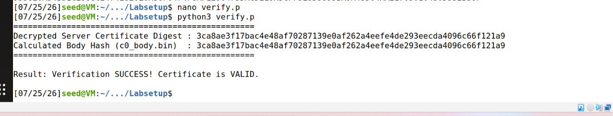

# RSA Public-Key Encryption and Signature Lab Guide

This guide covers the full line-by-line translation, conceptual breakdown, mathematical foundations, and quiz preparation material for the **SEED RSA Public-Key Encryption and Signature Lab**.

---

## 1. Line-by-Line Translation & Document Breakdown

### **Title & Header Info**
* **Title:** RSA Public-Key Encryption and Signature Lab
* **Copyright Box:** 
  > Copyright © 2018 by Wenliang Du.
  > This work is licensed under a Creative Commons Attribution-NonCommercial-ShareAlike 4.0 International License. If you remix, transform, or build upon the material, this copyright notice must be left intact...

---

### **Section 1: Overview**

* **Text:** *RSA (Rivest–Shamir–Adleman) is one of the first public-key cryptosystems and is widely used for secure communication.*
  * **Meaning:** RSA is a foundational asymmetric cryptographic system used globally to establish secure channel communications.

* **Text:** *The RSA algorithm first generates two large random prime numbers, and then use them to generate public and private key pairs, which can be used to do encryption, decryption, digital signature generation, and digital signature verification.*
  * **Meaning:** The entire security model relies on generating two distinct, extremely large prime numbers ($p$ and $q$) to form a key pair:
    1. **Public Key:** Used for encryption & signature verification.
    2. **Private Key:** Used for decryption & signature generation.

* **Text:** *The RSA algorithm is built upon number theories, and it can be quite easily implemented with the support of libraries.*
  * **Meaning:** The math relies on modular arithmetic and number theory, which can be efficiently implemented programmatically using specialized cryptographic libraries.

* **Text:** *The learning objective of this lab is for students to gain hands-on experiences on the RSA algorithm... Essentially, students will be implementing the RSA algorithm using the C program language.*
  * **Meaning:** Rather than just learning formulas in lectures, students must programmatically execute each step of RSA using real numbers in the **C programming language**.

* **Covered Security Topics:**
  1. Public-key cryptography
  2. The RSA algorithm and key generation
  3. Big number calculation
  4. Encryption and Decryption using RSA
  5. Digital signature
  6. X.509 certificate

* **Readings, Videos, & Lab Environment:**
  * **Readings:** Covered in SEED books and Udemy lecture series.
  * **Environment:** Tested on **SEED Ubuntu 20.04 VM** (run locally via VirtualBox or deployed on the cloud).
  * **Acknowledgment:** Developed with the help of Shatadiya Saha (Syracuse University).

---

### **Section 2: Background**

* **Text:** *The RSA algorithm involves computations on large numbers. These computations cannot be directly conducted using simple arithmetic operators in programs, because those operators can only operate on primitive data types, such as 32-bit integer and 64-bit long integer types. The numbers involved in the RSA algorithms are typically more than 512 bits long...*
  * **Meaning (The Core Problem):** Standard data types in C (`int`, `unsigned long`) max out at 32 or 64 bits. RSA keys in practice are 512, 1024, 2048, or 4096 bits long. Operating directly with standard C operators like `a * b` or `a ^ b` will immediately cause **integer overflow**.

* **Text (Page 2):** *...need to use `a * b` in our program. However, if they are big numbers, we cannot do that any more; instead, we need to use an algorithm (i.e., a function) to compute their products.*
  * **Meaning:** We must replace standard arithmetic expressions with specialized library functions.

* **Text:** *There are several libraries that can perform arithmetic operations on integers of arbitrary size. In this lab, we will use the Big Number library provided by `openssl`...*
  * **Meaning (The Solution):** We use the **OpenSSL BIGNUM** library (`<openssl/bn.h>`). Numbers are represented as `BIGNUM` structures, and operations (addition, multiplication, modular exponentiation, inverse) are executed using OpenSSL APIs.

---

## 2. Core Lab Concept & Purpose

1. **The Technical Problem:** Standard C types cannot hold numbers > 64 bits.
2. **The Solution:** Use OpenSSL's `BIGNUM` structure and its API functions to handle arbitrary-precision arithmetic.
3. **Practical Goal:** Implement RSA operations step-by-step from scratch in C without relying on high-level wrapper functions:
   * Key Generation
   * Message Encryption
   * Message Decryption
   * Digital Signature Creation
   * Signature Verification

---

## 3. Mathematical Foundations of RSA

| Operation | Mathematical Formula | Key Used |
| :--- | :--- | :--- |
| **Modulus** | $n = p \times q$ | Both $p, q$ are large primes |
| **Totient Function** | $\phi(n) = (p - 1)(q - 1)$ | Used for key calculation |
| **Private Key ($d$)** | $d \cdot e \equiv 1 \pmod{\phi(n)}$ | Calculated as $d = e^{-1} \pmod{\phi(n)}$ |
| **Encryption** | $C = M^e \pmod n$ | Recipient's Public Key $(e, n)$ |
| **Decryption** | $M = C^d \pmod n$ | Recipient's Private Key $(d, n)$ |
| **Signature Generation** | $S = M^d \pmod n$ | Sender's Private Key $(d, n)$ |
| **Signature Verification** | $M' = S^e \pmod n$ | Sender's Public Key $(e, n)$ |

---

## 4. Key OpenSSL BIGNUM APIs (Must-Know for C Code)

To write or read C code for this lab, you need to know these OpenSSL BIGNUM functions:

```c
#include <openssl/bn.h>

// 1. Initialization and Allocation
BIGNUM *a = BN_new();
BN_CTX *ctx = BN_CTX_new(); // Context for temporary variables in operations

// 2. Assigning values from Hex strings
BN_hex2bn(&a, "2A3F"); 

// 3. Multiplication: r = a * b
BN_mul(r, a, b, ctx);

// 4. Modular Exponentiation: r = (a ^ b) mod m (Used for Encryption/Decryption/Signatures)
BN_mod_exp(r, a, b, m, ctx);

// 5. Modular Inverse: r = (a ^ -1) mod m (Used to find Private Key d)
BN_mod_inverse(r, a, m, ctx);

// 6. Print BIGNUM in Hex format
BN_print_fp(stdout, a);
```

---

## 5. Frequently Asked Questions (Quiz Prep & Lab Exam)

### **Q1: Why can't we use standard primitive data types like `int` or `long` for RSA calculations in C?**
> **Answer:** Standard C data types are limited to 32 bits or 64 bits. RSA numbers are typically 512, 1024, or 2048 bits long. Attempting to use primitive data types and arithmetic operators (e.g., `*`, `%`) would cause an integer overflow and incorrect calculations.

---

### **Q2: Which library is used in this lab to handle large numbers, and what data structure represents them?**
> **Answer:** The **OpenSSL** library is used, specifically the **BIGNUM** (`BIGNUM`) data structure/API.

---

### **Q3: What keys are used for Encryption vs. Digital Signatures in RSA?**
> **Answer:**
> * **Encryption:** Message is encrypted using the **recipient's public key** ($e, n$) and decrypted using the **recipient's private key** ($d, n$).
> * **Digital Signature:** Signature is created using the **sender's private key** ($d, n$) and verified using the **sender's public key** ($e, n$).

---

### **Q4: How do you calculate the private key $d$ given primes $p$, $q$, and public exponent $e$?**
> **Answer:**
> 1. Calculate $n = p \times q$.
> 2. Calculate $\phi(n) = (p - 1) \times (q - 1)$.
> 3. Calculate $d$ as the modular multiplicative inverse of $e$ modulo $\phi(n)$:  
>    $$d = e^{-1} \pmod{\phi(n)}$$
> 4. In OpenSSL C code, this is computed using `BN_mod_inverse(d, e, phi, ctx)`.

---

### **Q5: What OpenSSL function performs modular exponentiation ($M^e \pmod n$)?**
> **Answer:** `BN_mod_exp(res, M, e, n, ctx)`.

---

### **Q6: Why is `BN_CTX` needed in OpenSSL operations?**
> **Answer:** `BN_CTX` (BIGNUM Context) holds temporary `BIGNUM` variables used internally by library functions (like multiplication and exponentiation) to avoid frequent memory allocation and deallocation overhead.

```text
# =========================================================
# SEED Lab: RSA Public-Key Cryptography
# Unified Script for Tasks 1, 2, 3, 4, and 5
# =========================================================

# 1. Open nano editor
cd ~/Desktop/Labsetup
nano bn_sample.c

# 2. Replace everything in main() with this complete code:
/*
int main ()
{
    BN_CTX *ctx = BN_CTX_new();

    // Declaration of BIGNUM variables
    BIGNUM *p   = BN_new();
    BIGNUM *q   = BN_new();
    BIGNUM *e   = BN_new();
    BIGNUM *n   = BN_new();
    BIGNUM *d   = BN_new();
    BIGNUM *M   = BN_new();
    BIGNUM *C   = BN_new();
    BIGNUM *S   = BN_new();
    BIGNUM *M2  = BN_new();
    BIGNUM *S2  = BN_new();
    BIGNUM *M_prime = BN_new();
    BIGNUM *phi = BN_new();
    BIGNUM *one = BN_new();
    BIGNUM *p_minus_1 = BN_new();
    BIGNUM *q_minus_1 = BN_new();

    BN_dec2bn(&one, "1");

    // =====================================================
    // TASK 1: Deriving the Private Key
    // =====================================================
    BN_hex2bn(&p, "F7E75FDC469067FFDC4E847C51F452DF");
    BN_hex2bn(&q, "E85CED54AF57E53E092113E62F436F4F");
    BN_hex2bn(&e, "0D88C3");

    BN_sub(p_minus_1, p, one);
    BN_sub(q_minus_1, q, one);
    BN_mul(phi, p_minus_1, q_minus_1, ctx);
    BN_mod_inverse(d, e, phi, ctx);

    printBN("--- Task 1 --- Derived Private Key d = ", d);

    // =====================================================
    // TASK 2: Encrypting a Message
    // =====================================================
    BN_hex2bn(&n, "DCBFFE3E51F62E09CE7032E2677A78946A849DC4CDDE3A4D0CB81629242FB1A5");
    BN_hex2bn(&e, "010001");
    BN_hex2bn(&M, "4120746f702073656372657421"); // "A top secret!"

    BN_mod_exp(C, M, e, n, ctx);
    printBN("--- Task 2 --- Encrypted Ciphertext C = ", C);

    // =====================================================
    // TASK 3: Decrypting a Message
    // =====================================================
    BN_hex2bn(&d, "74D806F9F3A62BAE331FFE3F0A68AFE35B3D2E4794148AACBC26AA381CD7D30D");
    BN_hex2bn(&C, "8C0F971DF2F3672B28811407E2DABBE1DA0FEBBBDFC7DCB67396567EA1E2493F");

    BN_mod_exp(M, C, d, n, ctx);
    printBN("--- Task 3 --- Decrypted Message M (Hex) = ", M);

    // =====================================================
    // TASK 4: Signing a Message (S = M^d mod n)
    // Keys from Task 2 (n and d are already set above)
    // =====================================================
    // 1. Sign original message "I owe you $2000."
    BN_hex2bn(&M, "49206f776520796f752024323030302e"); 
    BN_mod_exp(S, M, d, n, ctx);
    printBN("--- Task 4 --- Original Signature S1 = ", S);

    // 2. Sign modified message "I owe you $3000."
    BN_hex2bn(&M2, "49206f776520796f752024333030302e"); 
    BN_mod_exp(S2, M2, d, n, ctx);
    printBN("--- Task 4 --- Modified Message Signature S2 = ", S2);

    // =====================================================
    // TASK 5: Verifying a Signature (M' = S^e mod n)
    // =====================================================
    // Keys & Data from Task 5
    BN_hex2bn(&n, "AE1CD4DC432798D933779FBD46C6E1247F0CF1233595113AA51B450F18116115");
    BN_hex2bn(&e, "010001");
    
    // 1. Valid Signature
    BN_hex2bn(&S, "643D6F34902D9C7EC90CB0B2BCA36C47FA37165C0005CAB026C0542CBDB6802F");
    BN_mod_exp(M_prime, S, e, n, ctx);
    printBN("--- Task 5 --- Valid Signature Decrypted M' (Hex) = ", M_prime);

    // 2. Corrupted Signature (2F changed to 3F at the end)
    BN_hex2bn(&S2, "643D6F34902D9C7EC90CB0B2BCA36C47FA37165C0005CAB026C0542CBDB6803F");
    BN_mod_exp(M_prime, S2, e, n, ctx);
    printBN("--- Task 5 --- Corrupted Signature Result M' (Hex) = ", M_prime);

    return 0;
}
*/

# 3. Save (Ctrl+O -> Enter) and Exit (Ctrl+X)

# 4. Compile and Execute
make
./bn_sample
```

```text
# Task 6: Manually Verifying an X.509 Certificate

## Step 1: Download and Extract Server & CA Certificates

### 🎯 Objective
Fetch the certificate chain from a live web server using OpenSSL and separate the server certificate from its issuer's (CA) certificate for manual RSA verification.

---

### 📥 Commands & Execution Steps

# 1. Fetch the certificate chain from the web server
openssl s_client -connect www.example.org:443 -showcerts

# 2. Create c0.pem (Server Certificate)
# Copy the FIRST certificate block (from -----BEGIN CERTIFICATE----- to -----END CERTIFICATE-----)
nano c0.pem

# 3. Create c1.pem (Issuer/CA Certificate)
# Copy the SECOND certificate block (from -----BEGIN CERTIFICATE----- to -----END CERTIFICATE-----)
nano c1.pem

# 4. Verify that both files were created successfully with valid sizes
ls -l c0.pem c1.pem

---

### 📝 Summary Explanation
* c0.pem: The target server's certificate containing its public key and the CA's signature.
* c1.pem: The intermediate CA's certificate containing the public key needed to verify c0.pem.
```

```text
# Step 2: Extract the Public Key (e, n) from the Issuer's Certificate (c1.pem)

### 🎯 Objective
Extract the public key components—Modulus (n) and Public Exponent (e)—from the issuer's certificate (`c1.pem`) to verify the signature in Step 5.

---

### 📥 Commands & Execution
openssl s_client -connect rsa2048.badssl.com:443 -showcerts </dev/null 2>/dev/null | awk '/BEGIN CERTIFICATE/,/END CERTIFICATE/{ if (match($0, /BEGIN CERTIFICATE/)) c++; print > ("c" (c-1) ".pem") }'
# 1. Extract the Modulus (n):
openssl x509 -in c1.pem -noout -modulus
# 2. Extract the Public Exponent (e):
 openssl x509 -in c1.pem -text -noout | grep -i exponent
---

### 📝 Summary Explanation
* Modulus (n): Printed as a hex string prefixed with `Modulus=`. Copy the value without `Modulus=`.
* Exponent (e): Usually shown as `65537 (0x10001)`. The hex value used in our C script will be `010001`.
```


 ## Step 3: Extract the Signature from the Service Certificate

In this step, we extract the digital signature from the service certificate (`c0.pem`) and clean up its formatting so that it contains only the raw hexadecimal string for further analysis or verification.

---
```text
###  Commands Executed

#### 1. Extracting and Formatting the Signature
We used `openssl x509` combined with `tr` in a single command pipeline:


openssl x509 -in c0.pem -certopt no_header,no_version,no_serial,no_signame,no_validity,no_subject,no_issuer,no_pubkey,no_extensions -text -noout | tr -d '[:space:]:' > signature_clean.txt

cat signature_clean.txt

```


## Step 4: Extract the Body of the Server's Certificate

In this step, we parse the X.509 certificate structure using ASN.1 format, isolate the certificate body (`tbsCertificate`), and generate its SHA-256 hash value.

---

### 💡 Objective & Theory

A Certificate Authority (CA) signs a certificate by calculating a cryptographic hash of the certificate's body and encrypting it with their private key. To verify the signature, we must calculate the hash of the certificate body **excluding the signature block itself**.

Using `openssl asn1parse`, we analyze the structure of `c0.pem`:
* **Offset 4:** Start of the certificate body (`SEQUENCE`, length = 998 bytes).
* **Offset 1006:** End of the body and start of the signature block.

---

### 🛠️ Commands Executed

#### 1. Inspecting Certificate ASN.1 Structure
```text
openssl asn1parse -i -in c0.pem
```
#### 2. Extracting Certificate Body
Extracting the SEQUENCE at Offset 4 into a binary file named c0_body.bin:
```text
openssl asn1parse -i -in c0.pem -strparse 4 -out c0_body.bin -noout
```
#### 3. Calculating the SHA-256 Hash
Calculating the SHA-256 hash of the extracted body:
```text
sha256sum c0_body.bin
```


## 📝 Task 5: Manual Signature Verification 

### ⚙️ Steps Executed1. Extract Public Key Modulus ($n$)We extracted the modulus ($n$) from the Certificate Authority certificate (c1.pem) using OpenSSL:
```text
openssl x509 -in c1.pem -noout -modulus
```
### 2. Create the Python Verification Script (verify.p)We wrote a simple Python script to perform the RSA decryption mathematically ($\text{Digest} = \text{Signature}^e \bmod n$) and compare it with the SHA-256 hash of c0_body.bin.Script Code (verify.p):
```text
import subprocess
import hashlib

# Step 1: Extract the Modulus (n) automatically from c1.pem
cmd = "openssl x509 -in c1.pem -noout -modulus"
modulus_out = subprocess.check_output(cmd, shell=True).decode().strip()
n_hex = modulus_out.replace("Modulus=", "")
n = int(n_hex, 16)

# Step 2: Set the standard public exponent (e)
e = 0x010001

# Step 3: Read and parse the cleaned signature from signature_clean.txt
with open("signature_clean.txt", "r") as f:
    sig_data = f.read().strip()
    sig_hex = sig_data.replace("SignatureAlgorithmsha256WithRSAEncryption", "")
    sig = int(sig_hex, 16)

# Step 4: Manually decrypt the signature using RSA (Signature^e mod n)
decrypted = pow(sig, e, n)
decrypted_hex = hex(decrypted)[2:]
server_digest = decrypted_hex[-64:]

# Step 5: Compute the SHA-256 hash of c0_body.bin
with open("c0_body.bin", "rb") as f:
    body_hash = hashlib.sha256(f.read()).hexdigest()

# Step 6: Print and compare the results
print("==================================================")
print("Decrypted Server Certificate Digest :", server_digest)
print("Calculated Body Hash (c0_body.bin)  :", body_hash)
print("==================================================")

if server_digest == body_hash:
    print("\nResult: Verification SUCCESS! Certificate is VALID.\n")
else:
    print("\nResult: Verification FAILED! Hashes do not match.\n")
```



 


