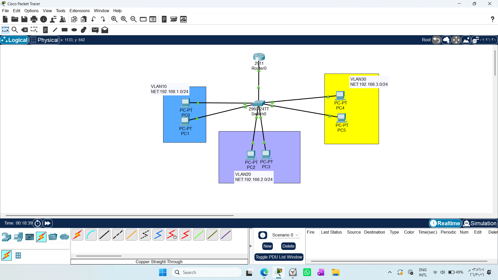
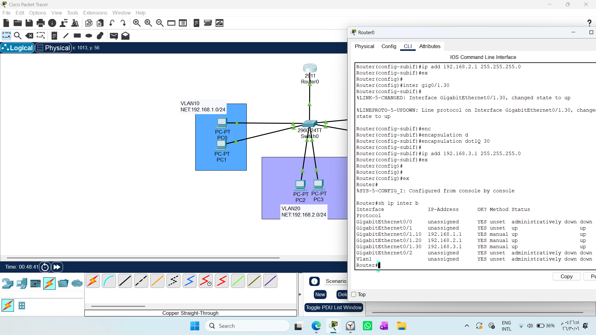
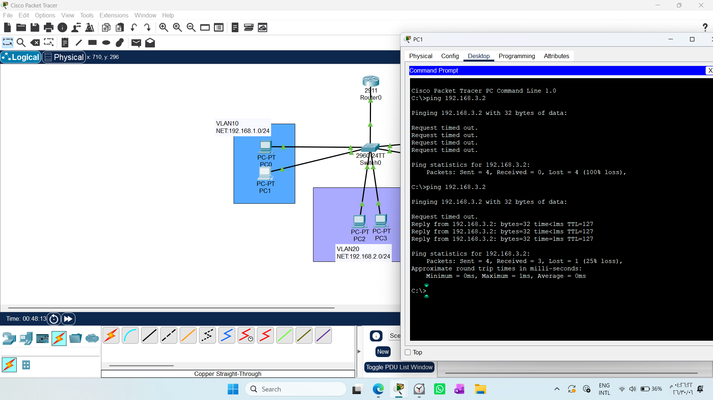

# CONFIGURING INTER-VLAN ROUTING- ROUTER-ON-A-STICK

1. Draw necessary topology, decorate and comment
2. Configure VLANs and assign VIDs to the switchports as per the respective VLAN.
3. Configure trunk on the link connecting the router.
4. Configure IP addresses to the PC as per the subnet- configure default gateway in advance, use first IP
5. Try to ping hosts in different VLANs --- this should not work.
6. Configure subinterfaces on the router, bind each subinterface to its VLAN, and assign IP address of the subnet
7. Ensure the IP address of each subinterface is the default gateway of each VLAN subnet.
8. Try to ping hosts in different VLANs --- this should work.

# 1. Overview
The Router-on-a-Stick (RoaS) configuration is an efficient method used in networking to route traffic between different VLANs using a single physical interface on a router connected to a trunk link on a switch.

### Network Topology
Below is the logical topology for our implementation:


# 2. The "Why": Engineering Logic
Before configuring, it is vital to understand the "Why" behind this architecture:

Problem: VLANs are Layer 2 broadcast domains that isolate traffic. By design, they cannot communicate with each other. Traditional routing would require one physical cable per VLAN from the switch to the router, which is expensive and unscalable.

Solution: RoaS allows us to "divide" a single physical router port into multiple logical sub-interfaces. Each sub-interface acts as a default gateway for a specific VLAN.

Mechanism: The switch uses an 802.1Q trunk link to carry traffic from multiple VLANs over a single cable, tagging each frame so the router knows which sub-interface should process it.

# 3. Configuration Steps
## A. Switch Configuration
* Define VLANs: Create the broadcast domains on the switch.
```text
* Define VLANs: Create the broadcast domains on the switch.

Switch(config)# vlan 10
Switch(config-vlan)# vlan 20
Switch(config-vlan)# vlan 30
Switch(config-vlan)# exit
* Assign Access Ports: Map specific physical switch ports to their respective VLANs.

Switch(config)# interface range fa0/2-3
Switch(config-if)# switchport mode access
Switch(config-if)# switchport access vlan 10

Switch(config)# interface range fa0/4-5
Switch(config-if)# switchport mode access
Switch(config-if)# switchport access vlan 20

Switch(config)# interface range fa0/6-7
Switch(config-if)# switchport mode access
Switch(config-if)# switchport access vlan 30

* Configure Trunk: Set the port connected to the router to switchport mode trunk. This allows the switch to pass traffic for all VLANs.
Switch(config)# interface f0/1
Switch(config-if)# switchport mode trunk
```
## B. Router Configuration (Sub-interfaces)
Instead of assigning an IP to the physical port, we create logical sub-interfaces:
* Encapsulation: We use encapsulation dot1Q [VLAN_ID] to bind the sub-interface to its specific VLAN.

* Gateway: We assign an IP address to each sub-interface. This IP acts as the Default Gateway for the hosts in that specific VLAN.
```text
Router(config)# interface g0/1  
Router(config-if)# no shutdown  

Router(config)# interface g0/1.10
Router(config-subif)# encapsulation dot1Q 10
Router(config-subif)# ip address 192.168.1.1 255.255.255.0

Router(config)# interface g0/1.20
Router(config-subif)# encapsulation dot1Q 20
Router(config-subif)# ip address 192.168.2.1 255.255.255.0

Router(config)# interface g0/1.30
Router(config-subif)# encapsulation dot1Q 30
Router(config-subif)# ip address 192.168.3.1 255.255.255.0
```
### Verification:
Using the command `show ip interface brief` (as shown in the configuration screenshot), we confirm that all sub-interfaces are operational ("up/up") and assigned the correct IP addresses for their respective VLAN gateways.


# 4. Key Engineering Insights (User Observations)
During our discussion, you raised critical questions that define a true engineering mindset. Here are the answers we reached:

## Q: Does the switch need a Default Gateway to know how to send packets to the router?

A: No. This is a common misconception.

Data Traffic: The switch operates at Layer 2. It switches frames based on MAC addresses. When a PC sends data to the router, it encapsulates the frame with the Router's MAC address. The switch simply forwards this frame to the trunk port. It does not need to understand IP routing.

Management Exception: The only time a switch needs a default-gateway is if you want to manage (SSH/Telnet) the switch itself from a different network.

## Q: Why does Ping fail before configuring the Router?

A: Because Layer 2 switches and VLANs are designed to isolate networks. Without the router (acting at Layer 3), there is no path (Gateway) for the packet to cross from one subnet to another. The switch drops the traffic because it cannot "route" between subnets.

# Note :
Always remember: A router is a professional at "routing" (choosing paths), while a switch is a professional at "switching" (delivering frames). 
By combining them with a Trunk, you create a powerful, flexible, and efficient network backbone.

# 5.Troubleshooting
One of the most important aspects of networking is testing and verifying connectivity. The image perfectly illustrates a common scenario during lab validation:


### Analysis of Connectivity Testing 
* Request Timed Out (Initial State): In the first attempt shown in image, the ping failed completely (100% loss). This is expected if the router sub-interfaces or trunking are not fully established or active, as the packets have no Layer 3 path to traverse between different VLANs.

* Partial Success (Subsequent State): In the second attempt in image, we see a 25% loss (1 lost, 3 received). In Packet Tracer, this often happens during the first ping because of the ARP process. The devices need time to resolve the MAC addresses of the default gateway, which results in the first packet being dropped before subsequent packets successfully reach the destination.


