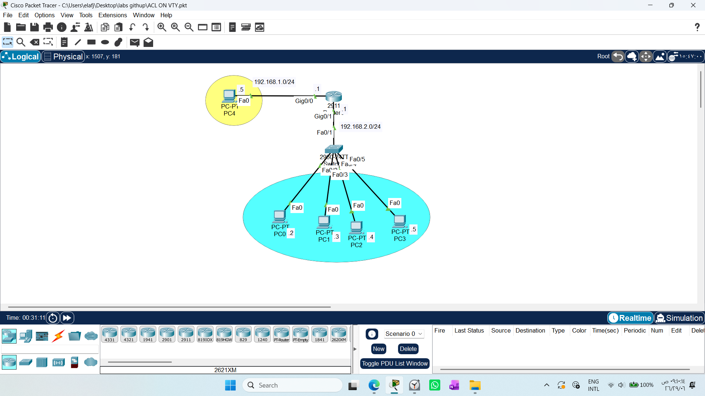

# Securing VTY Lines with Standard Access Control Lists (ACL)

1. Draw necessary topology, decorate and comment
2. Configure IP Addresses to all the PC + Router interfaces -- test communication.
3. Configure any management VLAN and assign it IP address in the subnet.
4. Configure the router as the default gateway of the switch.
5. Configure enable password on the switch, plus domain name, username and password.
6. Generate crypto rsa keys using 1024 modulus length.
7. Configure line VTY to use local database and to allow only SSH.
8. Enable SSH version 2.
9. Try to SSH from any PC ----- this will work in every PC.
10. Configure ACL to permit only SysAdmin-PC to access VTY interface.
11. Try to SSH from any PC ----- only SysAdmin should work.
---------------------------------------------------------------------------------------------------------------------------------------------------------------

## 1. Executive Summary & Architectural Philosophy

In network engineering, protecting the data plane (user traffic) is only half the battle. The most critical asset to secure is the **Management Plane**—the administrative brains of routers and switches. 

### The Evolution of Remote Management Security
1. **The Legacy Vulnerability (Telnet):** Historically, administrators managed devices remotely using Telnet. However, Telnet transmits all data, including credentials, in **plaintext**. Anyone running a packet analyzer (like Wireshark) on the path could capture passwords instantly.
2. **The Cryptographic Solution (SSH):** To remediate plaintext exposure, **Secure Shell (SSH)** was introduced, encrypting the entire management session session-wide.
3. **The Modern Perimeter Threat:** Even with SSH enabled, any active host inside the routing domain can reach the switch's IP and initiate brute-force or credential-stuffing attacks.
4. **The Ultimate Defense (VTY ACL):** By binding a Layer 3 **Access Control List (ACL)** directly to the logical **Virtual Terminal (VTY)** lines, we establish a hardware-level perimeter guard. The switch checks the incoming packet's source IP at the door. If it doesn't match the explicitly permitted Management Station IP, the connection is instantly severed before a login prompt is ever generated.

---

## 2. Lab Topology Diagram

The enterprise architecture below illustrates an isolated management topology where a Layer 3 Router connects two subnets: the core server/admin space (`192.168.1.0/24`) and the general deployment switch block (`192.168.2.0/24`).



---

## 3. Step-by-Step Configuration Framework

### Step 1: Physical Topology Setup
The devices are cabled and labeled according to the architectural layout, segregating the high-value administrative terminal from general network endpoints.

### Step 2: Layer 3 Interface & IP Addressing
Configure the Layer 3 endpoints on the Router and general hosts to establish cross-subnet IP communications.

### Step 3: Management VLAN Assignment
To give the Switch an identity on the network so it can be managed remotely, we configure a logical Switched Virtual Interface (SVI) under an administrative VLAN.
```text
sw1(config)# interface vlan 1
sw1(config-if)# ip address 192.168.2.6 255.255.255.0
sw1(config-if)# no shutdown
```
### Step 4: Default Gateway Configuration

Since the Switch needs to respond to management traffic coming from a different subnet (where the SysAdmin-PC lives), it must know how to route packets out of its local network.
```text
sw1(config)# ip default-gateway 192.168.2.1
```
### Step 5: Device Identity & Local Database Priming
Cisco IOS requires a valid domain name and local user database registry before generating cryptographic keys.
```text
sw1(config)# enable password cisco
sw1(config)# ip domain-name elaf.local
sw1(config)# username elaf password cisco
```
### Step 6: Cryptographic RSA Key Generation
```text
sw1(config)# crypto key generate rsa
! When prompted for modulus length, enter: 1024
```
### Step 7 & 8: VTY Line Lockdown & SSH Version 2 Enforcement
```text
sw1(config)# ip ssh version 2
sw1(config)# line vty 0 15
sw1(config-line)# login local
sw1(config-line)# transport input ssh
```
login local: Instructs the switch to authenticate incoming requests against the locally configured username database (elaf).

transport input ssh: Completely shuts down the Telnet engine daemon on these lines, allowing only incoming SSH traffic.

### Step 9:Initial Verification (The Unsecured State)
Before implementing the ACL perimeter, establishing an SSH session from any arbitrary computer in the network (e.g., PC1) succeeds and prompts for credentials:
```text
PC1> ssh -l elaf 192.168.2.6
```
This demonstrates the security gap: while the traffic is encrypted, the gateway is exposed to unauthorized terminal access requests from all nodes.

### Step 10:Restricting VTY Access via ACL
To mitigate exposure, a Standard Access Control List is engineered to act as a selective firewall specifically for incoming administrative terminal requests.

** Designing the Access List
Create a standard access-list (Group ID: 10) that explicitly permits only the designated SysAdmin station host (192.168.1.5).
```text
sw1(config)# access-list 10 permit host 192.168.1.5
```
⚠️ Core Engineering Note (Implicit Deny): Cisco ACLs end with an invisible, automatic deny any statement.
Since only the SysAdmin host is explicitly permitted, all other source IPs in the universe are dropped by default.

```text
sw1(config)# line vty 0 15
sw1(config-line)# access-class 10 in
```
access-class 10 in: The specific keyword command used to link an ACL to virtual lines (unlike ip access-group used on physical interfaces), monitoring all inbound (in) administrative traffic.

### step 11:Empirical Penetration Testing & Results
Test 1: Unauthorized Endpoint Attempt (PC1)
When an unauthorized client machine (PC1 with IP 192.168.2.2) attempts to execute an SSH request to the switch SVI, the connection drops instantly.

```text
C:\> ssh -l elaf 192.168.2.6
% Connection refused by remote host
```
The switch evaluates the packet source IP against Access List 10, triggers the implicit deny rule, and drops the connection frame at the boundary before even presenting a login prompt.

Test 2: Authorized SysAdmin Connection (PC4)
When the verified SysAdmin-PC (PC4 with IP 192.168.1.5) initiates the exact same command across the router, the switch matches the permit host criteria and allows the traffic through

```text
C:\> ssh -l elaf 192.168.2.6
Password:
```
The session successfully opens, proving that management access is tightly locked down to authorized administrative infrastructure terminals.


