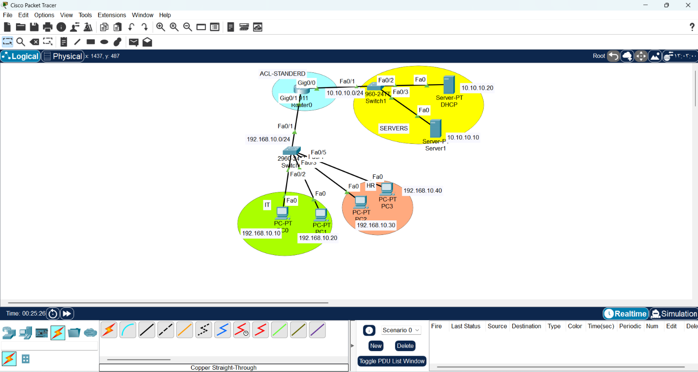
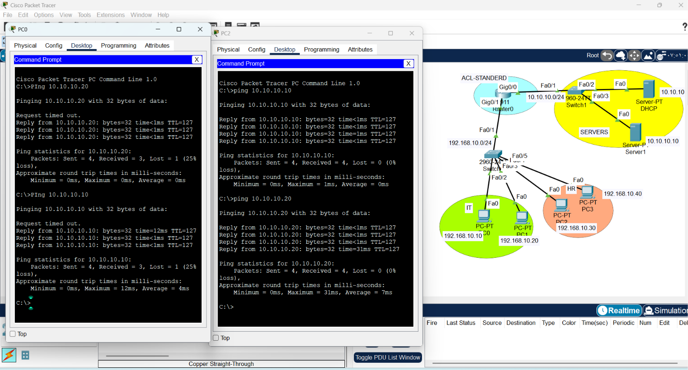
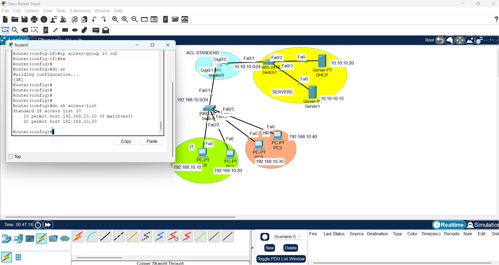
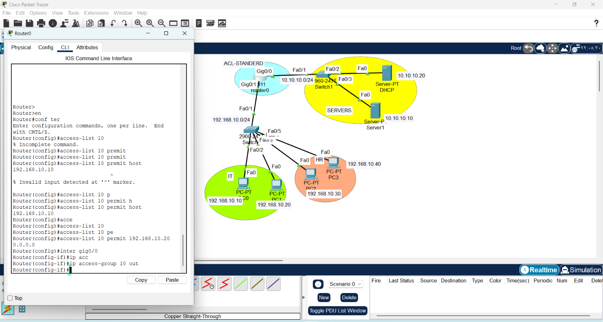
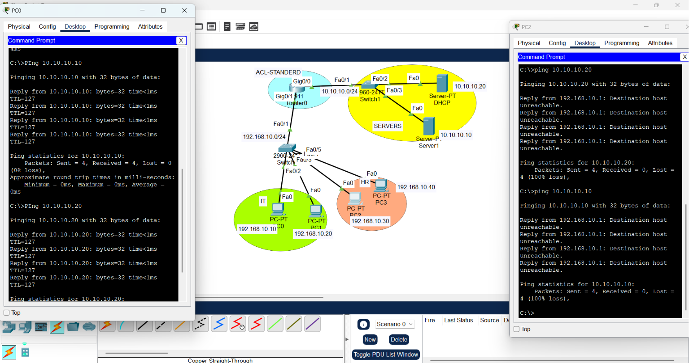

# CONFIGURING STANDARD ACL 

1. Draw necessary topology, decorate and comment
2. Configure IP addresses to the routers and hosts.
3. Try to ping the servers from IT and HR depts.
4. Configure a standard ACL to only permit the two IT PCs while denying the rest.
5. Bind the ACL created on either router interfaces.
6. Try again to ping the servers from IT and HR depts.
---------------------------------------------------------------------------------------

 

This repository documents the architectural design, routing protocols, and security implementation for the current lab project. It reflects a professional approach to building scalable and secure enterprise networks.

---

## 1. Routing Strategy: IGP vs. EGP
A professional engineer chooses the right tool for the job.

### OSPF (Interior Gateway Protocol)
* **Purpose:** Ensures fast, efficient, and consistent routing *inside* the enterprise.
* **Core Logic:** Uses **LSDB (Link State Database)** to build an identical map across all routers in an area.
* **Scalability:** We implement **Multi-Area OSPF** to contain topology changes within local areas, preventing unnecessary SPF calculations across the entire network.
* **Best Practice:** Always use a manual `router-id` to ensure stable network identity.

### BGP (Exterior Gateway Protocol)
* **Purpose:** The "Internet's Diplomat." Used to interconnect independent Autonomous Systems (AS).
* **Policy-Driven:** Unlike OSPF, BGP prioritizes **policy (security, cost, agreements)** over raw speed.
* **Peering:** Relies on manual `neighbor` configurations and a stable **TCP/179** connection.

---

## 2. Security Infrastructure: ACLs (Standard)
ACLs act as the "Security Gatekeeper" of our network.

### Standard ACL Engineering Principles
* **Function:** Filters traffic based *only* on the **Source IP Address**.
* **Placement Strategy:** Always apply the ACL as close to the **Destination** as possible (Outbound on the interface).
* **The "Sequence" Rule:** Routers process rules line-by-line. Once a match occurs, processing stops.
* **The "Implicit Deny" Trap:** Every ACL ends with a hidden `deny any`. Always add `permit any` at the end of your list to ensure legitimate traffic flow.

## 3. Try to ping the servers from IT and HR depts.
 

### Troubleshooting Logic
* `show access-list`: Our primary diagnostic tool.  

* **Match Counter:** We monitor the "Matches" count to verify that our rules are actively intercepting the intended traffic. If matches remain at 0, the ACL is either not applied or traffic is taking an alternate path.
---
```bash
# Example: Restricting HR network access to the Servers
Router(config)# access-list 10 permit host 192.168.10.10 
Router(config)# access-list 10 permit 192.168.10.10 0.0.0.0 

# Apply to destination interface
Router(config)# interface gig0/0
Router(config-if)# ip access-group 10 out
```
 


| Feature          | OSPF (IGP)           | BGP (EGP)              | Standard ACL         |
|------------------|----------------------|------------------------|----------------------|
| Domain           | Internal Network     | External/Internet      | Security & Filtering |
| Discovery        | Automatic            | Manual (Peering)       | Manual (Rules)       |
| Logic            | Speed/Shortest Path  | Policy/Agreements      | Source IP Filtering  |

## 4. Try again to ping the servers from IT and HR depts.

 


