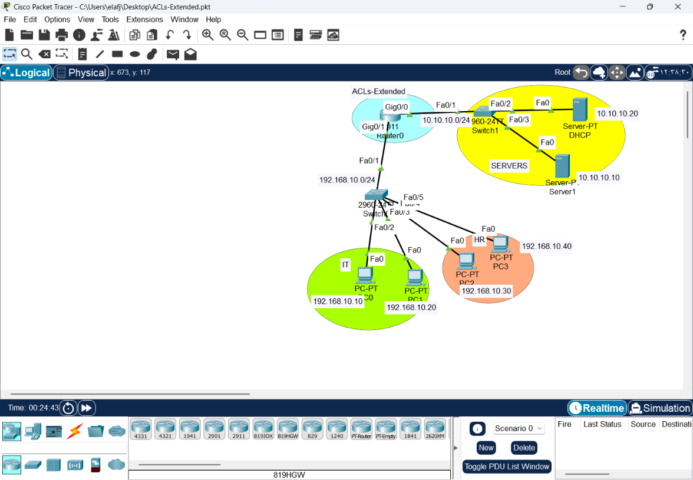
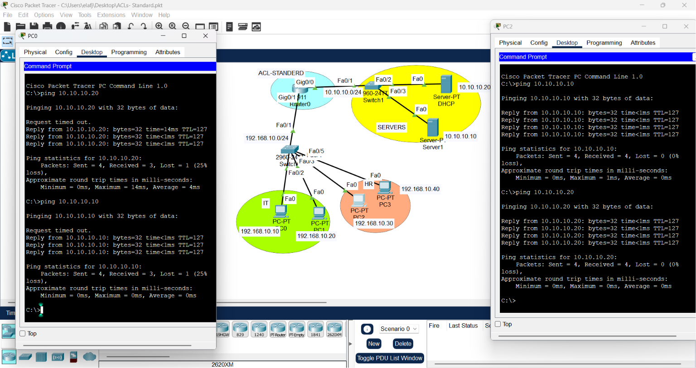
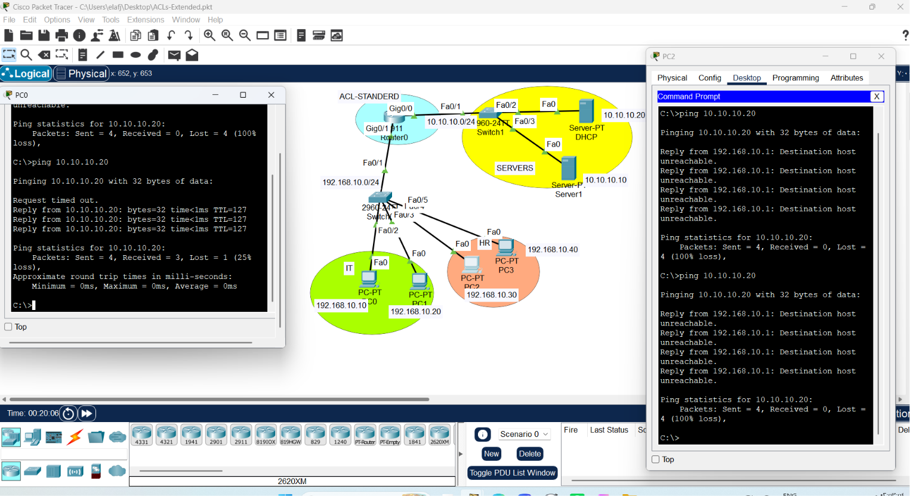

# Network Engineering & Security: Comprehensive Lab Guide
-----------------------------------------------------------------------
# CONFIGURING EXTENDED ACL
1. Draw necessary topology, decorate and comment
2. Configure IP addresses to the routers and hosts.
3. Try to ping the servers from IT and HR depts.
4. Configure a extended ACL to only permit the two IT PCs to access DHCP while denying the rest
5. Bind the ACL created on either router interfaces.
6. Try again to ping the servers from IT and HR depts.

-----------------------------------------------------------------------------------------------------------------------

his document summarizes the architectural design, routing protocols (IGP/EGP), and traffic filtering strategies (ACLs) implemented in the lab environment. It serves as a reference for professional network design and security troubleshooting.

---

## 1. Routing Protocols: The Backbone
A robust network requires a tiered routing approach.

### OSPF (Internal Routing - IGP)
* **Goal:** Speed and efficiency within the enterprise.
* **Mechanism:** Uses **LSDB (Link State Database)** to maintain a uniform topological map.
* **Optimization:** Implement **Multi-Area** design to contain SPF calculations and improve scalability.

### BGP (External Routing - EGP)
* **Goal:** Connectivity between independent Autonomous Systems (AS).
* **Diplomatic Logic:** Unlike OSPF’s "shortest path" logic, BGP is **Policy-Based**, allowing administrators to dictate traffic flow based on business/security policies.
* **Peering:** Uses **TCP/179** for reliable, stable connections.

---

## 2. Traffic Filtering: ACLs (Security Gatekeepers)
We implement ACLs to control access and secure sensitive network segments.

### Comparison: Standard vs. Extended ACLs

| Feature | Standard ACL | Extended ACL |
| :--- | :--- | :--- |
| **Domain** | Internal/General | Perimeter/Specific |
| **Filtering Basis** | Source IP only | Source, Destination, Port, Protocol |
| **Placement** | Close to Destination | Close to Source |
| **Complexity** | Basic | Granular/Intelligent |

---
| ACL Type       | Best Placement                | Rationale (Why?)                                                                              |
|----------------|-------------------------------|-----------------------------------------------------------------------------------------------|
| Standard ACL   | Closest to the Destination    | Filters only by Source IP; applying near the destination avoids blocking traffic prematurely. |
| Extended ACL   | Closest to the Source         | Filters by full context; dropping traffic early saves router resources and bandwidth.         |




### The Syntax Formula (Extended ACL)
`access-list [ID] [permit/deny] [protocol] [Source] [Destination] [Port]`
* **Host vs. Network:** Use `host [IP]` for single devices and `[IP] [Wildcard Mask]` for subnets. Never mix them.
* **Implicit Deny:** Every ACL ends with a hidden `deny ip any any`. Always include `permit ip any any` at the end if you want to allow remaining traffic.

### Troubleshooting Workflow
1. **Placement:** Always verify the interface (e.g., `Gig0/0`) and direction (`in` vs `out`).
2. **Audit:** Use `show access-list` to monitor **Match Counters**. If matches are zero, the ACL is likely not applied correctly.
3. **Logic Check:** If a filter (like `deny ip any any`) fails to block traffic, verify if the traffic is taking an alternate path or if the ACL is on the wrong interface.
4. **Clean-up:** Use `no access-list [ID]` to remove filters, but remember to remove the group from the interface first (`no ip access-group [ID] [dir]`).
---
## 4. Try to ping the servers from IT and HR depts.



## 5. Example Configuration (Extended ACL)
To restrict IT staff access to specific server services (e.g., DHCP) while blocking unauthorized ICMP traffic:

```bash
# Allow DHCP services (bootps) for specific hosts
access-list 101 permit udp host 192.168.10.10 host 10.10.10.20 eq 67
access-list 101 permit udp host 192.168.10.20 host 10.10.10.20 eq 67
access-list 101 permit icmp host 192.168.10.10 host 10.10.10.20 
access-list 101 permit icmp host 192.168.10.20 host 10.10.10.20 
# Deny all other IP traffic to the server
access-list 101 deny ip 192.168.10.0 0.0.0.255 host 10.10.10.20

# Permit remaining legitimate traffic
access-list 101 permit ip any any
# Bind the ACL created on either router interfaces.
interface gig0/1
ip access-group 101 in
```
## 6. Try again to ping the servers from IT and HR depts.


## 7. Conclusion:
network security is about Granular Control. By moving from basic Standard ACLs to precision-based Extended ACLs, and balancing IGP for speed with EGP for policy, we build architectures that are not just connected, but secure and manageable.
