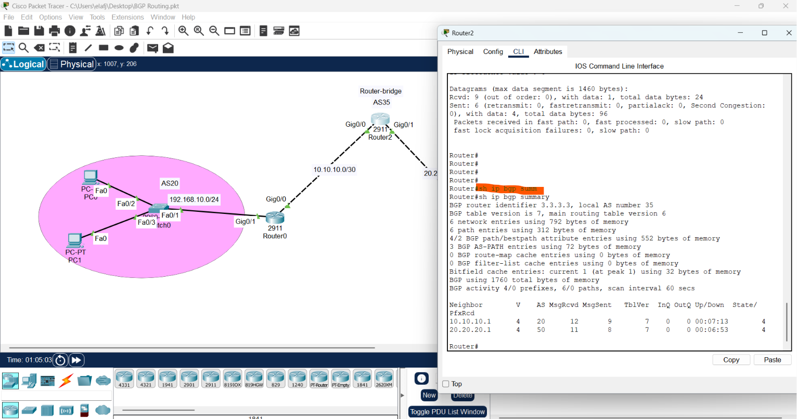
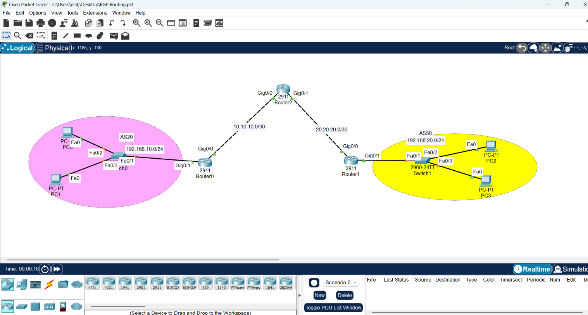
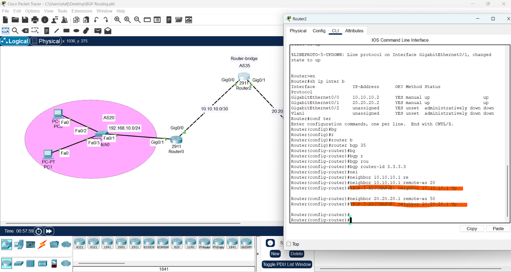
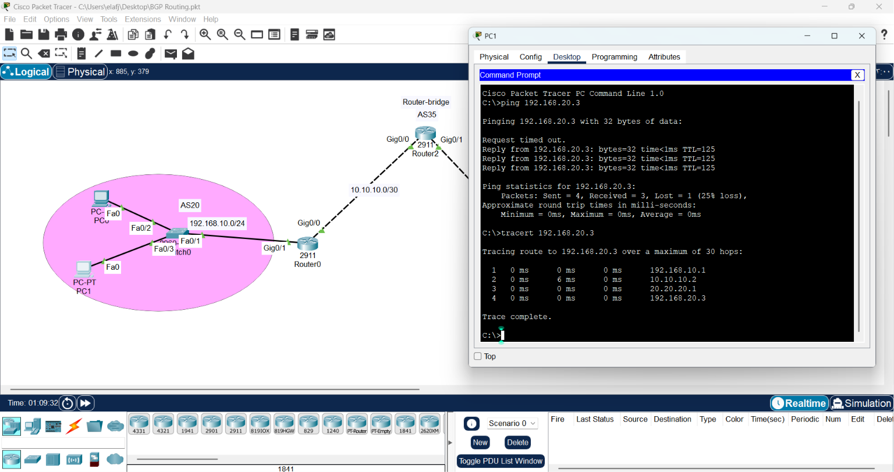

# CONFIGURING BGP 

1. Draw necessary topology, decorate and comment
2. Configure IP addresses to the routers and hosts.
3. Configure BGP, specify neighbor with ASN and advertise the directly connected networks.
4. Traceroute the path and ping the hosts.
-------------------------------------------------------------------------------
# Advanced Network Routing: The Complete Engineering Guide

This repository serves as a comprehensive technical reference for Routing Protocols (OSPF & BGP). It bridges the gap between basic configuration and professional architectural understanding.

---

## 1. OSPF: The "Map-Based" Protocol (IGP)
OSPF builds a consistent view of the network to ensure loop-free, efficient routing.

### The OSPF Core Components
* **LSA (Link State Advertisement):** The status report sent by routers.
* **LSDB (Link State Database):** The common map. Every router in an area builds an **identical LSDB**, ensuring every node has the exact same topological view.
* **SPF Tree:** The Dijkstra algorithm used to calculate the mathematically shortest path.

### Key OSPF Concepts
* **Router-ID:** The unique "ID card" for the router. **Engineering Best Practice:** Always set it manually (e.g., `router-id 1.1.1.1`) to ensure identity stability during interface failures.
* **Multi-Area OSPF:** Essential for large networks.
    * **Area 0 (Backbone):** The transit core.
    * **ABR (Area Border Router):** The bridge between areas.
    * **Benefit:** It isolates topology changes, preventing unnecessary SPF calculations across the enterprise.


---

## 2. BGP: The "Policy-Based" Protocol (EGP)
BGP is the language of the Internet, designed to connect independent entities (Autonomous Systems).

### Why BGP?
Unlike OSPF, which looks for the *fastest* path, BGP looks for the *best policy* path. It allows engineers to control traffic based on business agreements, security, and cost.

### How BGP Works
* **AS (Autonomous System):** An independent network entity (e.g., an ISP). BGP connects these AS numbers together.
* **TCP Connection (Peering):** BGP uses TCP port 179 to establish a stable, reliable connection between neighbors.
* **Manual Peering:** Unlike OSPF’s automatic discovery, BGP neighbors must be defined manually via the `neighbor` command.


---

## 3. Comparative Summary: IGP vs. EGP

| Feature | OSPF (IGP) | BGP (EGP) |
| :--- | :--- | :--- |
| **Primary Goal** | Speed & Efficiency | Policy & Connectivity |
| **Logic** | Map-based (Global view) | Policy-based (Path vector) |
| **Neighboring** | Automatic | Manual (Peering) |
| **Database** | LSDB | BGP Table |

---

## 4. Configuration Template

### OSPF (Single/Multi-Area)
```bash
Router(config)# router ospf 1
Router(config-router)# router-id 1.1.1.1
# Syntax: network [IP] [Wildcard] area [Area_ID]

# BGP (The Contract)
# Define your Identity (AS)
Router(config)# router bgp 100
# Define the neighbor contract (Manual Peering)
Router(config-router)# neighbor 20.20.20.2 remote-as 200
# Advertise your network
Router(config-router)# network 192.168.10.0 mask 255.255.255.0
```
## 5.  Troubleshooting Checklist
* Physical Layer: Are interfaces `Up/Up`?

* Adjacency: `show ip ospf neighbor` or `show ip bgp summary`. Is the status FULL or Established?  


* Database Audit:` show ip ospf database` (for OSPF) or `show ip bgp` (for BGP). Do you see the network routes you expect?

* Logic Check: For BGP, ensure the IP addresses of the neighbors are reachable via physical connectivity first.

---------------------------------------------------------------------------------------------------------------------------------------------------
# BGP Network Architecture Lab: Analysis and Implementation
 

This project simulates a real-world multi-AS (Autonomous System) environment using Cisco Packet Tracer, demonstrating how BGP acts as the "Internet's Diplomat" to connect independent network entities.

## 1. Network Topology Analysis
The architecture consists of three core segments acting as independent AS entities:
* **AS20 (Left):** Represented by `Router0` and LAN `192.168.10.0/24`.
* **AS50 (Right):** Represented by `Router1` and LAN `192.168.20.0/24`.
* **AS100 (Transit/Core):** Represented by `Router2`, which acts as the diplomatic bridge connecting the two autonomous systems.


## 2. The BGP Engineering Logic
Unlike Interior protocols (OSPF), BGP configuration is manual and policy-driven:

### Why this design?
1. **Manual Peering:** We explicitly define `neighbor` relationships via `remote-as`. This provides complete control over which routers can establish trust, a crucial security layer in large-scale networks.
2. **AS-Path Independence:** By utilizing distinct AS numbers, we simulate how ISPs and major corporations interconnect their internal networks globally while maintaining autonomy.
3. **Transit Strategy:** `Router2` serves as a transit provider; it does advertise local networks and facilitates the exchange of routing information between AS20 and AS50.

## 3. Implementation Guide

### The Configuration Workflow
1. **Define Identity:** Assign each router its AS number (`router bgp [ASN]`).
2. **Establish Trust:** Create the neighbor contract using `neighbor [IP] remote-as [ASN]`.
3. **Advertise Assets:** Use the `network` command to announce reachable subnets (only on edge routers).

### Essential Configuration Template (Sample for Edge Routers)
```bash
# Define AS Identity
Router0(config)# router bgp 20
Router0(config-router)#bgp router-id 1.1.1.1
# Define the contract with the Transit Router
Router0(config-router)# neighbor 10.10.10.2 remote-as 35
# Announce local assets
Router0(config-router)# network 192.168.10.0 mask 255.255.255.0
Router0(config-router)# network 10.10.10.0 mask 255.255.255.252

Router1(config)# router bgp 50
Router1(config-router)#bgp router-id 2.2.2.2
Router1(config-router)# neighbor 20.20.20.2 remote-as 35
Router1(config-router)# network 192.168.20.0 mask 255.255.255.0
Router1(config-router)# network 20.20.20.0 mask 255.255.255.252
``` 
```text
# Router-bridge
Router2(config)# router bgp 35
Router2(config-router)#bgp router-id 3.3.3.3
Router2(config-router)# neighbor 10.10.10.1 remote-as 20
Router2(config-router)# neighbor 20.20.20.1 remote-as 50
Router2(config-router)# network 10.10.10.0 mask 255.255.255.252
Router2(config-router)# network 20.20.20.0 mask 255.255.255.252
```
 

## Traceroute the path and ping the hosts
 

## Conclusion:
A master engineer understands the distinction between Internal Routing (IGP) for speed and External Routing (EGP) for policy. By mastering the LSDB for consistency and BGP Peering for connectivity, you provide a stable, scalable, and professional network architecture
