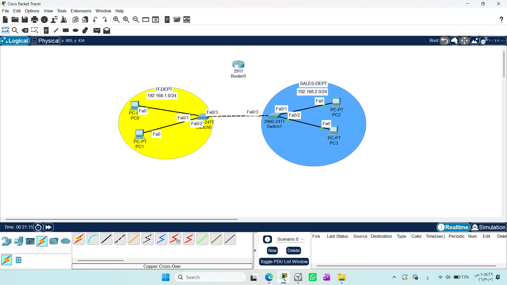
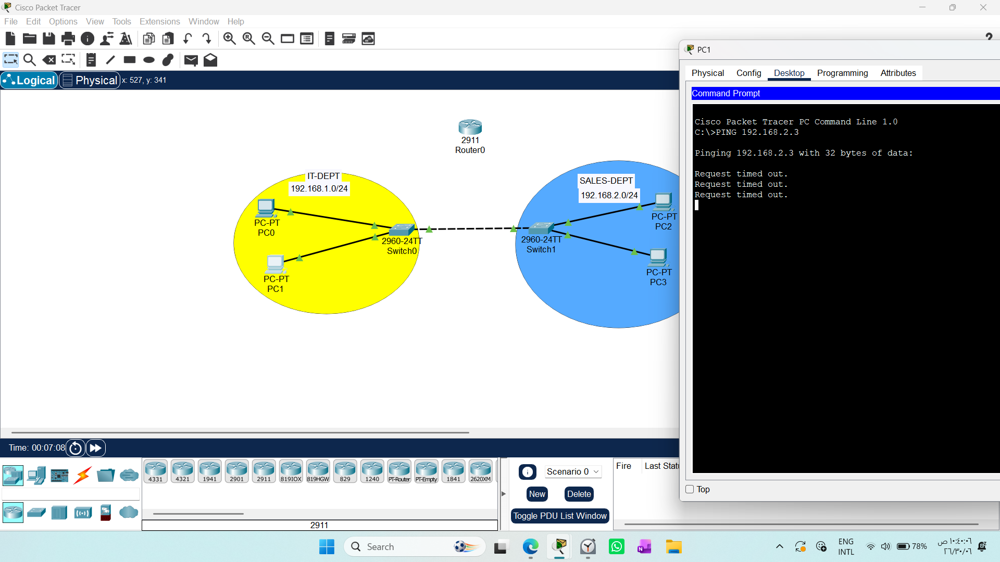
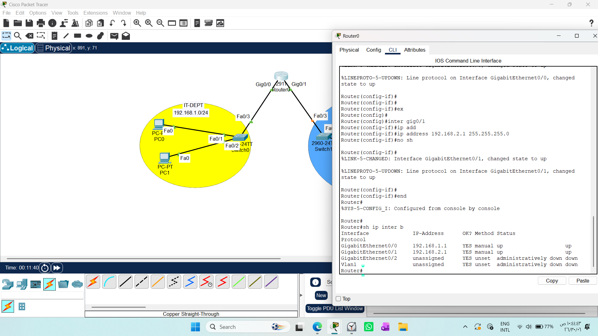
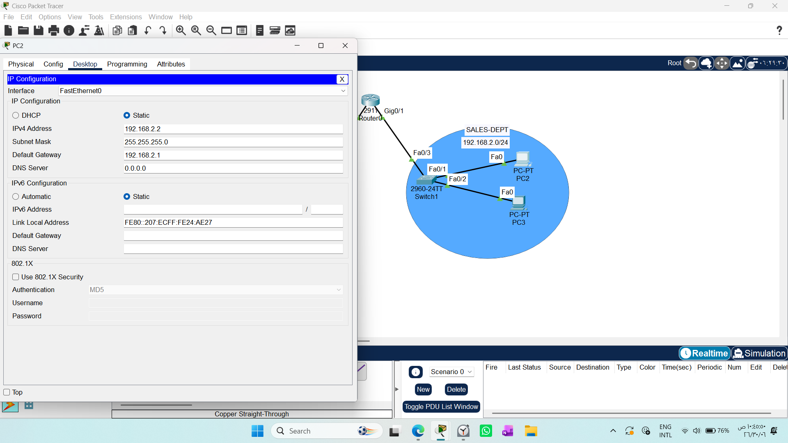
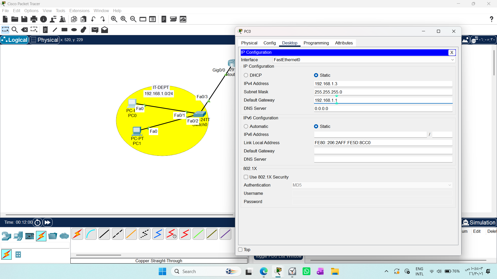
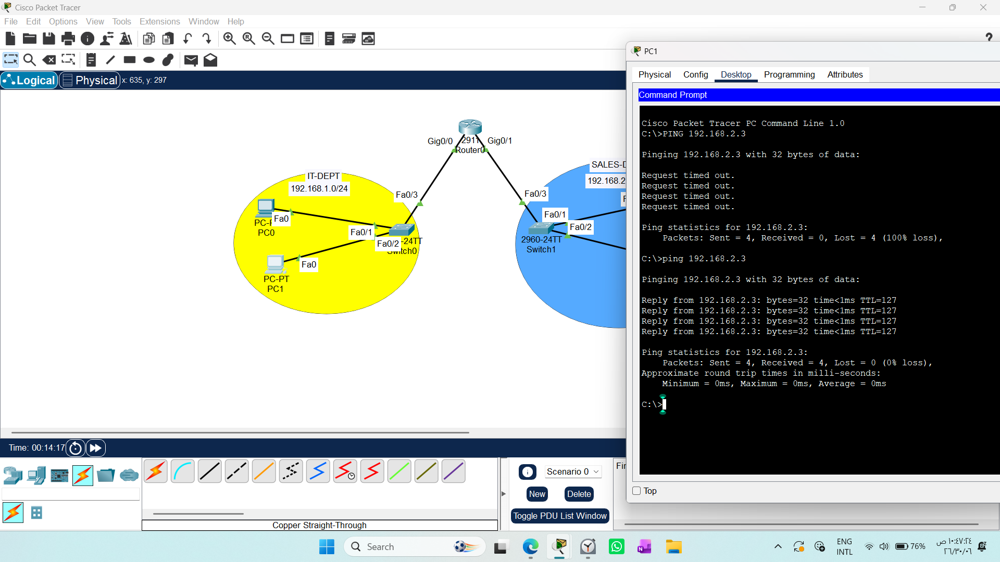

## CONNECTING MULTIPLE NETWORKS USING A ROUTER #####

1. Draw necessary topology, decorate and comment
2. Firstly make a topology with two switches each with PC connected.
3. Assign the PCs IP addresses as per the subnet and test ping --- ping won't work.
4. Include a router between the two switches and configure IP addresses to the router interfaces.
5. Now test ping ---- this should work.
----------------------------------------------------------------------------------------------------------------------------------------
# Overview
In this lab, I successfully connected two different network segments using a Cisco router. 
This exercise demonstrates how routers enable communication between separate subnets that cannot "see" each other otherwise.
### Topology Details

The network consists of two departments, each acting as a distinct network:

IT-DEPT (Left): Subnet 192.168.1.0/24 connected to Switch0.

SAI FS-DEPT (Right): Subnet 192.168.2.0/24 connected to Switch1.

Router: A 2911 series router acts as the gateway to bridge these two networks.
### Steps Taken
Initial Testing: Attempted to ping between the two networks. As expected, the connection failed (Request timed out) because they are on different subnets.

### Router Configuration:

Connected both switches to the router interfaces.

Assigned IP addresses to the router's interfaces (Default Gateways).

Configured the PCs to use the router's interface as their Default Gateway.

### Final Verification: 
Performed a ping test again. The connection was successful, as the router now correctly routes packets between the subnets.

Final Verification: Performed a ping test again. The connection was successful, as the router now correctly routes packets between the subnets.

