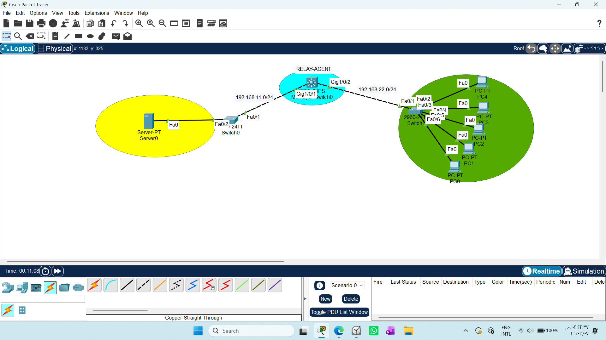
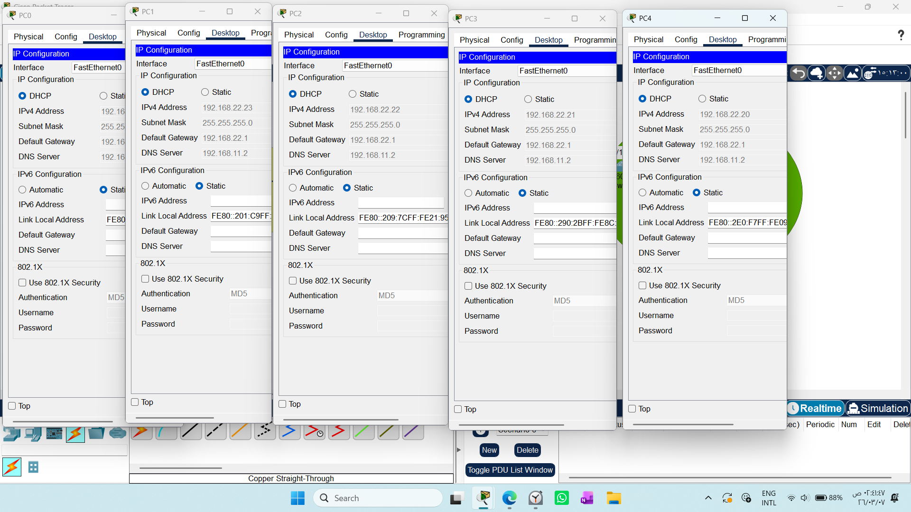
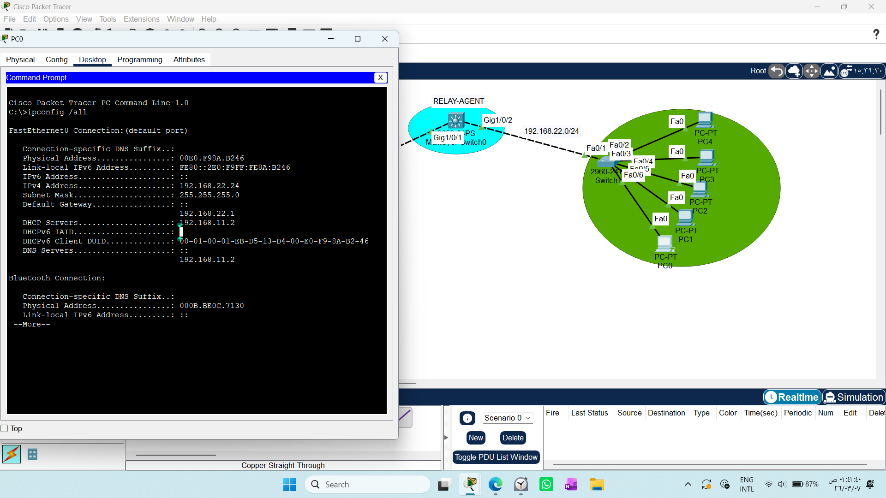

# CONFIGURING DHCP RELAY AGENT ON CISCO L3SW #######

1. Draw necessary topology, decorate and comment
2. Enable IP routing and configure IP to the L3SW interface and static IP addresses to the server
3. On the DHCP Server device, create DHCP pools, subnet mask, no of useable IP, default gateway and dns address.
4. Go to the L3SW interface connecting the LAN and configure it to relay DHCP messages to the DHCP server.
5. Go to every PC and change option to DHCP.


# DHCP Relay Agent Implementation Guide
This guide covers the implementation and theoretical foundation of a DHCP Relay Agent on a Layer 3 Switch (L3SW), specifically tailored for lab environments and enterprise network design.

## 1. What is a DHCP Relay Agent?
In networking, DHCP requests are Broadcast packets. Routers and Layer 3 switches do not forward broadcast traffic across different subnets. The DHCP Relay Agent (also known as ip helper-address in Cisco environments) acts as a mediator:

1- It intercepts the client's broadcast DHCP Discover message.

2- It converts the broadcast message into a Unicast packet.

3- It forwards this packet to the specific IP address of the DHCP Server.

## 2. Practical Configuration Steps
Designed for your Packet Tracer topology.

### Step 1: Enable L3 Routing
To allow the switch to route packets between different subnets, you must enable global routing:
```text
Router(config)# ip routing
```

### Step 2: Configure Physical Interfaces (Routed Ports)
Since your current topology uses direct connections without VLANs, we use "Routed Ports":
```text
interface Gig1/0/1
no switchport
ip address 192.168.11.2 255.255.255.0

interface Gig1/0/2
 no switchport
 ip address 192.168.22.1 255.255.255.0
```
### Step 3: Configure DHCP Server
Set a static IP on the server (e.g., 192.168.11.2).

* Go to Services > DHCP.

* Create a pool with:

* Default Gateway: 192.168.22.1

* Start IP Address: 192.168.22.20

### Step 4: Enable DHCP Relay Agent
Apply this command on the interface facing the clients (the interface that receives the initial broadcast):

```text
interface Gig1/0/2
ip helper-address 192.168.11.2
```
## 3. Critical Design Note: Routed Port vs. SVI
Understanding when to use:
| Feature | Routed Port (no switchport) | SVI (Switch Virtual Interface) |
| :--- | :--- | :--- |
| **Concept** | Treats the physical port like a router port. | A logical interface representing a VLAN. |
| **Best For** | Point-to-point links or flat networks. | Scalable Enterprise Campus LANs. |
| **DHCP Relay** | Applied directly to the interface. | Applied to the `interface Vlan X`. |


* Note for Implementation: We used `no switchport` because your current lab design lacks VLAN segmentation. In a production environment with multiple departments, you would use SVIs, where each VLAN has its own ip helper-address configured on its respective SVI.

## 4. Troubleshooting Checklist
* Check ip routing: If the switch isn't acting as a gateway, DHCP traffic won't pass.

* Ping Test: Always verify that the client can ping the default gateway (192.168.22.1) before testing DHCP.

* Service Status: Ensure the DHCP service on the Server device is set to ON.

* Interface IP: Double-check that the ip helper-address points to the correct, reachable IP of the DHCP Server.





