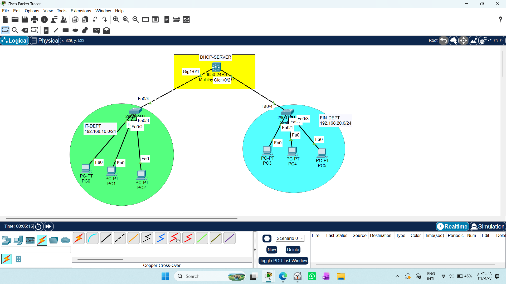
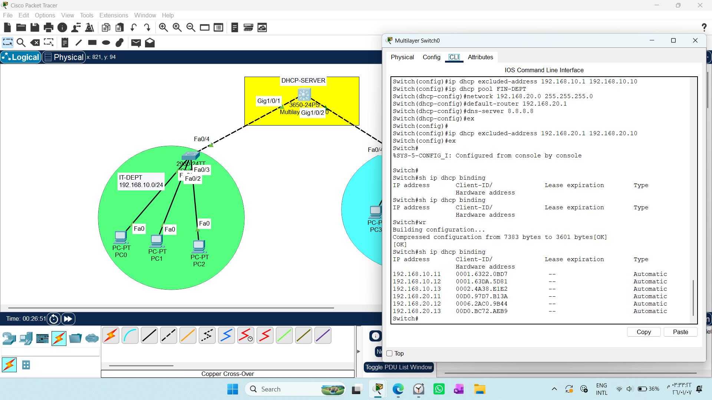
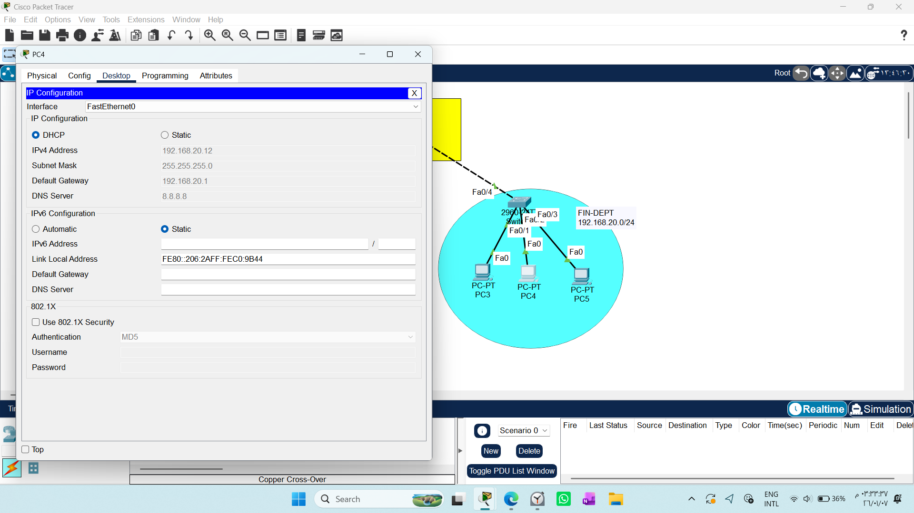
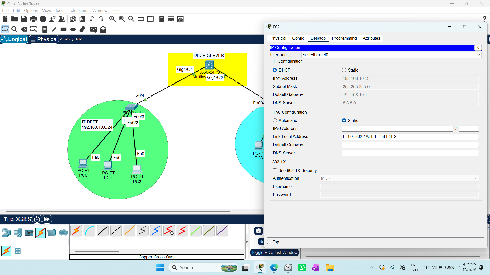

# CONFIGURING DHCP SERVER ON A MULTILAYER SWITCH

1. Draw necessary topology, decorate and comment
2. Configure IP addresses to the L3SW interface and enable IP Routing.
3. Create DHCP pools, assign network address, default gateway and dns address.
4. Exclude ranges of IP address that shoul not be assigned dynamically.
5. Go to every PC and change option to DHCP.

# 1. Lab Overview
In this lab, the Cisco 3650 Multilayer Switch acts as the central intelligence of the network. It performs critical functions:

DHCP Server: Dynamically assigning IP addresses to end-devices in multiple subnets.

# 2. Network Configuration Strategy
* Configure IP addresses to the L3SW interface and enable IP Routing.
## Step 1: Interface Routing (Routed Ports)
Instead of traditional SVIs, we configured physical ports as Routed Ports. This bypasses VLAN-based switching and treats the ports as pure router interfaces.
```text
Switch(config)# interface gigabitEthernet 1/0/1-2
Switch(config-if)# no switchport

Switch(config)# interface gigabitEthernet 1/0/1
Switch(config-if)# ip address 192.168.10.1 255.255.255.0
Switch(config-if)# no shutdown

Switch(config)# interface gigabitEthernet 1/0/2
Switch(config-if)# ip address 192.168.20.1 255.255.255.0
Switch(config-if)# no shutdown
```
## Step 2: Enabling Global Routing
* For the switch to perform routing between subnets, the IP routing engine must be enabled:
```text
Switch(config)# ip routing
```
## Step 3: DHCP Server Configuration
We created specific address pools for each department. We also excluded the first 10 IP addresses in each range to avoid conflicts with static devices (like the gateway itself).
```text
# Create IT-DEPT Pool
Switch(config)# ip dhcp pool IT-DEPT
Switch(dhcp-config)# network 192.168.10.0 255.255.255.0
Switch(dhcp-config)# default-router 192.168.10.1
Switch(dhcp-config)# dns-server 8.8.8.8

# Create FIN-DEPT Pool
Switch(config)# ip dhcp pool FIN-DEPT
Switch(dhcp-config)# network 192.168.20.0 255.255.255.0
Switch(dhcp-config)# default-router 192.168.20.1
Switch(dhcp-config)# dns-server 8.8.8.8

# Exclude ranges to reserve static IPs
Switch(config)# ip dhcp excluded-address 192.168.10.1 192.168.10.10
Switch(config)# ip dhcp excluded-address 192.168.20.1 192.168.20.1
```
# 3. Verification & Troubleshooting
To ensure the DHCP server is successfully assigning addresses, use the following verification commands:

Verify DHCP Bindings
Check which devices have received an IP address from the pool:
`Switch# show ip dhcp binding`


### Client-Side Verification
On each PC:

1- Navigate to Desktop > IP Configuration.

2- Switch the radio button from Static to DHCP.

3- Ensure you receive the "DHCP request successful" message.



# 4. Key Learning Insights
1- Routed Ports (no switchport) vs. SVIs: Using no switchport on physical interfaces is an effective way to connect directly to other subnets or routers without requiring VLAN tagging. It is ideal for Point-to-Point connections.

2- DHCP Centralization: By moving DHCP services to the Core (Multilayer Switch), we reduce the overhead of having multiple dedicated servers or separate routers for each department.

3- Binding Management: Always remember to use excluded-address to protect your Gateway IP addresses.


