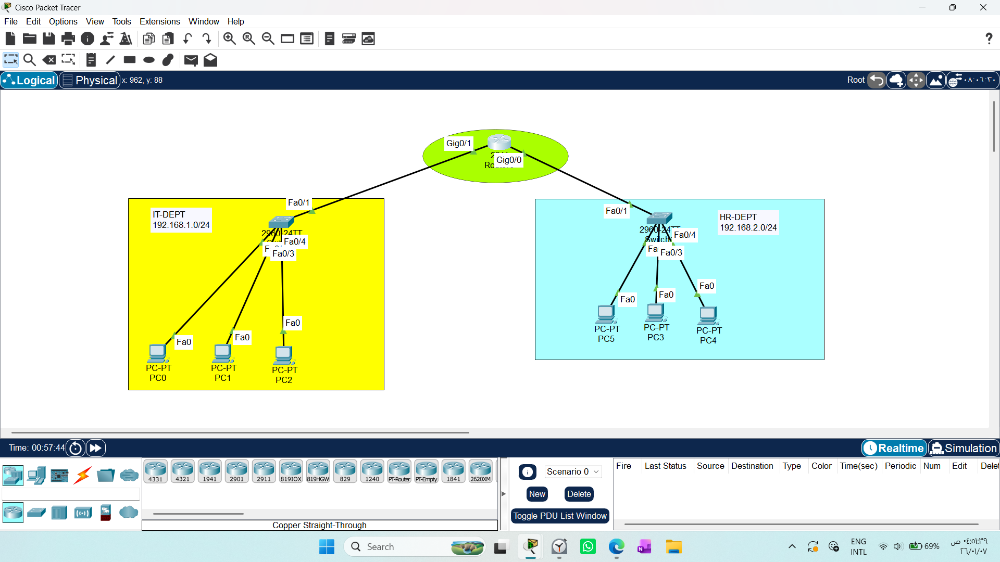
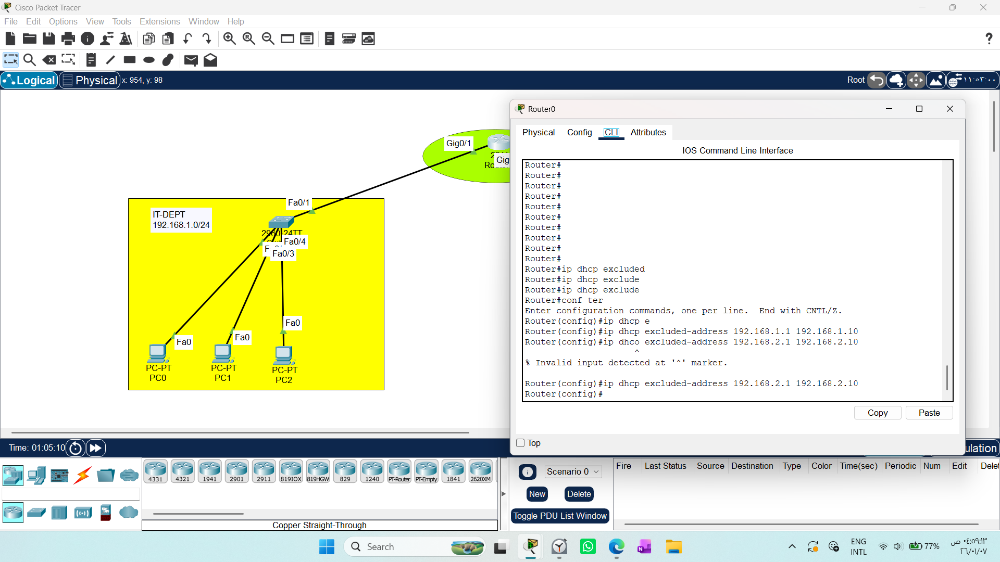
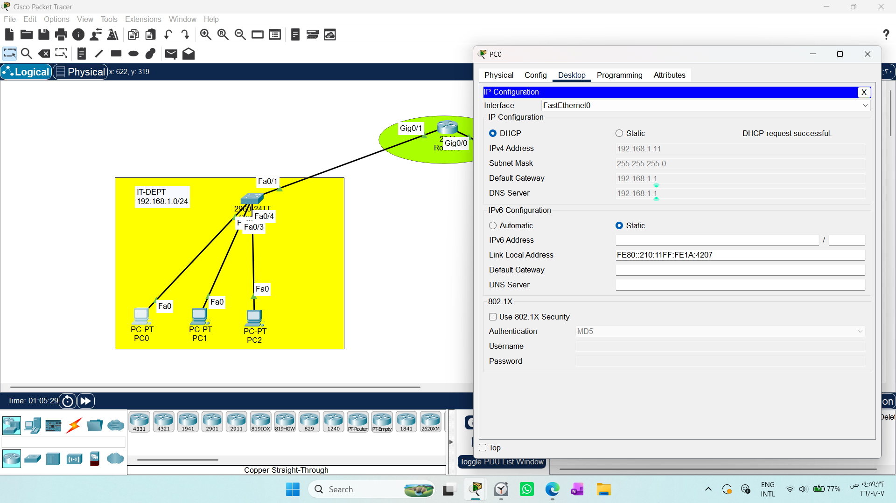
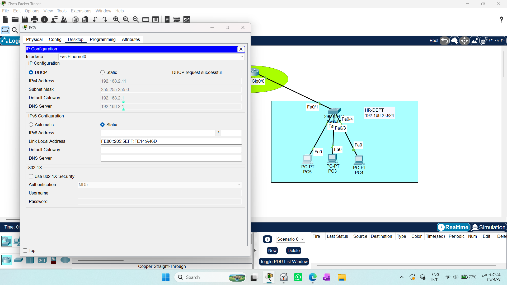
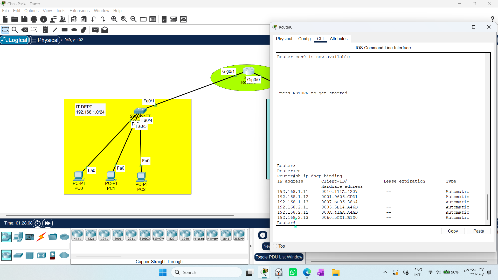

# CONFIGURING DHCP SERVER ON A ROUTER

1. Draw necessary topology, decorate and comment

2. Configure IP addresses to the router interface.

3. Create DHCP pools, assign network address, default gateway and dns address.

4. Exclude ranges of IP address that should not be assigned dynamically.

5. Go to every PC and change option to DHCP.

# 1. DHCP Server on a Cisco Router
Using a Cisco router as a DHCP server eliminates the need for an external dedicated server, making it perfect for small to medium-sized networks.
### The DHCP Process (DORA)
The router manages network addresses automatically through four steps:
1- Discover: The PC broadcasts: "Is there a DHCP server?"

2- Offer: The Router replies: "I am here, I have an IP for you."

3- Request: The PC says: "I will take that IP."

4- Acknowledge: The Router confirms: "IP granted, here is your gateway and DNS."

# 2.Topology


# 3. Configure IP addresses to the router interface.
```text
Router(config)# interface gigabitEthernet 0/1
Router(config-if)# ip address 192.168.1.1 255.255.255.0
Router(config-if)# no shutdown
Router(config-if)# exit
```
```text
Router(config)# interface gigabitEthernet 0/
Router(config-if)# ip address 192.168.2.1 255.255.255.0
Router(config-if)# no shutdown
Router(config-if)# exit
```
# 4. Create DHCP
* Define the DHCP Pool 1
```text
Router(config)# ip dhcp pool IT-DEPT

Router(config-dhcp)# network 192.168.1.0 255.255.255.0

Router(config-dhcp)# default-router 192.168.1.1

Router(config-dhcp)# dns-server 8.8.8.8
Router(config-dhcp)# exit
```

* Define the DHCP Pool 2
```text
Router(config)# ip dhcp pool HR-DEPT

Router(config-dhcp)# network 192.168.2.0 255.255.255.0

Router(config-dhcp)# default-router 192.168.2.1

Router(config-dhcp)# dns-server 8.8.8.8
Router(config-dhcp)# exit
```
# 5.Exclude static IPs (like the Gateway)
* for the DHCP Pool 1
```text
Router(config)# ip dhcp excluded-address 192.168.1.1 192.168.1.10
```
* for the DHCP Pool 2
```text
Router(config)# ip dhcp excluded-address 192.168.2.1 192.168.2.10
```


# 6.Client Configuration (The "Request" Step)
To verify that your PC receives the IP from the router:

1- Click on the PC icon in Packet Tracer.

2- Navigate to the Desktop tab.

3- Open IP Configuration.

4- Change the selection from Static to DHCP.

5- Wait for the "DHCP request successful" message.




# 7.Verification & Troubleshooting
If you need to audit which devices have received an IP address, use the following command on your router:
```text
Router# show ip dhcp binding
```
* Why use this command? It displays the IP address assigned to each device, the corresponding MAC address, and the lease expiration. If the table is empty, your DHCP pool settings or the PC’s connection to the network are likely misconfigured.



