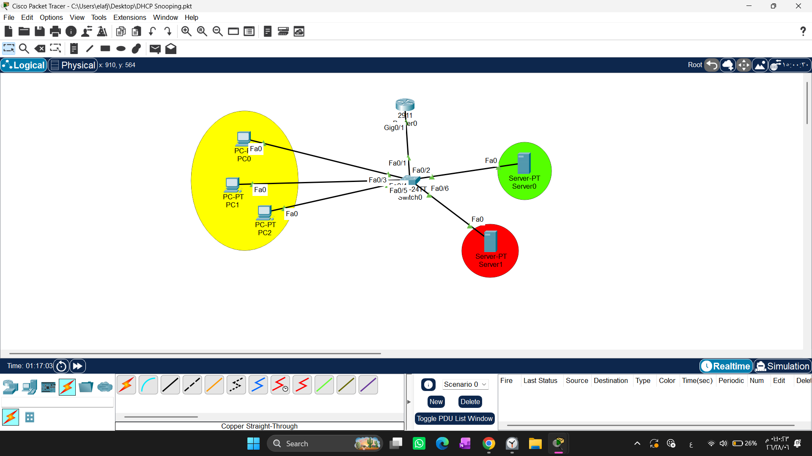
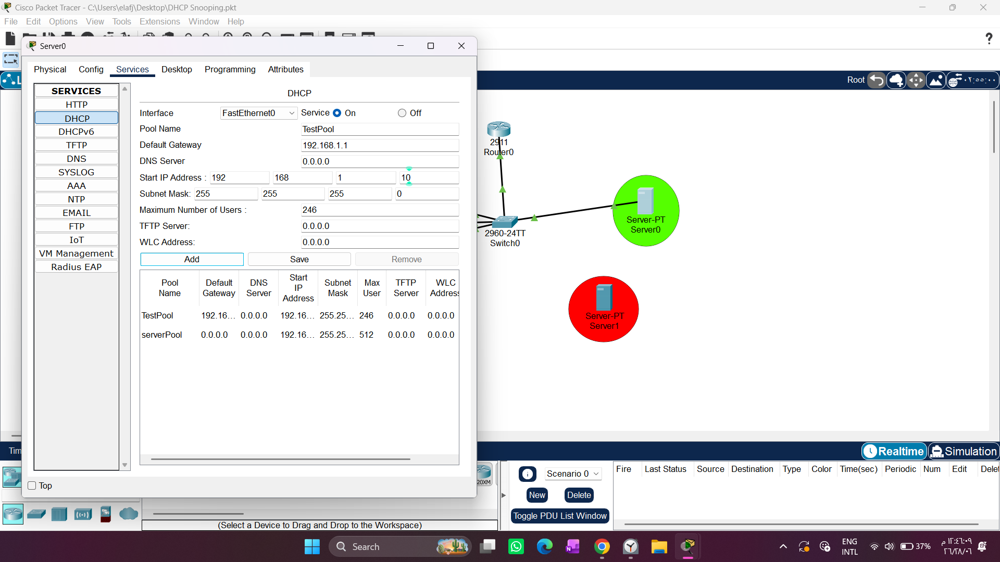
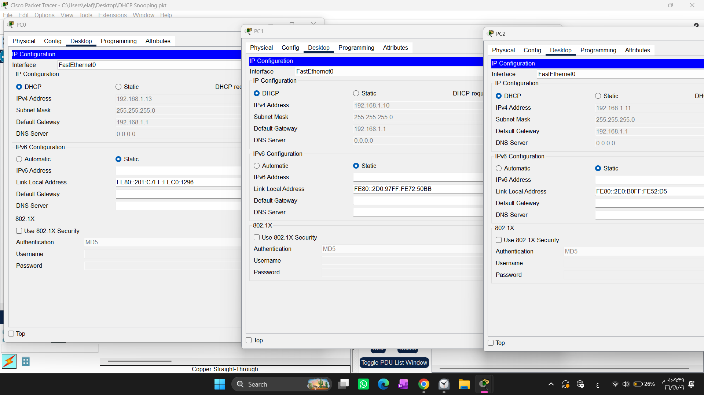
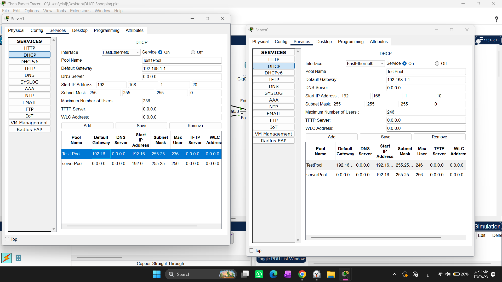
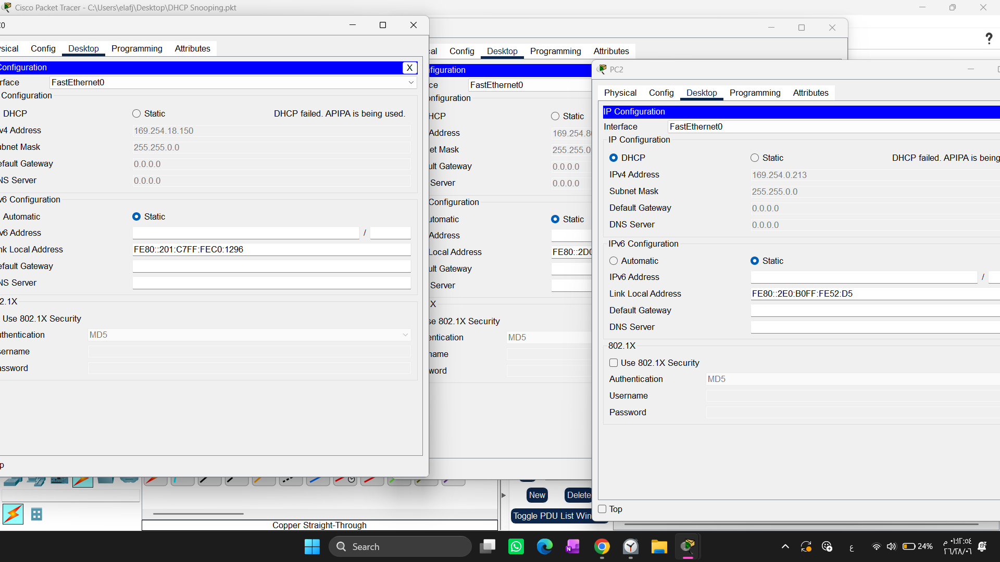

# DHCP Snooping Security Lab: Rogue Server Mitigation

1. Draw necessary topology, decorate and comment
2. Configure IP addresses to the router interface and the dhcp server
3. Configure a simple DHCP server device
4. Enable DHCP snooping on the switch.
5. Identify and configure ports as a trusted ports.
6. Assign IP DHCP Snooping to the VLAN that is currently being used.
-----------------------------------------------------------------------------------

## 1. Architectural Design & Philosophy

This project showcases the implementation of Layer 2 network security to defeat dynamic injection attacks. In a production enterprise topology, end-host workstations use the **Dynamic Host Configuration Protocol (DHCP)** to fully automate device IP settings using the standard four-step **DORA** transaction sequence:
1. **D**iscover *(Broadcast)*
2. **O**ffer *(Unicast/Broadcast)*
3. **R**equest *(Broadcast)*
4. **A**cknowledgment *(Unicast/Broadcast)*

Because this handshake logic values efficiency over cryptography, it relies on absolute structural trust. This trust leaves networks critically vulnerable to a malicious deployment style called a **Rogue DHCP Server Attack**.

### The Threat Model: Identity Theft & The Rogue Server
An attacker injects an unauthorized network device serving as a counterfeit DHCP controller. To execute an invisible **Man-in-the-Middle (MitM)** exploit, the rogue platform deliberately clones the exact identity properties of the production server—such as copying the identical infrastructure gateway and IP configuration signatures. 

When user nodes broadcast a request, the rogue node races to reply first. By successfully leasing information, the attacker modifies the **Default Gateway** address field to point straight to their custom capture node, routing all corporate user traffic into an intercept zone without raising operational alarms.

### The Solution: Switch Snooping as an Authorized MitM
To mitigate this threat, we provision **DHCP Snooping** inside the local access switch layer. When provisioned, the switch breaks standard Layer 2 isolation boundaries and performs **Deep Packet Inspection (DPI)** on passing transit streams. By listening in on the legitimate DORA handshake, the switch constructs a cryptographically secure telemetry database known as the **DHCP Snooping Binding Table**. This matrix pairs four structural metrics:
* **Source Hardware MAC Address**
* **Assigned Network IP Address**
* **Lease Time Duration**
* **Physical Target Port & VLAN ID Allocation**

This catalog functions as a trusted identity verification map. Interfaces are partitioned into two strict security zones:
* **Trusted Interface Zone:** Manually mapped ports leading straight to true infrastructure servers. They are permitted to pass all DHCP data formats, including distribution offers (`DHCPOFFER`, `DHCPACK`).
* **Untrusted Interface Zone:** Default setting applied across all end-user drop lines. If a server distribution frame tries to ingress an untrusted edge port, the switch immediately drops the packet and shuts down the interface.

---

## 2. Lab Topology Map

The entire design pattern has been built, documented, and fully secured inside Cisco Packet Tracer.



---

## 3. Infrastructure Initialization & Core Service Configuration

### Step 1: Interface & Server Gateway Provisioning
The initial setup phase maps fixed, static addresses to both the default infrastructure router interface and the authoritative network assets to ensure predictable delivery lanes.

| Infrastructure Node | Interface Designation | Hardware IPv4 Configuration | Subnet Mask | Default Gateway |
| :--- | :--- | :--- | :--- | :--- |
| **Router0** | GigabitEthernet 0/1 | `192.168.1.1` | `255.255.255.0` | *N/A* |
| **Server0 (Production)** | FastEthernet 0 | `192.168.1.100` | `255.255.255.0` | `192.168.1.1` |

.png)

.png)

> **Architectural Note:** Notice how the rogue attack machine (`Server1`) is purposefully initialized with the identical static network IP parameters (`192.168.1.100`). This matches the authentic server to demonstrate how the attacker tries to hide behind an identity spoofing technique.

### Step 2: Dynamic Pool Allocation Architecture
The legitimate server is configured using the internal **Services** engine to distribute structural variables automatically across the enterprise network.



### Step 3: Verifying the Initial Clean State Lease
Before running security commands, the end devices (`PC0`, `PC1`, `PC2`) issue clear broadcast discoveries. They successfully acquire verified leases straight from the designated system pool.




---

## 4. Attacker Profile vs. Production Parameters

To examine the exploit layout, we look at both allocation configurations side by side:



* **The Production Server (`Server0`):** Deploys the verified scope `TestPool` distributing IP structures beginning at `192.168.1.10`.
* **The Rogue Server (`Server1`):** Deploys a malicious scope named `Test1Pool` designed to release overlapping addresses beginning at `192.168.1.20`. It is built to hijack the network by pushing a modified default gateway pointing directly to the attacker.

---
-----------------------------------------------------------------------------------------------------------------------------------------------
## 5. Attack Testing & Security Validation
=================================================================================================================================================

### Step 1: Simulating the Attack Vector (Rogue Server Connection)

To thoroughly test our defense mechanisms, we simulate an active attack. The malicious server (`Server1`) attempts to bypass security by injecting itself into the network. However, instead of using the designated **Trusted Port** (`FastEthernet 0/2`), it is hard-wired into an ordinary access port: **`FastEthernet 0/6`**, which is automatically treated by the switch as **Untrusted**.

.png)

### Step 2: Mitigation & Attack Failure Verification

With **DHCP Snooping** actively monitoring the broadcast domain, user devices (`PC0`, `PC1`, `PC2`) are forced to refresh their IP configuration states to trigger a new DORA handshake. 

When the rogue server catches the *DHCP Discover* broadcast and attempts to respond with a malicious *DHCP Offer* via port `Fa0/6`, the switch immediately 
intercepts the frame. The internal logic engine detects an unauthorized server signature on an untrusted edge link, resulting in the following mitigation behavior:

1. The switch drops the malicious packets instantly, preventing the rogue configuration from ever reaching the workstations.

2. Because the authentic server is completely isolated during this test phase and the rogue server is blocked, the host workstations fail to acquire a valid lease.

3. The client operating systems safely default to an **APIPA (Automatic Private IP Addressing)** address block range (**`169.254.X.X`**), proving that the attack vector has been fully neutralized.



======================================================================================================================================

## 6. Hardening the Access Layer Switch (CLI Script)

To protect the broadcast domain, login to your access switch console (`Switch0`) and apply these defensive scripts:

```text

! 1. Initialize the Deep Packet Inspection Engine Globally

Switch0# configure terminal

Switch0(config)# ip dhcp snooping

Switch0(config)# ip dhcp snooping vlan 1

! 2. Define the Secure Trust Zone Port (Leading to Production Server)

Switch0(config)# interface range fastEthernet 0/1-2

Switch0(config-if)# ip dhcp snooping trust

Switch0(config-if)# exit

! 3. Apply Traffic Rate Limits on Untrusted Edges to Block Starvation Floods

Switch0(config)# interface range fastEthernet 0/3 - 24, gig0/1-2

Switch0(config-if-range)# ip dhcp snooping limit rate 10

Switch0(config-if-range)# end

! 4.System Verification & Security Validation

# Validate Global Active Status & Port Mappings:

Switch# show ip dhcp snooping

# Inspect the Authorized MitM Registry Table:

Switch# show ip dhcp snooping binding


