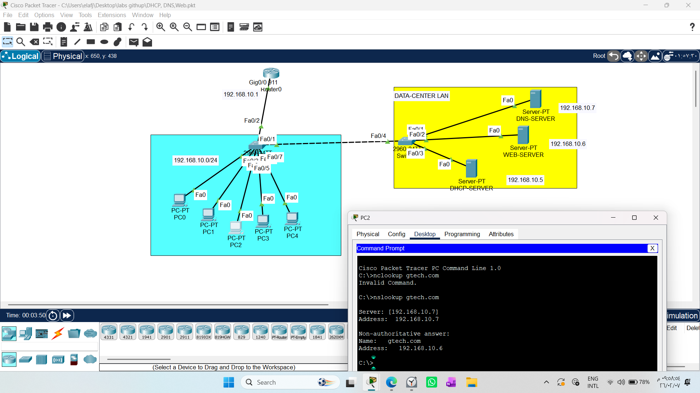
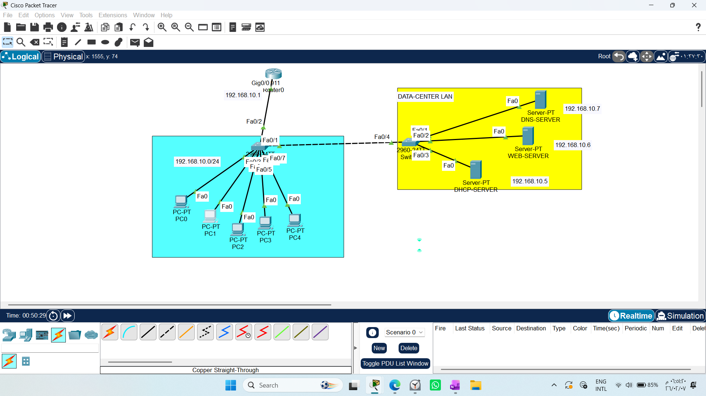
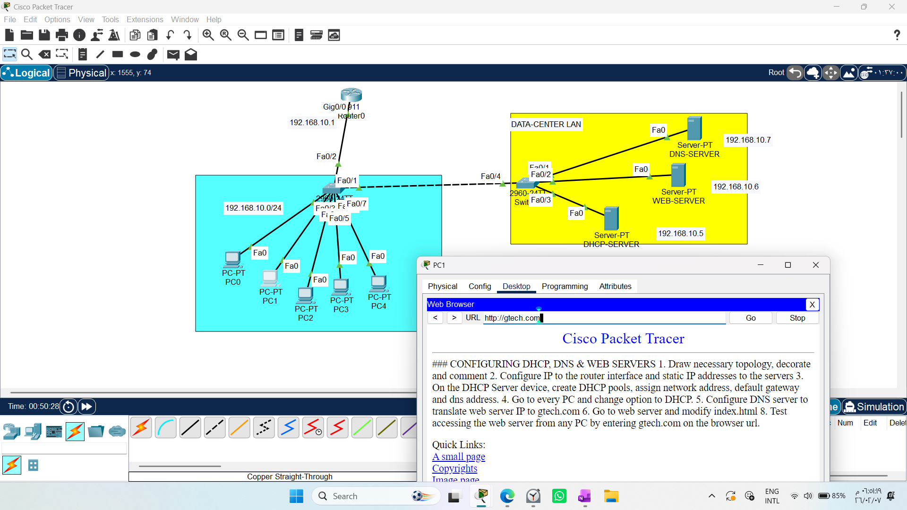

# CONFIGURING DHCP, DNS & WEB SERVERS

1. Draw necessary topology, decorate and comment
2. Configure IP to the router interface and static IP addresses to the servers
3. On the DHCP Server device, create DHCP pools, assign network address, default gateway and dns address.
4. Go to every PC and change option to DHCP.
5. Configure DNS server to translate web server IP to gtech.com
6. Go to web server and modify index.html
8. Test accessing the web server from any PC by entering gtech.com on the browser url.
---------------------------------------------------------------------------------------------

# Lab Report: Configuring DHCP, DNS, and Web Servers

This lab covers the essential services required to manage and navigate a network effectively. Understanding how Web Servers and DNS Servers work together is fundamental for any network engineer.

## 1. Core Services Overview

### Web Server
Think of the **Web Server** as a "file storage" specifically for websites. Its primary job is to host website files (like `index.html`).
* **Function:** When you request a page from your browser, the Web Server delivers the file to your computer.
* **In this Lab:** The Web Server hosts the `index.html` file that we customized to display the message "Welcome to GTech".

### DNS Server (Domain Name System)
The **DNS Server** is like the "Phonebook" of the internet.
* **Why do we need it?** Computers communicate using IP addresses (e.g., `192.168.10.6`), which are difficult for humans to remember. DNS allows us to use easy-to-remember names like `gtech.com`.
* **Function:** When you type a domain name in your browser, your computer asks the DNS Server, "What is the IP address for `gtech.com`?"
* **Result:** The DNS Server responds with the correct IP address (e.g., `192.168.10.6`), allowing your device to connect to the right destination.

---

## 2. Step-by-Step Data Flow

When you type `gtech.com` into your browser, here is the journey the request takes:

1.  **DNS Query:** Your PC asks the configured **DNS Server** for the IP address of `gtech.com`.
2.  **DNS Resolution:** The DNS Server replies with the corresponding IP address (e.g., `192.168.10.6`). Your PC now has the "map" to the destination.
3.  **HTTP Request:** Your browser sends a direct request to the Web Server at `192.168.10.6` asking for the `index.html` file.
4.  **Web Server Processing:** The Web Server receives the request, retrieves the requested file from its memory, and packages it into data packets.
5.  **Delivery & Rendering:** The data arrives at your PC, and your browser translates the HTML code into the visual website content you see on the screen.

---

## 3. Critical Implementation Note

A common mistake for beginners is forgetting to tell the PC where to ask for domain translations.

* **Configuration:** You **must** go into the IP configuration settings of your PC and enter the IP address of the **DNS Server** (in this lab, `192.168.10.7`) in the `DNS Server` field.
* **The Consequence:** Without this configuration, your computer will not know where to send its "phonebook" queries, and the browser will fail to resolve `gtech.com`.

---

## 4. Troubleshooting Tools

* **`nslookup`:** This is a vital diagnostic tool. By typing `nslookup gtech.com` in the command prompt, you are manually querying the DNS server to verify that it correctly maps the domain name to the Web Server's IP address. If this fails, it indicates a misconfiguration in your DNS Server or your PC's DNS settings.

# Lab Guide: Configuring DHCP, DNS, and Web Servers

This guide provides a structured walkthrough for setting up core network services. Mastering these services is essential for any network engineer, as they form the backbone of connectivity and resource discovery in modern networks.

---

## 1. Network Topology
To begin, set up your workspace in Cisco Packet Tracer:
* **Equipment:** Central Switch, Router, and four end devices (DHCP Server, DNS Server, Web Server, and PC).
* **Connections:** Connect all servers and the PC to the Switch. Connect the Switch to a LAN interface on the Router.
* **Requirement:** Ensure all devices are on the same subnet (e.g., `192.168.10.0/24`).

## 2. Static IP Configuration
Assign static IP addresses to your infrastructure devices to ensure they are always reachable:
* **Router (LAN Interface):** `192.168.10.1` (This acts as the Default Gateway).
* **DHCP Server:** `192.168.10.5`
* **DNS Server:** `192.168.10.7`
* **Web Server:** `192.168.10.6`

## 3. Configuring the DHCP Server
Enable the DHCP service to automate IP distribution for your PCs:
1.  Navigate to **Services > DHCP**.
2.  **Pool Name:** Enter a descriptive name (e.g., `MyPool`).
3.  **Default Gateway:** `192.168.10.1`
4.  **DNS Server:** `192.168.10.7`
5.  **Start IP Address:** `192.168.10.10`
6.  **Subnet Mask:** `255.255.255.0`
7.  Click  **Add** to activate the pool.

## 4. Configuring the PC (DHCP Client)
To allow your PC to receive its configuration automatically:
1.  Go to **Desktop > IP Configuration**.
2.  Switch the setting from **Static** to **DHCP**.
3.  The PC will request an IP address, Subnet Mask, Default Gateway, and DNS server address from your DHCP Server.

## 5. Configuring the DNS Server
The DNS server translates human-readable domain names into IP addresses:
1.  Navigate to **Services > DNS**.
2.  Toggle the service to **ON**.
3.  **Name:** `gtech.com`
4.  **Address:** `192.168.10.6` (The Web Server's IP).
5.  Click **Add**.

## 6. Modifying the Web Server
Customize the hosted web page:
1.  Navigate to **Services > HTTP**.
2.  Locate `index.html` and click **Edit**.
3.  Replace the existing code with your custom content (e.g., `<h1>Welcome to GTech Network</h1>`).
4.  Click **Save**.

## 7. Final Testing
Verify the end-to-end connectivity:
1.  Open the **Web Browser** on your PC.
2.  Enter the URL: `gtech.com`.
3.  If configured correctly, the browser will request the IP from the DNS server, connect to the Web Server, and display your custom web page.

