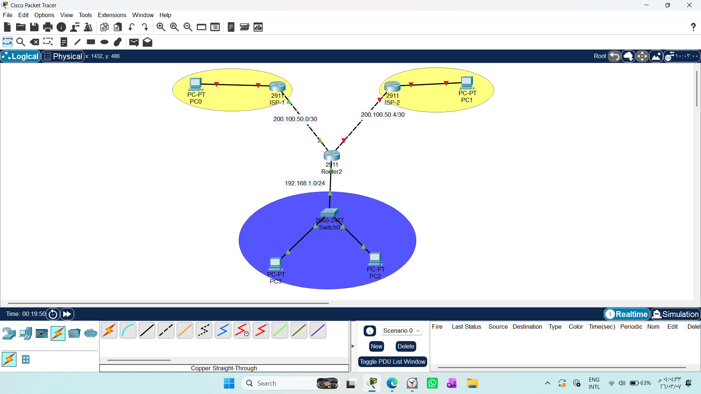
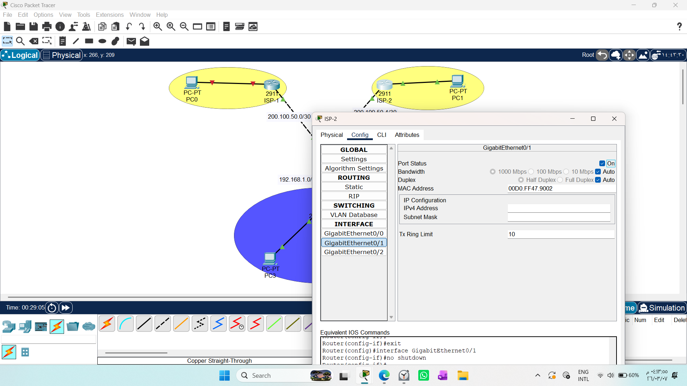
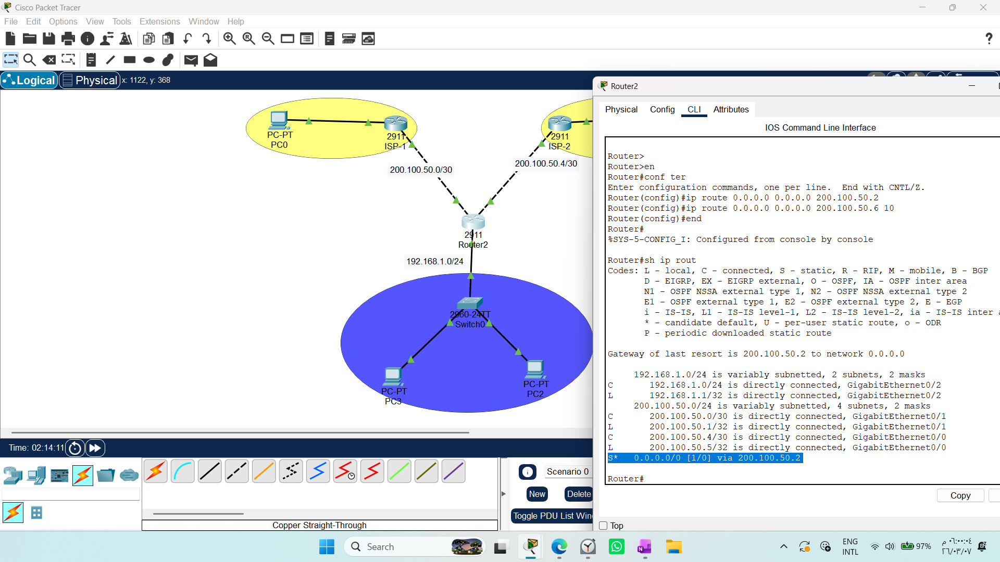
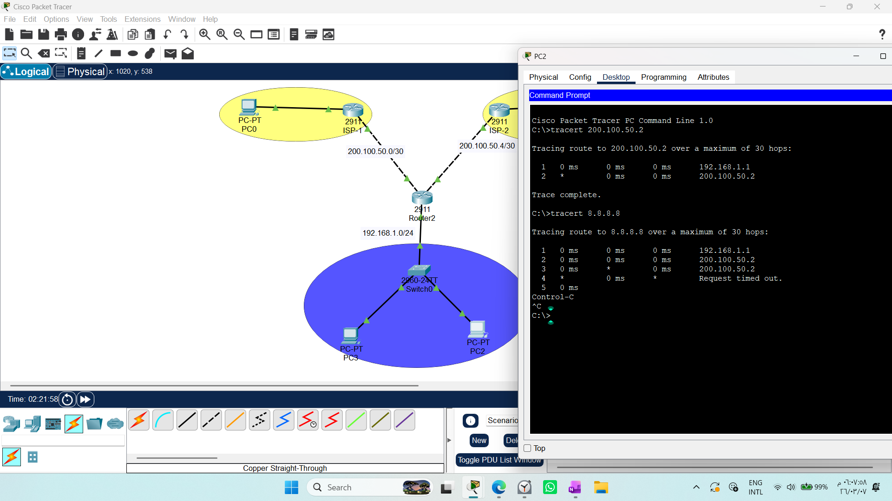
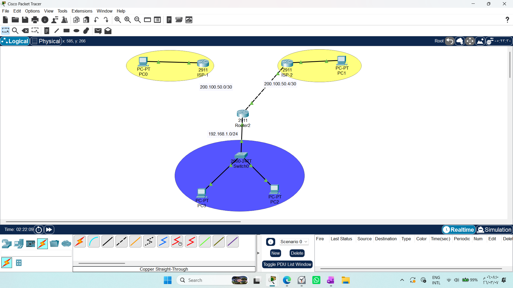
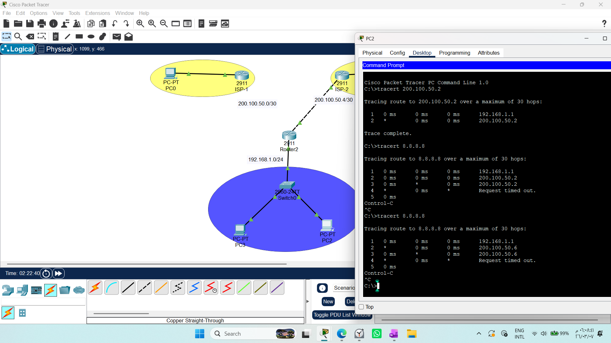

# CONFIGURING DEFAULT STATIC ROUTES WITH BACKUP 

1. Draw necessary topology, decorate and comment
2. Configure IP addresses to the routers and hosts.
3. Configure default static routes to two ISPs, use the IP add of the next hop.
4. Traceroute the path.
5. Configure backup/floating static routes to two ISPs, use the IP add of the next hop
6. Traceroute the path.

# Master Lab Guide:Default & Floating Static Routing

This comprehensive guide serves as the definitive documentation for implementing robust, scalable, and resilient routing solutions in Cisco Packet Tracer.


 
 

---

## 1. Concept: The Default Static Route (Gateway of Last Resort)
A **Default Static Route** is a "catch-all" path. Instead of listing every network on the internet, the router uses a single command to send any traffic with an unknown destination to a designated ISP.
* **Command:** `ip route 0.0.0.0 0.0.0.0 [Next_Hop_IP]`

## 2. Achieving Resilience (Floating Default Route)
To ensure the network never goes offline, we implement a **Floating Default Route**.
* **Primary Route:** Default Static Route (AD 1).
* **Backup Route:** Default Static Route with a higher AD (e.g., AD 10).
* **The Logic:** The router maintains the primary path. If the primary link fails, it automatically "promotes" the backup path to the routing table.

---

## 3. Configuration Script (Master Template)
For a router connected to two ISPs (`ISP1: 200.100.50.2` and `ISP2: 200.100.50.6`):

```bash
# 1. Primary Path (ISP1)
Router(config)# ip route 0.0.0.0 0.0.0.0 200.100.50.2

# 2. Backup/Floating Path (ISP2) - AD set to 10
Router(config)# ip route 0.0.0.0 0.0.0.0 200.100.50.6 10
```

## 4. Verification & Troubleshooting Protocol
A professional engineer does not just configure—they verify.

### 1- Routing Table Audit:
Run `show ip route` Look for the `S*` flag. This indicates a Default Static Route is active.
 

### 2- Path Analysis:
Run `tracert [Target_IP]` Note that the first packet may show a delay due to ARP resolution. Subsequent packets will be immediate.
 

### 3- Failover Simulation (The "Proof of Work"):

* Perform `tracert` (Observe Primary Path).

* Perform `tracert` again (Observe automatic shift to the backup path).

* `no shutdown` (Primary path resumes priority).
## 5- Network Resilience & Redundancy Test Report
Objective:
To verify the network's capability to maintain continuous connectivity during infrastructure failure by implementing Floating Default Static Routes.

Test Methodology:
We configured two ISPs as potential paths for outgoing traffic from our internal network.

 1- Primary Path: Configured via ISP-1 (Next-hop: 200.100.50.2).

2- Backup (Floating) Path: Configured via ISP-2 (Next-hop: 200.100.50.6) with a higher Administrative Distance (AD) to ensure it remains inactive unless the primary link fails.
 
 

### Testing Observations:

* Normal Operation: Running `tracert 8.8.8.8` successfully traced the path through the primary gateway (200.100.50.2).

* Failover Simulation: Upon administratively shutting down the interface connected to `ISP-1`, the router automatically detected the link failure.

* Redundancy Validation: A subsequent `tracert 8.8.8.8` confirmed that traffic was immediately re-routed through the backup path (200.100.50.6).

### Conclusion:
The implementation of Floating Default Static Routes proved highly effective. The network demonstrated seamless Failover capabilities, ensuring no single point of failure within the exit paths. This confirms the robustness of the designed architecture and its readiness for enterprise-level deployment.

## 6. Security & Engineering Conclusion
High Availability (HA) is a pillar of network security. By implementing Floating Default Routes, we eliminate single points of failure. This proactive approach ensures service continuity, which is vital for any enterprise network environment.


