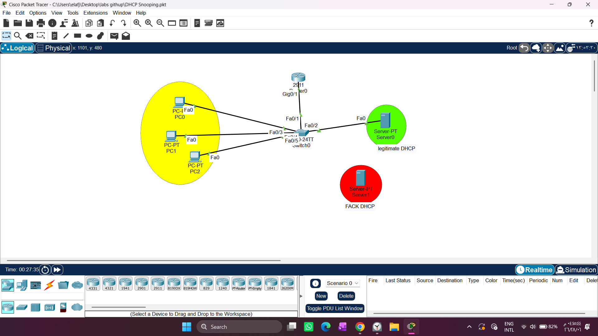

# Layer 2 Access Layer Security: Comprehensive IPSG, DAI, and DHCP Snooping Integration

1. Draw necessary topology, decorate and comment
2. Configure DHCP Snooping on the switch.
3. Enable IP ARP Inspection on the current VLAN used.
4. Configure trusted ports for IP ARP Inspection.
5. Configure IP verify source for untrusted ports.
==========================================================================================================================================================

## 1. Executive Summary & Philosophy

Securing the Local Area Network (LAN) at the access tier demands a multi-layered defensive strategy. Relying on a single protocol leaves security gaps that sophisticated attackers can exploit. This project demonstrates a **Defense-in-Depth** network model by binding three critical Cisco security features together: **DHCP Snooping**, **Dynamic ARP Inspection (DAI)**, and **IP Source Guard (IPSG)**.

These three protocols work sequentially as a unified traffic-filtering system, all relying on a single dynamic database to validate network traffic in real time.

[ DHCP Snooping ] (Base Layer)
  
                     │
                     └── Builds & Maintains: DHCP Snooping Binding Table
                     │   (Dynamic Database: Port ↔ MAC ↔ IP ↔ VLAN)
                     │
    ┌────────────────┴────────────────┐
    ▼                                 ▼
[ Dynamic ARP Inspection ]              [ IP Source Guard ]

Fights: ARP Spoofing                   Fights: IP/MAC Spoofing

Validates: Layer 2 ARP Control           Validates: Layer 3 Data Traffic


* **DHCP Snooping (The Baseline Database):** Acts as the fundamental information-gathering engine. It monitors the network's address assignment and builds a secure **Dynamic Binding Table** mapping: `Physical Port ↔ Hardware MAC Address ↔ Leased IP Address`.
* **Dynamic ARP Inspection (DAI - The Control Plane Guard):** Stops **ARP Spoofing and Poisoning** (Man-in-the-Middle attacks). It intercepts all incoming ARP packets on untrusted ports and cross-references them with the DHCP Snooping database to verify IP-to-MAC ownership before forwarding.
* **IP Source Guard (IPSG - The Data Plane Guard):** Prevents **IP/MAC Address Hijacking**. While DAI only validates ARP control packets, an attacker could bypass it by configuring a static spoofed IP address manually on their network card and sending standard IP traffic (e.g., Pings, HTTP data). IPSG dynamically creates a hardware-level filter on the port to block any traffic whose source parameters do not match the dynamic binding registry.

---

## 2. Lab Topology Diagram

The established network design below illustrates the local VLAN architecture, partitioning our legitimate infrastructure assets from untrusted access host lines.



---

## 3. Core Device Configurations & Scripting

### Step 1: Initializing the DHCP Snooping Engine
First, globally activate the snooping protocol and scope it to your active production broadcast domain (VLAN 1):
```text
Switch0(config)# ip dhcp snooping
Switch0(config)# ip dhcp snooping vlan 1


### Step 2: Implementing Dynamic ARP Inspection (DAI)
Activate ARP inspection on the VLAN. This step instructs the switch to instantly distrust and inspect all incoming ARP frames on all ports across this VLAN domain:

Switch0(config)# ip arp inspection vlan 1

# Defining the DAI Trust Boundary
Because the switch now systematically inspects every single ARP payload, 
legitimate default gateway routers and core server connections will be blocked unless their ports are explicitly marked as Trusted:

Switch0(config)# interface fastEthernet 0/2

Switch0(config-if)# ip arp inspection trust

Switch0(config-if)# exit

(Interfaces leading to verified corporate assets bypass inspection to maintain infrastructure delivery lanes).

# Diagnostic & Verification Command
To analyze traffic statistics, monitor interface trust properties, and view live verification drop counters, execute:

Switch0# show ip arp inspection interfaces

Note: This command serves as your engineering dashboard. 
It displays interface trust states (Trusted vs Untrusted), rate limiting values (defaulting to 15 packets-per-second on untrusted ports to prevent DoS via ARP flooding), 
and real-time statistics regarding dropped or forwarded frames.

#The Problem :
When attempting to apply IP Source Guard directly to the untrusted client access scopes (such as interface range fa0/3-24, gig0/1-2) using the standard command:

Switch0(config-if-range)# ip verify source

The Cisco Packet Tracer software CLI parser rejects the input, throwing an explicit validation error:

% Invalid input detected at '^' marker.

Key Architectural Rule: IP Source Guard (ip verify source) must only be deployed on Untrusted Access Ports where normal user endpoints sit.
If you accidentally apply it to a Trusted Infrastructure Uplink or Core Server interface, the switch will experience catastrophic packet loss because transit addresses coming from outside won't match the local switch's DHCP dynamic binding database.


