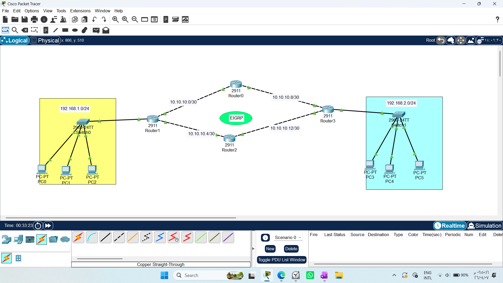
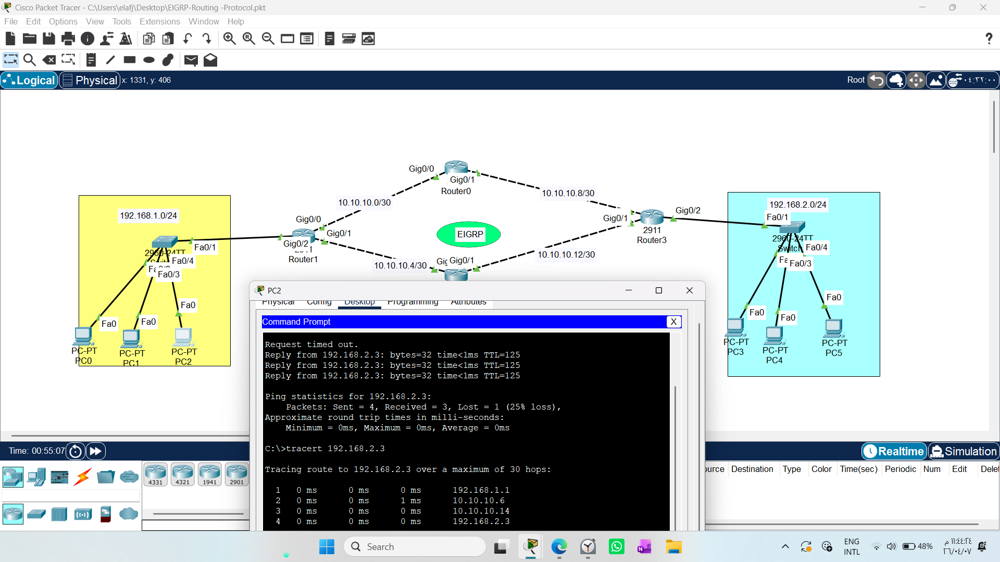

# CONFIGURING EIGRP

1. Draw necessary topology, decorate and comment
2. Configure IP addresses to the routers and hosts.
3. Configure default EIGRP in all the routers to advertise the directly connected network
4. Traceroute the path and ping the hosts.
----------------------------------------------------
 

# 1. Concept: Why EIGRP?
EIGRP (Enhanced Interior Gateway Routing Protocol) is a Cisco-proprietary hybrid protocol. It is engineered for fast convergence and high efficiency. Unlike RIP, it does not broadcast the whole routing table periodically; it only sends updates when a change occurs.

# 2. Engineering Key Concepts
* Neighbor Relationship : EIGRP routers establish trust via "Hello Packets." If a neighbor stops responding, the route is marked invalid immediately.

* DUAL Algorithm (The Brain): The "Diffusing Update Algorithm" calculates the best path using Bandwidth and Delay. It maintains a "Feasible Successor" (a pre-calculated backup path), allowing almost zero-second failover.

* Autonomous System (AS): A group of routers sharing the same AS number will exchange routing information.

# 3. Professional Configuration Template
```text
# Enter global configuration
Router(config)# router eigrp 10
# (10 is the AS number, must match across all routers)

# Disable auto-summary to maintain precise subnetting
Router(config-router)# no auto-summary

# Advertise locally connected networks
Router(config-router)# network 192.168.1.0 0.0.0.255
Router(config-router)# network 10.10.10.0  0.0.0.3
Router(config-router)# network [IP] [Wildcard]
Router(config-router)#no auto-summary
```
# 4. Verification & Troubleshooting
1- Neighbor Audit: Run show ip eigrp neighbors. This command verifies the "trust relationship" between your routers.

2- Routing Table Audit: Run show ip route. You should see routes marked with 'D', indicating they were learned via EIGRP.

3- Connectivity Testing: Use tracert to verify that traffic follows the optimal path calculated by DUAL.
 

# Conclusion:
EIGRP is the preferred choice for enterprise networks where stability and speed are critical. While Static Routing provides control and RIP provides simplicity, EIGRP provides the intelligence required to manage modern, complex network environments.

# Note: RIP vs. EIGRP Command Logic
It is a common misconception that the network command in RIP and EIGRP serves the same purpose. While the syntax is identical, the underlying mechanics differ significantly:

* In RIP: The network command acts as a "Broadcast/Multicast Trigger." It simply tells the router: "Listen to this network and shout your routing table updates out of all interfaces belonging to this range." It is a passive, periodic approach.

* In EIGRP: The network command acts as a "Neighbor Discovery & Activation Trigger." It tells the router: "Activate EIGRP on all interfaces within this range, start sending 'Hello' packets, and actively look for EIGRP-enabled neighbors to build a trusted relationship."

## Why this matters:
This distinction is crucial for network security and stability. EIGRP provides controlled, proactive neighbor discovery, whereas RIP provides passive, reactive updates. Understanding this enables engineers to design more robust, scalable network architectures.

# EIGRP Adjacency Mechanism (The "Hello" Protocol)
To establish a routing relationship, EIGRP routers do not just exchange tables; they build Adjacency (a trusted relationship) using "Hello Packets."

## What are Hello Packets?
These are small, lightweight packets sent periodically via multicast (224.0.0.10) to identify the router to its neighbors.

## What is inside the "Hello" packet?
Think of it as a "Digital Identity Card" containing:

* AS Number: Must match to form a relationship.

* K-Values: Mathematical metrics for path calculation (Bandwidth/Delay).

* Hold Time: A countdown timer. If no new Hello packet is received within this time, the neighbor is declared dead, and the route is instantly removed.

## How is "Trust" formed?

1- Exchange: Routers send Hello packets to discover each other.

2- Validation: Each router verifies that parameters (AS Number, K-values) match its own.

3- Acknowledgement: Once verified, they exchange routing topology data.

4- Persistence: They continuously send Hello packets to ensure the "pulse" of the network remains active.

### Significance:
This mechanism ensures Instant Convergence. Unlike RIP, which waits for periodic updates, EIGRP knows the status of its neighbors at all times. If a link fails, the "Hello" packets stop, the "Hold Time" expires, and the DUAL algorithm immediately switches to a backup path.

# "Engineering Perspective on Auto-Summary"
"While EIGRP is highly intelligent, the `auto-summary` feature is a legacy behavior that assumes classful addressing. In modern networks using VLSM, this feature leads to routing loops and ambiguous path advertisement. Therefore, disabling it via `no auto-summary` is not just a preference; it is a professional requirement to ensure precise, predictable routing and to support complex subnetting architectures."

# "Advanced Tip: Using Wildcard Masks"
"While EIGRP defaults to classful subnet masks when the `network` command is used without a mask, we can utilize Wildcard Masks to explicitly define which interfaces participate in the EIGRP process. This provides granular control and enhanced security, ensuring that routing updates are only exchanged on specific, intended interfaces."

### Why it is "Not Just Important, but Essential":

Interface Granularity: Without a Wildcard Mask, EIGRP defaults to classful boundaries, potentially enabling the routing process on interfaces that should remain private. By using `network [IP] [Wildcard]`, you explicitly define exactly which interface participates.

Security (Preventing Leaks): In a production environment, you never want your router to inadvertently send EIGRP updates out of a port connected to an end-user device. Using a Wildcard Mask (`0.0.0.0`) ensures that the EIGRP process is bound only to the intended management or core interface.

Predictable Network Topology: It eliminates the "guessing" mechanism of the router, ensuring that the network topology is exactly as you designed it, preventing unintended neighbors from forming.


# Wildcard Masks: An Engineering Deep Dive
### 1. Concept: Beyond the Subnet Mask
While the Subnet Mask is used to define a network boundary for IP addressing, the Wildcard Mask is the engineer's tool for selective control. It is used in dynamic routing protocols (like EIGRP) and security policies (ACLs) to define exactly which bits in an IP address must match and which are "don't care."

### 2. The Binary Logic (The "0" and "1" Rule)
The Wildcard Mask is the mathematical inverse of a Subnet Mask:

0 (Match): Tells the router: "The corresponding bit in the IP address must match exactly."

1 (Ignore/Don't Care): Tells the router: "I don't care what this bit is, skip it."

### 3. Calculating the Mask: The "Subtraction Method"
To convert any Subnet Mask to a Wildcard Mask, subtract the Subnet Mask from the "all-ones" value (255.255.255.255).

### 4. Why Professional Engineers Use Wildcards
In a production network, using a Wildcard Mask is not optional—it is a Precision Control requirement:

Interface Granularity: It allows us to bind the routing process to a specific interface rather than the entire range of an IP class.

Security (Binding): It prevents routing updates from leaking into unintended segments of the network (e.g., ports connected to end-users).

Flexibility: Unlike Subnet Masks that require contiguous bit patterns, Wildcard Masks allow for Non-contiguous filtering, enabling engineers to create complex, highly specific traffic policies.

### 5. The Engineering Mindset
"Use Subnet Masks for defining where a host lives, and use Wildcard Masks for defining where the traffic is allowed to go." 


