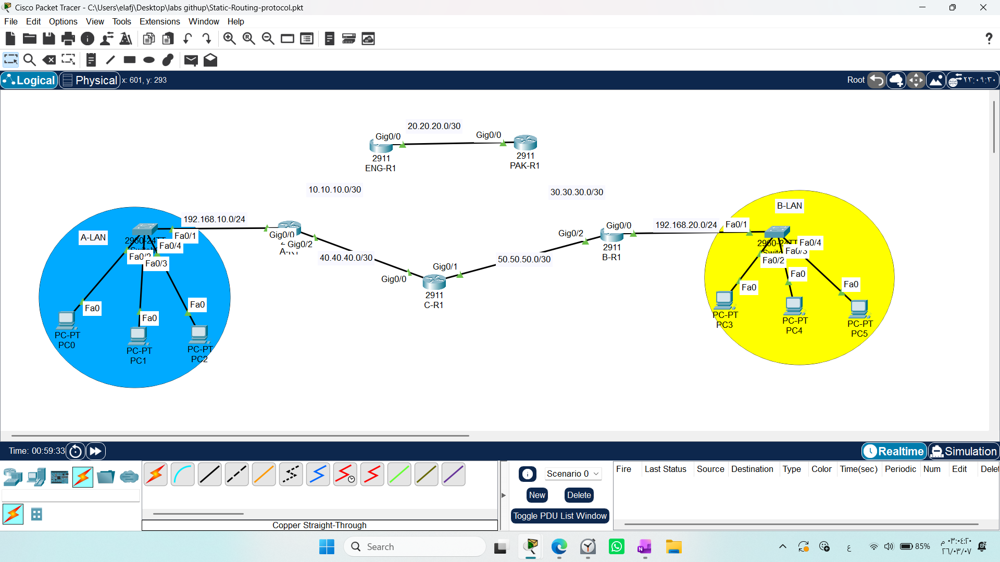
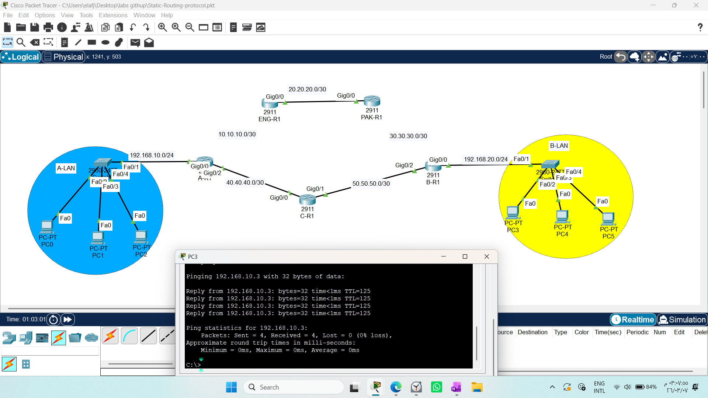
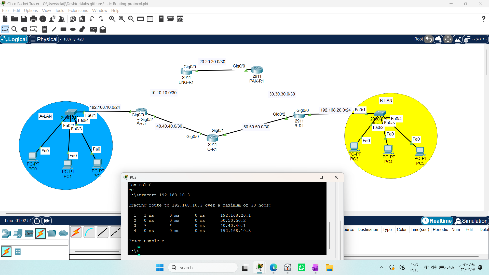
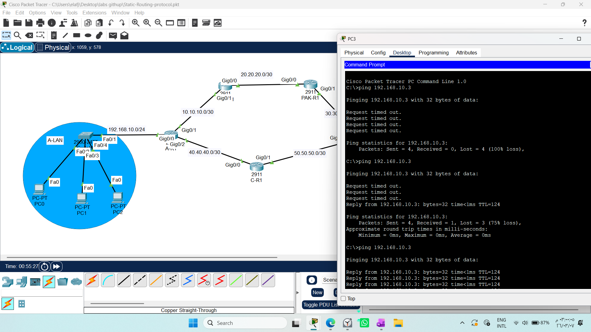
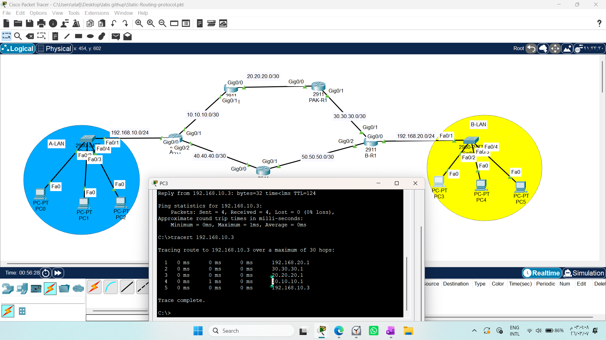

# CONFIGURING STATIC ROUTES 

1. Draw necessary topology, decorate and comment
2. Configure IP addresses to the routers and hosts.
3. Configure forward and backward static routes from A-LAN to B-LAN.
N/B Make sure to configure forward route to use the outgoing router interface.
N/B Make sure to configure backward route to use the IP add of the next hop.
4. Test communication from A-LAN to B-LAN, traceroute the path.

## CONTINUATION

5. Add another router as C-R1 between A-LAN to B-LAN
6. Configure forward and backward floating static routes from A-LAN to B-LAN
7. Traceroute the path from A-LAN to B-LAN
8. Disable the primary path and test communication, ping tracert

 

# Advanced Lab: Floating Static Routing (Network Resilience)

In this lab, we implement **Floating Static Routing** to achieve high availability and fault tolerance. This is a critical concept for network engineers responsible for "Disaster Recovery" and ensuring that a network never goes offline.

---

## 1. Concept: What is Floating Static Route?
A Floating Static Route is a backup path configured with a higher **Administrative Distance (AD)** than the primary path. 
* **The Mechanism:** The router only injects the floating route into the routing table if the primary route fails (i.e., the primary interface goes down).
* **The "Floating" Nature:** It remains "hidden" or "inactive" in the background while the primary path is healthy, effectively acting as a failover mechanism.

---

## 2. The Logic: Administrative Distance (AD)
The router chooses the best path based on the lowest **AD**.
* **Primary Path:** Default Static AD is **1**.
* **Floating (Backup) Path:** We manually set the AD to a higher value (e.g., **5, 10, or 20**).

Since `1 < 5`, the router will always prefer the primary path. If the primary path disappears, the router "promotes" the floating route to the routing table.

---

## 3. Configuration Steps
To configure a backup path to network `192.168.20.0/24`:

### Primary Path (Always active)
`Router(config)# ip route 192.168.20.0 255.255.255.0 [Next_Hop_IP]` 
*(Default AD is 1)*

### Floating Path (Backup)
`Router(config)# ip route 192.168.20.0 255.255.255.0 [Backup_Next_Hop_IP] 10`
*(Setting AD to 10 makes it the backup)*

---

## 4. Verification & Testing
1. **Initial State:** Run `show ip route`. You will only see the primary static route.
2. **Failure Simulation:** Administratively shut down the interface of the primary link (`shutdown`).
3. **Verification:** Run `show ip route` again. You will see the primary route disappear and the **Floating Route (AD 10)** immediately appear and take over the traffic.
4. **Restoration:** Turn the primary interface back on (`no shutdown`). The Floating Route will automatically disappear from the table as the primary route resumes control.
 
 
 

---
## Testing Failover
* Normal State: Run tracert. Traffic should follow the primary path.

* Failure State: Shut down the primary interface (interface [id], then shutdown).

* Verification: Run tracert again. The traffic should automatically shift to the backup path.

* Recovery: Re-enable the interface (no shutdown). The primary path should reclaim priority immediately.
 
 
  

## 6. Security & Availability Impact
As a security student, you must recognize that:
* **Availability is a core Security pillar (CIA Triad):** A network that stops working is a security vulnerability. 
* **Automation:** Floating routes provide automated failover, reducing the time a system is vulnerable or unreachable during a link failure.

---
