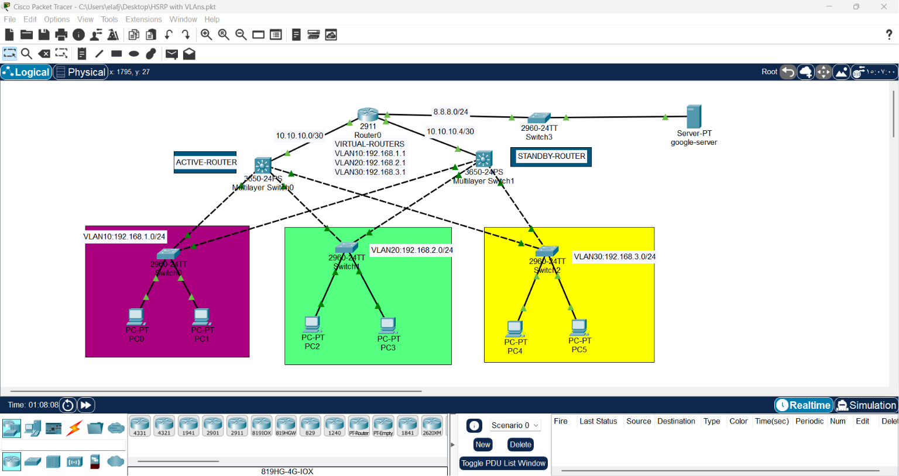
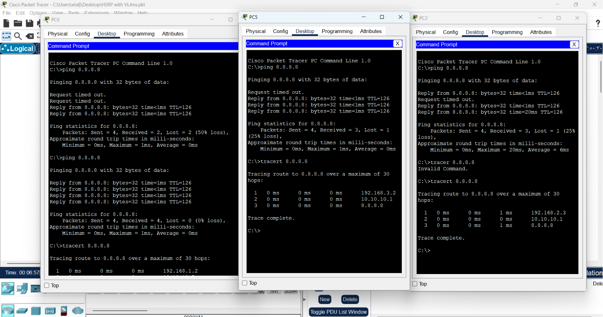
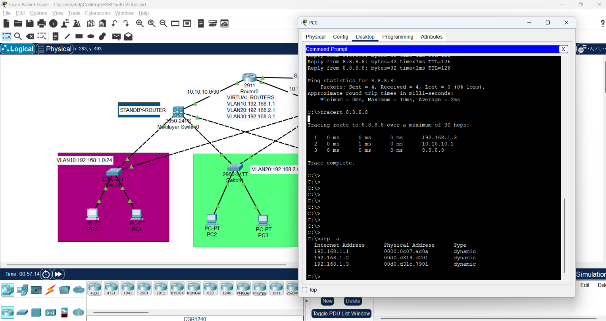

# Network Lab: HSRP with Multiple VLANs Implementation

1. Draw necessaify topology, decorate and comment
2. Configure IP addresses to the routers and the multilayer switches.
3. Configure VLANs, name and assign to the interfaces on the access switches and specify trunk ports ..
4. Create all the three VLANs on the two multilayer switches and specify trunk ports.
5. Enable routing and Configure inter-VLAN routing on the MLSW and specify HSRP parameters on the SVIs
6. Configure OSPF.
7. Ping and traceroute the google server.
8. Disable any SVI on the Active router and Ping and traceroute the google server.



This repository provides a comprehensive guide and engineering analysis for configuring **HSRP (Hot Standby Router Protocol)** across multiple **VLANs** using **Multilayer Switches (MLSW)**. 

---

## 1. Engineering Concept
Network availability is a core requirement in enterprise infrastructure. This lab implements a redundant gateway architecture to eliminate "Single Points of Failure."

* **HSRP (Gateway Redundancy):** Instead of a single static gateway, we create a "Virtual Gateway" shared between two Multilayer Switches. If the **Active** switch fails, the **Standby** switch assumes control instantly.
* **VLAN Segmentation:** Traffic is partitioned into VLANs (10, 20, 30), each with a dedicated HSRP group and Virtual IP.


---

## 2. Implementation Methodology

### A. Core Configuration Steps
1. **Infrastructure Prep:** Configure trunks and VLANs on all switches.
2. **Layer 3 Routing:** Enable `ip routing` on Multilayer Switches to allow inter-VLAN communication.
3. **SVI Setup:** Create Switched Virtual Interfaces (SVIs) and assign physical IPs.
4. **HSRP Configuration:** Configure unique HSRP groups for each VLAN:
```bash
# VLAN 10
interface vlan 10
  standby 10 ip 192.168.1.1   # Group 10
  standby 10 priority 110
  standby 10 preempt

# VLAN 20
interface vlan 20
  standby 20 ip 192.168.2.1   # Group 20
  standby 20 priority 110
  standby 20 preempt

# VLAN 30
interface vlan 30
  standby 30 ip 192.168.3.1   # Group 30
  standby 30 priority 110
  standby 30 preempt
  ``` 
  # Note
: Using a unique group number (e.g., 10, 20, 30) for each VLAN is critical to prevent routing loops and IP conflicts.

## The Interaction with Spanning Tree Protocol (STP)
In environments with multiple redundant paths, STP may block ports to prevent loops. If ports are blocked, HSRP "Hello" packets may not be received, causing state confusion (e.g., Speak to Standby transitions or duplicated address errors).

Engineering Fix: Always manually set the Root Bridge for your VLANs is Active MLSW:
```text
(config)# spanning-tree vlan 10,20,30 root primary
```
And always manually set the redundant Root Bridge for your VLANs is Standby MLSW:
```text
(config)# spanning-tree vlan 10,20,30 root secondary
```
## HSRP State Management
`Speak State`: The device is listening and negotiating status. It should quickly transition to `Active` or `Standby`.

`Hello Packets`: These heartbeat messages (sent to multicast address `224.0.0.2`) are vital. If configurations are incorrect (e.g., wrong group number), these packets cause address conflicts `(%IP-4-DUPADDR)`.

## 4. Verification & Troubleshooting Commands

| Command | Purpose |
| :--- | :--- |
| `show standby brief` | Verify HSRP state (Active/Standby) and Virtual IP status. |
| `show ip route` | Inspect the routing table to ensure path connectivity. |
| `arp -a` (on PC) | Verify the Virtual MAC address mapping for the gateway. |
| `show spanning-tree vlan X` | Confirm port status and Root Bridge roles. |




### Engineering Note on Verification: 
It is important to note that traceroute might display the physical interface IP of the Active router rather than the HSRP Virtual IP. This is expected behavior as the router identifies itself by its physical IP in ICMP responses. The true verification of HSRP functionality is achieved by inspecting the ARP table on the client (verifying the Virtual MAC Address) and performing a real-time failover test (Ping continuity during interface shutdown).


## 5. Resilience Test Procedure
To validate the architecture:

1-Baseline: Confirm connectivity to the remote server.

2-Stress Test: Administratively `shutdown` the SVI (VLAN interface) of the Active Switch.

3-Monitor: Observe the Standby switch transitioning to `Active` via `show standby brief`.

4-Validation: Perform a continuous `ping` `(ping -t)` during the failover; notice minimal packet loss, proving the resilience of the design.



