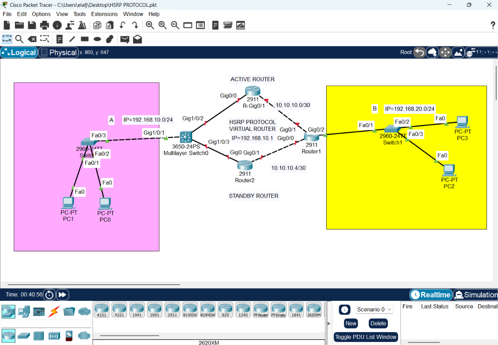
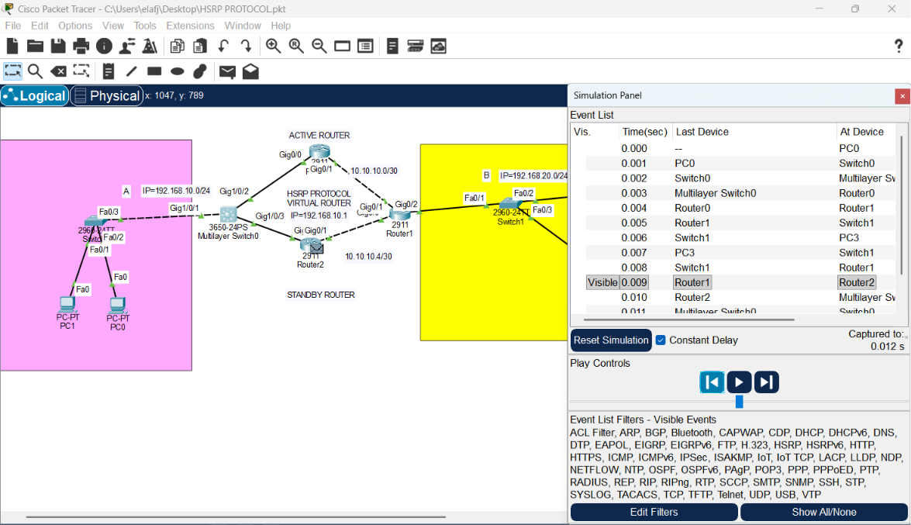
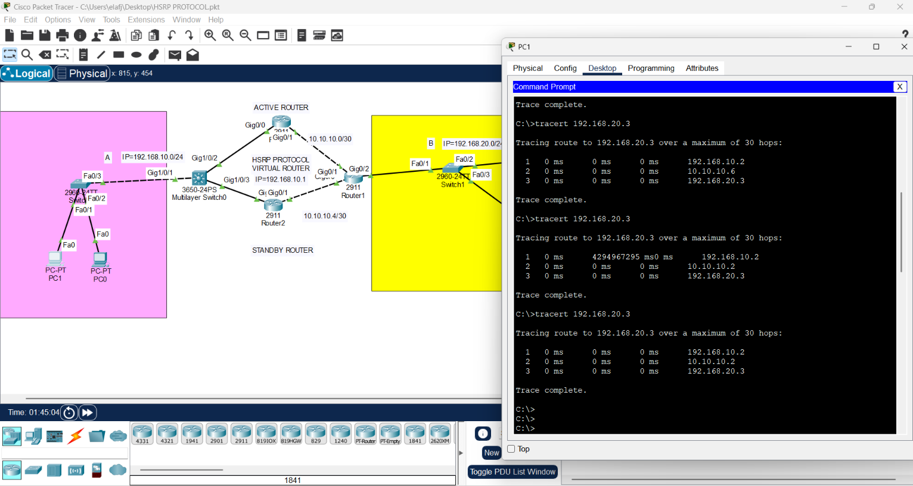
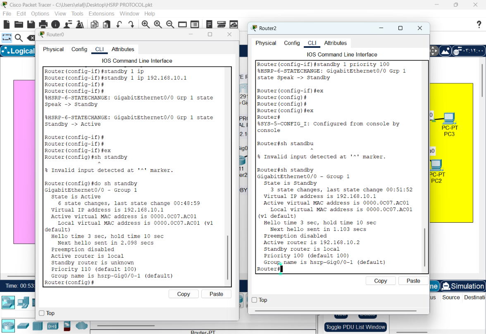
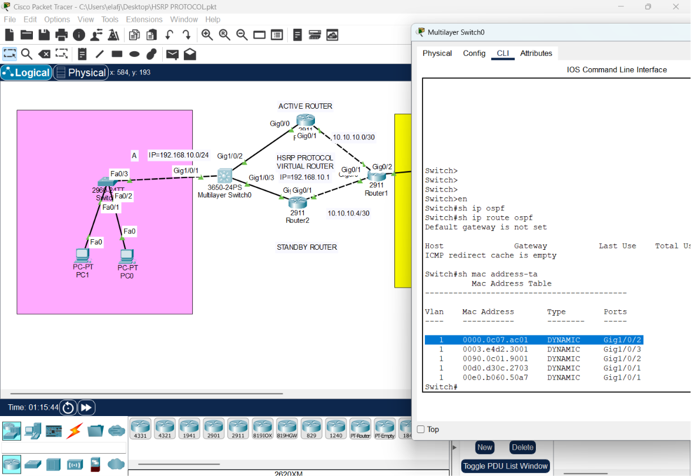
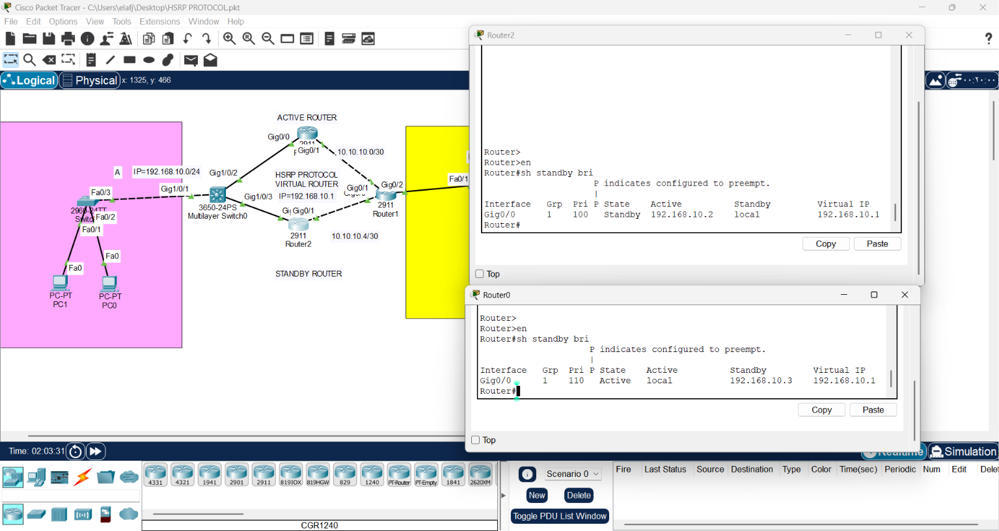
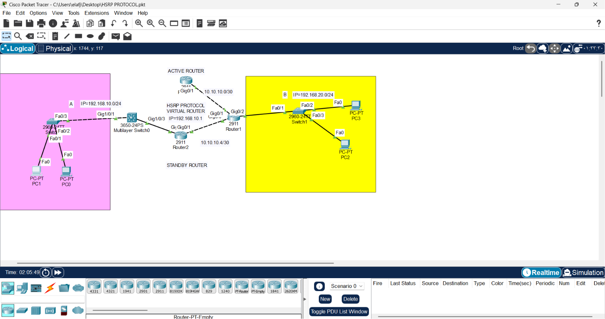
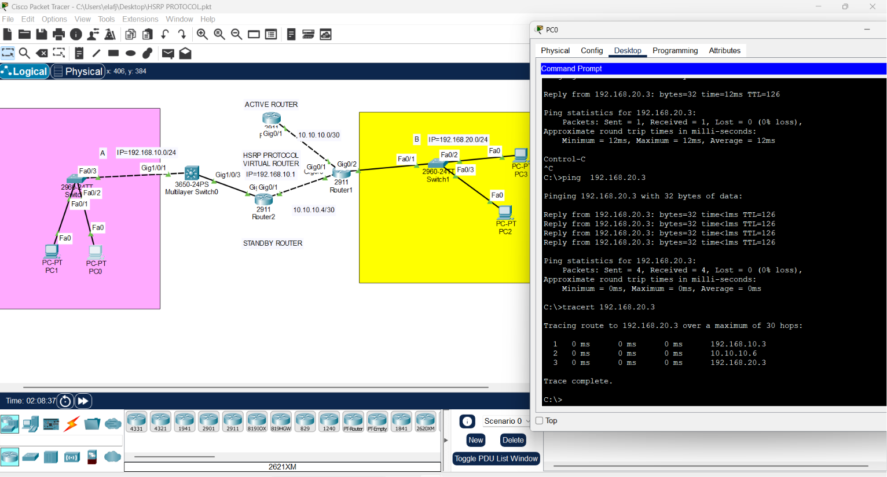

# CONFIGURING HSRP on a Router

1. Draw necessary topology, decorate and comment
2. Configure IP addresses to the routers and specific HSRP parameters on the two routers.
3. Configure IP addresses to hosts and make site-A LAN use virtual router as the default gateway.
4. Configure ospf to advertise routes.
5. Ping and traceroute from A to B
6. Disconnect link through the Active Router.
7. Ping and traceroute from A to B again

# High Availability Network Infrastructure: HSRP & OSPF Implementation

This repository documents the architecture of a redundant network design using **HSRP (Hot Standby Router Protocol)** for gateway redundancy and **OSPF (Open Shortest Path First)** for dynamic routing.


---

## 1. Engineering Concept
Network uptime is critical. To prevent a "Single Point of Failure" at the network edge, we implement HSRP.

* **HSRP (Gateway Redundancy):** Allows two routers to function as a single "Virtual Router." If the Active router fails, the Standby router takes over the Virtual IP (VIP) instantly, ensuring clients never lose their gateway.
* **OSPF (Path Optimization):** Dynamically manages routing tables between routers to ensure the fastest path to destinations (like Site B).


---

## 2. Implementation Logic

### A. HSRP Configuration (Active vs. Standby)
We assign the routers a virtual IP that the internal PCs will use as their default gateway.

**Active Router (Router 1):**
```bash
Router(config-if)# interface gig0/0
Router(config-if)# ip address 192.168.10.2 255.255.255.0
Router(config-if)# standby 1 ip 192.168.10.1    # The Virtual Gateway
Router(config-if)# standby 1 priority 110       # Higher priority makes it Active
Router(config-if)# standby 1 preempt            # Ensures it reclaims role if it reboots (I prefare do not use this command because we want to make the network stabile as match as posible)

#Standby Router (Router 2):
Router(config-if)# interface gig0/0
Router(config-if)# ip address 192.168.10.3 255.255.255.0
Router(config-if)# standby 1 ip 192.168.10.1
Router(config-if)# standby 1 priority 100       # Lower priority

# OSPF Configuration
To advertise routes across the network so Site A can communicate with Site B.
Router0(config)#router ospf 1
Router0(config)#router-id 1.1.1.1
Router0(config-router)# network 192.168.10.0 0.0.0.255 area 0
Router0(config-router)# network 10.10.10.0 0.0.0.3 area 0

Router2(config)#router ospf 1
Router2(config)#router-id 2.2.2.2
Router2(config-router)# network 192.168.10.0 0.0.0.255 area 0
Router2(config-router)# network 10.10.10.4 0.0.0.3 area 0

Router1(config)#router ospf 1
Router1(config)#router-id 3.3.3.3
Router1(config-router)# network 192.168.20.0 0.0.0.255 area 0
Router1(config-router)# network 10.10.10.0 0.0.0.3 area 0
Router1(config-router)# network 10.10.10.4 0.0.0.3 area 0
```
## 3. Engineering Insights: HSRP vs. OSPF Interaction
In this topology, it is crucial to understand the distinct roles and the dynamic nature of the protocols:

* Separation of Duties: * HSRP manages the "exit door" for local clients (Default Gateway).

* OSPF manages the "roadmap" between routers (End-to-End Path Determination).

* Dynamic Path Adaptation:
During verification, it was observed that return traffic paths shifted dynamically during traceroute testing (e.g., from Router 2 to Router 1). This behavior confirms the dynamic nature of OSPF. Unlike static routing, OSPF continuously re-calculates the best path based on the Link State Database. This demonstrates how OSPF adapts to network conditions to ensure optimal routing, working in harmony alongside HSRP’s gateway redundancy.



 
## 4. Verification & Troubleshooting

### Verification & Troubleshooting Commands

| Command | Purpose |
| :--- | :--- |
| `show standby brief` | Check HSRP state (Active/Standby) and Virtual IP status. |
| `traceroute` | Track the flow of outbound and return traffic. |




## 5. Stress Test Procedure
### To validate the architecture:

* Initial State: Observe outbound path via Active Router (Router 1) using `traceroute`.

* Failover Test: Administratively shut down the interface of the Active Router.

* Transition: Observe the Standby router transition to "Active" mode.

* Validation:`Ping` the remote network; notice seamless continuity in connectivity.

## Disconnect link through the Active Router and Ping and traceroute from A to B again




