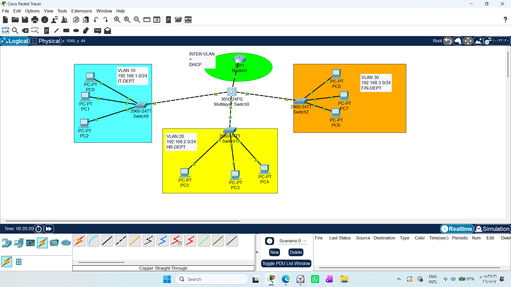
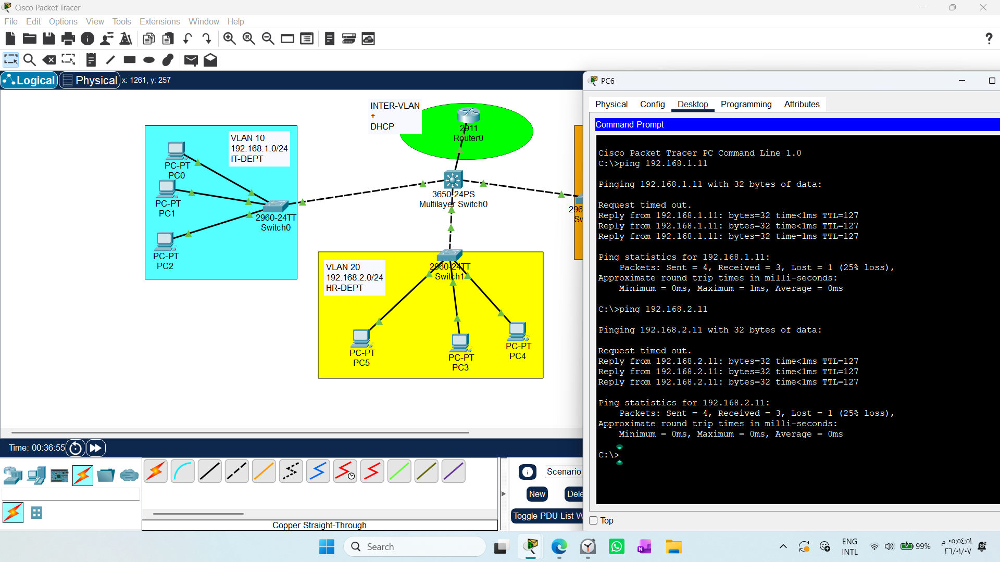

# Inter-VLAN Routing & DHCP Implementation
1. Draw necessary topology, decorate and comment
2. Configure VLANs, name them, assign ports and configure trunks between switches and to the router.
3. Create subinterfaces on the router, bind them to respective VLAN ID, and assign the IP address.
3. Create DHCP pools, assign network address, default gateway and dns address.
4. Exclude ranges of IP address that shoul not be assigned dynamically.
5. Go to every PC and change option to DHCP.

# 1. Project Overview
This project focuses on implementing Inter-VLAN Routing and DHCP services using the Router-on-a-Stick model. The network topology includes a Cisco 2911 Router, a 3650 Multilayer Switch (MLS) acting as a core switch, and multiple 2960 Access Switches.

# 2. Engineering Insights & Technical Notes
## A. The Role of the Multilayer Switch (MLS) in this Topology
In this specific design, the Multilayer Switch is operating in Layer 2 mode.

Why? Even though the 3650 MLS is capable of L3 routing, we centralized the intelligence (Routing and DHCP) on the router to maintain a single management point.

Operational Role: It functions as an Aggregation point. It performs Trunking to forward tagged frames between the Access Switches and the Router, without performing L3 switching (ip routing is disabled).

## B. The "VLAN Database" Necessity
A common pitfall for beginners is failing to define VLANs on intermediate switches.

The Rule: You must define all used VLANs on the Multilayer Switch.

Why? If a VLAN (e.g., VLAN 10) is not active in the switch’s database, the switch will treat frames with that VLAN tag as "unknown/garbage" and drop them. Furthermore, Trunk ports will only forward VLANs that exist in the local database.
```text
Switch(config)# vlan 10
Switch(config-vlan)# name IT
Switch(config-vlan)# exit

Switch(config)# vlan 20
Switch(config-vlan)# name HR
Switch(config-vlan)# exit

Switch(config)# vlan 30
Switch(config-vlan)# name FIN
```
## C.Technical Analysis: The "Layer 2 Mode" of the Multilayer Switch
In this specific design, we have deliberately restricted the Multilayer Switch (MLS) to operate in Layer 2 mode, while assigning all "intelligence" (Routing and DHCP) to the Edge Router.

### The Role of the MLS in this Topology
The MLS functions as a high-performance "Connectivity Hub." Its role is two-fold:

Aggregation: Acting as the central meeting point for all departmental access switches.

Transparent Trunking: It receives tagged frames from access switches and forwards them "as-is" to the router via the trunk link, and vice versa. It does not perform any L3 switching decisions itself.

### Required Configurations for this Mode
To force an MLS to behave strictly as a Layer 2 switch:

Disable L3 Routing: Ensure the ip routing command is not active. This prevents the switch from interfering with the routing process.

Trunking: All ports connecting to the Access Switches and the Router must be configured as trunk ports.

SVI Usage: We do not create SVIs (Switch Virtual Interfaces) for the data VLANs, as the default gateways reside on the router’s sub-interfaces.

Note: An SVI for management (e.g., interface vlan 1) is optional but recommended for remote access (SSH/Telnet) to the device.

### Data Flow Scenario
1- DHCP Request: A PC sends a DHCP Discover broadcast. The MLS tags this frame and forwards it through the trunk to the Router. The Router identifies the VLAN, processes the request, and assigns an IP address from the corresponding pool.

2- Inter-VLAN Communication: When a PC in the IT department needs to talk to the HR department, the MLS does not route the traffic. Instead, it forwards the traffic to the Router (the gateway). The Router performs the inter-VLAN routing and sends the traffic back through the trunk to the destination VLAN.

## D. Design Rationale: Why use a Router alongside an MLS?
Some may ask: If we have an MLS, why use a Router for Inter-VLAN routing?

1- Edge/Gateway Logic: The Router is superior for WAN/Internet connectivity, NAT, and advanced firewall policies.

2- Separation of Concerns:

* MLS: Acts as the "City Mayor," handling internal high-speed switching between departments.

* Router: Acts as the "Security Guard" at the gate, managing external traffic and security.

3- Future-Proofing: While currently configured as Router-on-a-Stick, this setup allows for a seamless transition. In the future, we can enable ip routing on the MLS and create SVIs (Switch Virtual Interfaces) to handle internal routing at hardware speed, leaving the router strictly for Internet traffic.
## 3. Summary for Troubleshooting
1- Data Path: A PC sends a DHCP Discover. The Switch identifies the VLAN, tags the frame, and forwards it to the Router. The Router checks the sub-interface, recognizes the VLAN, and assigns the correct IP from the corresponding DHCP pool.

2- Key Management: For remote management of the switch, an SVI (e.g.,` interface vlan 1`) with an IP address is necessary, even if L3 routing is disabled.

3- Professional Best Practice: This hybrid configuration is standard in enterprise networks where the Core/Distribution layer manages traffic, and the Edge Router handles external boundaries.
## 4. Practical Configuration (CLI)
### A. Switch Configuration (Multilayer Switch)
These commands define the VLANs and configure the trunking ports.
```text
# Define VLANs
Switch(config)# vlan 10
Switch(config-vlan)# name IT-DEPT
Switch(config)# vlan 20
Switch(config-vlan)# name HR-DEPT
Switch(config)# vlan 30
Switch(config-vlan)# name FIN-DEPT

# Configure Trunks to Access Switches and Router
Switch(config)# interface range gigabitEthernet 1/0/1-4
Switch(config-if-range)# switchport trunk encapsulation dot1q
Switch(config-if-range)# switchport mode trunk
```
## NOTE :The "VLAN Database" Necessity
You must define all VLANs on the Multilayer Switch database. If a VLAN is not active in the switch's database, the switch will drop all tagged frames associated with that VLAN, and Trunk ports will refuse to carry its traffic.

### B. Router Configuration (Router-on-a-Stick & DHCP)
These commands configure the sub-interfaces and DHCP pools.
```text
# Configure Sub-interfaces
Router(config)# interface gigabitEthernet 0/0.10
Router(config-subif)# encapsulation dot1Q 10
Router(config-subif)# ip address 192.168.1.1 255.255.255.0

Router(config)# interface gigabitEthernet 0/0.20
Router(config-subif)# encapsulation dot1Q 20
Router(config-subif)# ip address 192.168.2.1 255.255.255.0

Router(config)# interface gigabitEthernet 0/0.30
Router(config-subif)# encapsulation dot1Q 30
Router(config-subif)# ip address 192.168.3.1 255.255.255.0

# Configure DHCP Pools
Router(config)# ip dhcp pool IT-DEPT
Router(dhcp-config)# network 192.168.1.0 255.255.255.0
Router(dhcp-config)# default-router 192.168.1.1
Router(dhcp-config)# dns-server 8.8.8.8

Router(config)# ip dhcp pool HR-DEPT
Router(dhcp-config)# network 192.168.2.0 255.255.255.0
Router(dhcp-config)# default-router 192.168.2.1
Router(dhcp-config)# dns-server 8.8.8.8

Router(config)# ip dhcp pool FIN-DEPT
Router(dhcp-config)# network 192.168.3.0 255.255.255.0
Router(dhcp-config)# default-router 192.168.3.1
Router(dhcp-config)# dns-server 8.8.8.8

# Exclude reserved IPs
Router(config)# ip dhcp excluded-address 192.168.1.1 192.168.1.10
Router(config)# ip dhcp excluded-address 192.168.2.1 192.168.2.10
Router(config)# ip dhcp excluded-address 192.168.3.1 192.168.3.10
```
### Troubleshooting Checklist
* Verify VLANs: Run `show vlan brief` on the MLS to ensure all IDs are present and active.

* Verify Trunks: Run `show interfaces trunk` to ensure the correct VLANs are allowed.

* Verify Routing: Run `show ip interface brief` on the Router to confirm sub-interfaces are "up/up".

* Connectivity: Use `ping` from a PC to its default gateway to verify the end-to-end path.




