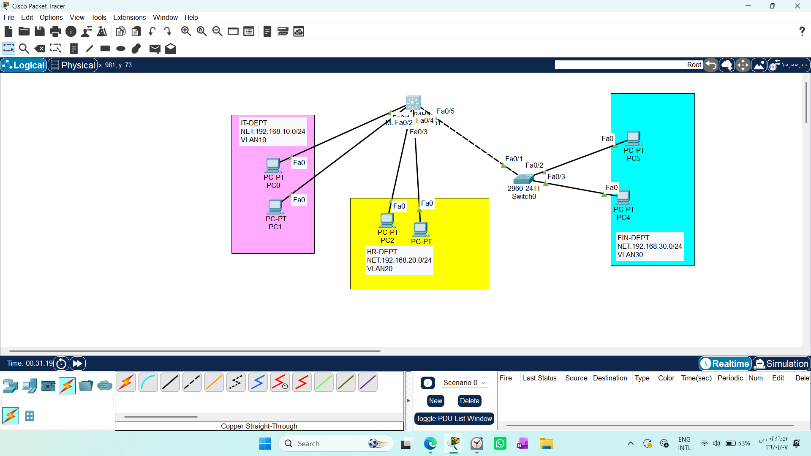
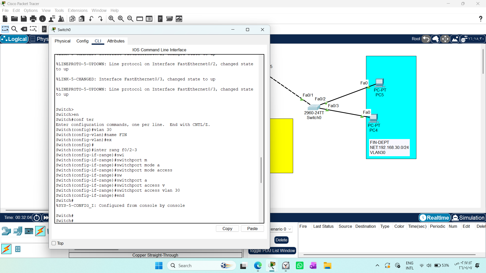
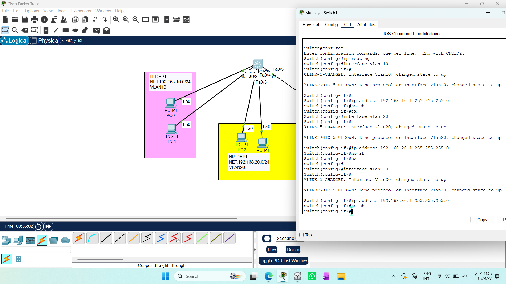
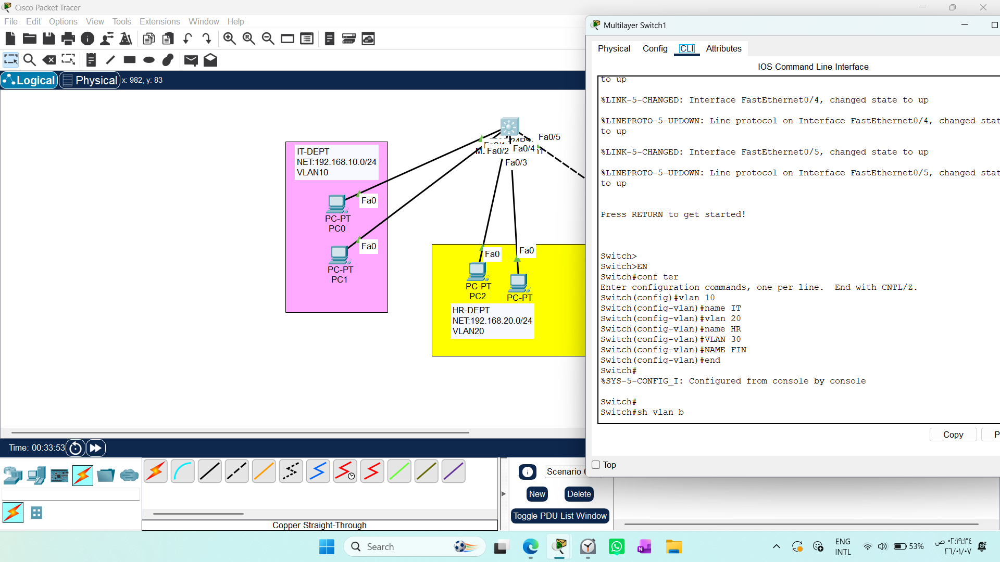
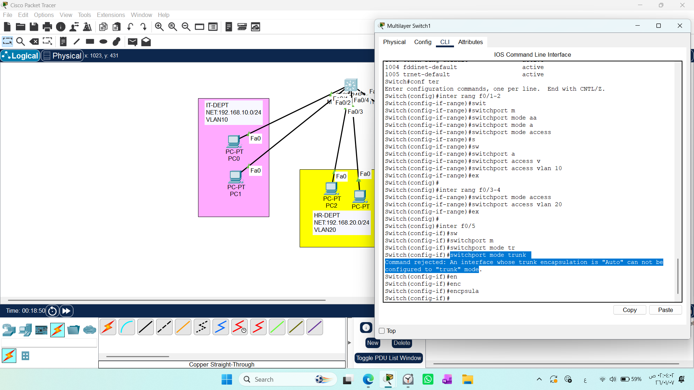
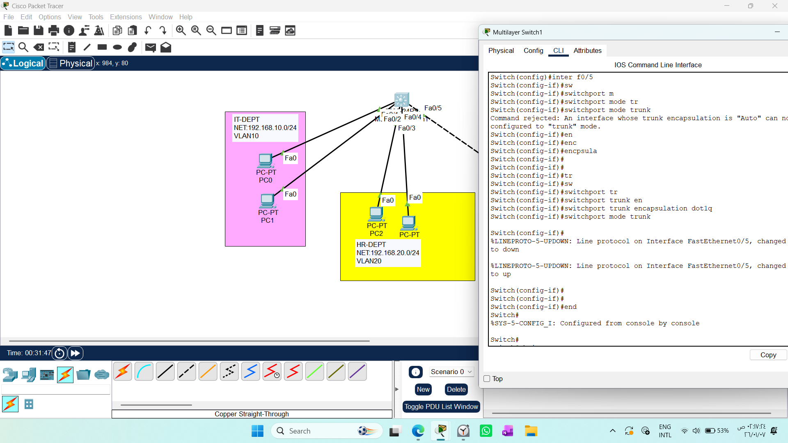
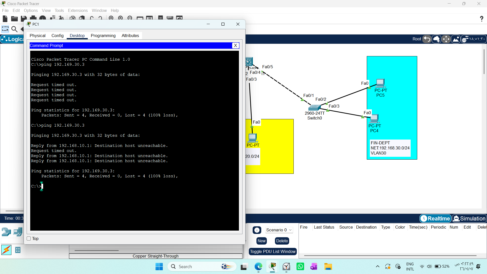
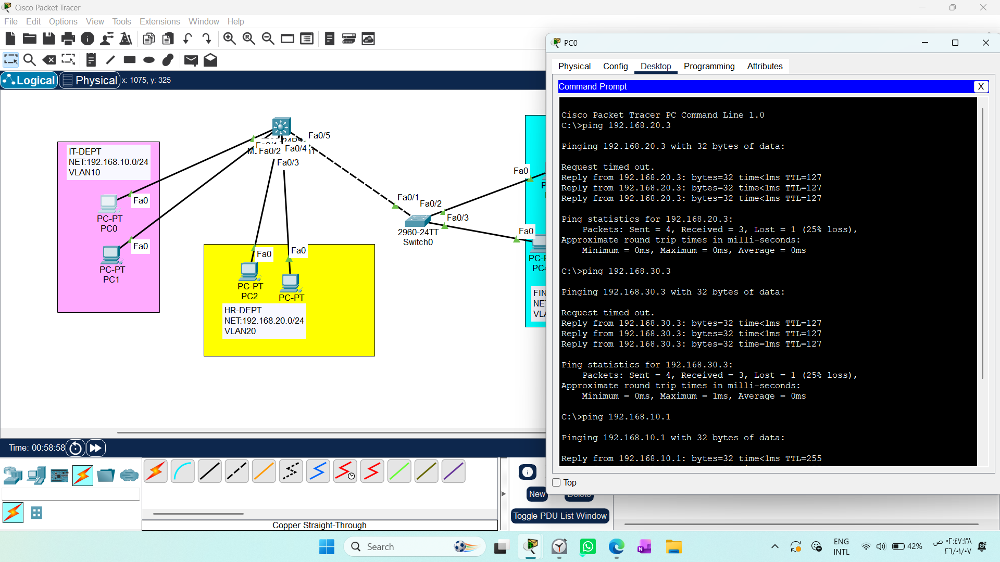
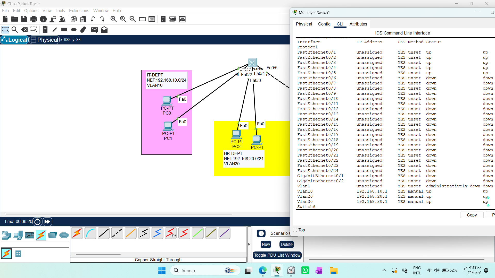

# CONFIGURING INTER-VLAN ROUTING- USING L3SW OR SVI

1. Draw necessary topology, decorate and comment
2. Configure VLANs and assign VIDs to the switchports as per the respective VLAN.
3. Configure trunk on the link connecting the two switches.
4. Configure IP addresses to the PC as per the subnet- configure default gateway in advance, use first ip
5. Try to ping hosts in different VLANs --- this should not work.
6. Configure SVIs on the 13sw and assign IP address of the subnet.
7. Ensure the IP address of each SVI is the default gateway of each VLAN subnet.
8. Enable IP routing
9. Try to ping hosts in different VLANs --- this should work.

# 1. Concept & Architecture
Traditional inter-VLAN routing (Router-on-a-Stick) often creates a bottleneck. Moving to a Layer 3 (Multilayer) Switch allows for hardware-based routing, which is significantly faster and more scalable for enterprise networks.
### The Role of SVI (Switch Virtual Interface)
An SVI is a logical interface that acts as the Default Gateway for a specific VLAN.
* Function 1 (Gateway): Enables routing between different VLANs within the switch.
* Function 2 (Management): Allows remote access (SSH/Telnet) to the switch.
# 2. Step-by-Step Configuration Strategy
To successfully deploy this, we followed a logical order to ensure network stability:

### Access Layer Setup (L2 Switch): Configure VLANs and assign access ports to end-devices.

### Trunking: Establish a trunk link between the L2 and L3 switches to allow inter-VLAN traffic.


.png)

### Core Routing Setup (L3 Switch):

* Enable global routing: ip routing.

* Create SVIs for each VLAN: interface vlan [ID].

* Assign IP addresses (Gateways).


## Note:
Always define all VLANs on the L3 switch, even if they are physically connected to an L2 switch downstream. The L3 switch must know about every VLAN to provide a gateway for them.


# 3. Critical Configuration Nuances (Learning Insights)
Troubleshooting the "Encapsulation" Error
When configuring a trunk on L3 switches, you may encounter:
Command rejected: An interface whose trunk encapsulation is "Auto" cannot be configured to "trunk" mode.

Solution: Explicitly set the encapsulation type before setting the mode:
```text
(config-if)# switchport trunk encapsulation dot1q
(config-if)# switchport mode trunk
```



### Routed Ports (no switchport) vs. SVIs
* SVI (switchport): Used for connecting users and performing Inter-VLAN routing.

* Routed Port (no switchport): Used to connect the switch to a router or another L3 switch in a direct routed link. It behaves exactly like a router interface and ignores VLAN tags.
# 4. Comparison Table: RoaS vs. L3 SVI

| Feature | Router-on-a-Stick (RoaS) | Multilayer Switch (SVI) |
| :--- | :--- | :--- |
| **Primary Device** | Router + L2 Switch | L3 Multilayer Switch |
| **Routing Logic** | Software-based (Slow) | Hardware-based/ASIC (Very Fast) |
| **Scalability** | Limited (Bottleneck) | High (Enterprise Standard) |
| **Best Use** | Small labs / Offices | Modern scalable corporate networks |

# 5. Troubleshooting Common Issues
If you encounter `Destination host unreachable`:
1- Check Default Gateway: Ensure the PC's Gateway matches the SVI IP of its VLAN.

2- ARP Cache: Use `arp -d ` in the PC command prompt to clear stale cache entries.

3- Bidirectional Path: Remember that PING requires a successful round trip. Both the sender and receiver must have their Default Gateways configured correctly.


# Reflection
Working through this lab, we learned that:

Hierarchy matters: Start from the edge (L2) and move to the core (L3).

Order of operations: ip routing must be enabled, or the SVI will stay "dormant."

Visualization: Using simulation mode to trace ICMP packets helps visualize exactly where a packet gets dropped (e.g., at the Gateway or the destination).

# 6.Understanding Layer 3 Switch Functions
A Layer 3 Switch is a "hybrid" device that combines the high-speed switching of Layer 2 with the intelligent routing of Layer 3. Its behavior is defined by how you configure its ports:### Layer 3 Switch Configuration Modes & Functions

| Function | Configuration Mode | Main Purpose | VLAN Interaction |
| :--- | :--- | :--- | :--- |
| **L2 Switching** | `switchport` | Fast local communication | Connects devices within the same VLAN |
| **Inter-VLAN Routing** | `interface vlan X` (SVI) | Routes data between local VLANs | Acts as the Default Gateway |
| **Routed Port / Routing** | `no switchport` | Connects to external routers/ISPs | Treats port as a pure Router interface |
# 7. Deep Dive: SVI vs. Routed Ports
It is crucial to understand where traffic enters the Layer 3 engine:

* SVI (Switch Virtual Interface): Used for Internal Routing. It acts as the gateway for your VLANs. Because it is a virtual interface, you do not use no switchport.

* Routed Port: Used for External Routing. By applying no switchport to a physical port, you convert it into a router-like interface that ignores VLAN tags, ideal for connecting to ISPs or other Core switches.
# 8. Why use an L2 Switch with an L3 Switch?
In enterprise design, we rarely connect all users directly to the L3 Switch. We use a hierarchical approach:

1- Port Density: L3 switches are expensive; we use them as the "Core" and cheaper L2 switches as "Access" devices for end-users.

2- Cable Management: We aggregate user connections at the L2 level and run a single trunk cable to the L3 core.

3- Fault Isolation: If a "Broadcast Storm" occurs in a specific office, the L2 switch isolates the impact, protecting the Core L3 switch.
# 9.Validation & Verification: 
After configuring your Layer 3 Switch and VLANs, you must verify the connectivity


* Check Status: Run `show ip interface brief` on the L3 Switch. All SVIs and physical ports should show up/up




