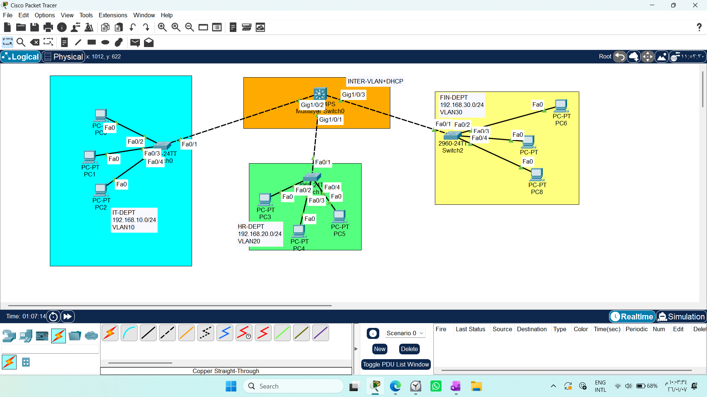

## CONFIGURING INTER-VLAN + DHCP SERVER ON A L3SW

1. Draw necessary topology, decorate and comment
2. Configure VLANs, name them, assign ports and configure trunks between switches.
3. Enable IP routing on the L3SW
4. Create SVIs on the L3SW as per the respective VLAN ID, and assign the IP address.
5. Create DHCP pools, assign network address, default gateway and dns address.
6. Exclude ranges of IP address that should not be assigned dynamically.
7. Go to every PC and change option to DHCP.
8. Test communication

# Inter-VLAN Routing & DHCP Configuration Guide (L3SW)
This guide provides a comprehensive overview of configuring Inter-VLAN routing and DHCP services on a **Multilayer Switch (L3SW)**. It also highlights the technical advantages of this approach compared to traditional routing methods.

## 1. Step-by-Step Configuration

To enable routing between VLANs and dynamic IP assignment on an L3SW, follow these logical steps:

### A. VLAN Creation & SVI Setup
**Crucial Note:** You must create the VLAN in the database *before* configuring its Switch Virtual Interface (SVI). If the VLAN is missing, the SVI will remain in a "Down/Down" state.

```bash
# 1. Create the VLAN
Switch(config)# vlan 10
Switch(config-vlan)# name IT_DEPT
Switch(config-vlan)# exit

Switch(config)# vlan 20
Switch(config-vlan)# name HR-DEPT
Switch(config-vlan)# exit

Switch(config)# vlan 30
Switch(config-vlan)# name FIN-DEPT
Switch(config-vlan)# exit

# 2. Enable L3 Routing (The most important step!)
Switch(config)# ip routing

# 3. Configure the SVI (The Gateway for the VLAN)
Switch(config)# interface vlan 10
Switch(config-if)# ip address 192.168.10.1 255.255.255.0
Switch(config-if)# no shutdown

Switch(config)# interface vlan 20
Switch(config-if)# ip address 192.168.20.1 255.255.255.0
Switch(config-if)# no shutdown


Switch(config)# interface vlan 30
Switch(config-if)# ip address 192.168.30.1 255.255.255.0
Switch(config-if)# no shutdown
```
### B. DHCP Server Setup
Configure a DHCP pool to automate IP distribution for your clients:
```bash
# 1. Create the DHCP pool
Switch(config)# ip dhcp pool IT-POOL
Switch(dhcp-config)# network 192.168.10.0 255.255.255.0
Switch(dhcp-config)# default-router 192.168.10.1
Switch(dhcp-config)#dns-server 8.8.8.8


Switch(config)# ip dhcp pool HR-POOL
Switch(dhcp-config)# network 192.168.20.0 255.255.255.0
Switch(dhcp-config)# default-router 192.168.20.1
Switch(dhcp-config)#dns-server 8.8.8.8


Switch(config)# ip dhcp pool FIN-POOL
Switch(dhcp-config)# network 192.168.30.0 255.255.255.0
Switch(dhcp-config)# default-router 192.168.30.1
Switch(dhcp-config)#dns-server 8.8.8.8


# 2. Exclude the Gateway address (to prevent IP conflict)
Switch(config)# ip dhcp excluded-address 192.168.10.1
Switch(config)# ip dhcp excluded-address 192.168.20.1
Switch(config)# ip dhcp excluded-address 192.168.30.1
```
## 2. L3SW vs. Router-on-a-Stick
### Comparison: Multilayer Switch (L3SW) vs. Router-on-a-Stick

| Comparison Factor | Multilayer Switch (L3SW) | Router-on-a-Stick |
| :--- | :--- | :--- |
| **Performance** | High (Hardware-based ASIC) | Moderate (Software-based) |
| **Implementation** | SVI (Internal Virtual Interfaces) | Sub-interfaces on a single physical port |
| **Bottleneck** | None (High-speed internal backplane) | High (Single link traffic congestion) |

## 3. Why L3SW is Preferred
* Wire-Speed Routing: L3SWs utilize ASIC (Application-Specific Integrated Circuit) chips. This allows the switch to route traffic at the full physical line speed, unlike a traditional router which relies on CPU processing.

* Bottleneck Elimination: By moving the routing engine inside the switch backplane, we avoid the "Router-on-a-Stick" bottleneck where all inter-VLAN traffic must pass through a single physical cable.

* Simplified Management: Reduces cable clutter and the number of physical devices in the rack, increasing overall reliability and reducing failure points.

* Scalability: Handles massive amounts of VLANs and high-speed throughput (10Gbps+) much more efficiently than a standard router.

## 4. Architectural Insight: How L3SW Processes Packets
L3SW functions differently from a standard router due to Cisco Express Forwarding (CEF), which enables "Wire-Speed" routing.

### The CEF Mechanism:
* Routing Once, Switching Many: - The first packet in a flow is sent to the CPU to determine the path.

The resulting information is stored in two hardware-based tables:

1- FIB (Forwarding Information Base): A high-speed lookup table derived from the routing table.

2- Adjacency Table: Stores L2 header information (Next-hop MAC addresses).

* Hardware Acceleration (The "Rewrite"): - Subsequent packets in the flow are handled entirely by ASIC chips.

The hardware performs the "Rewrite" operation (decrementing TTL, updating Checksum, and swapping Source/Destination MAC addresses) in a single pipeline step.

* Efficiency: By moving these operations from software (CPU) to hardware (ASIC), the L3SW eliminates the latency typically associated with traditional routers.

## 5. Notes
Why L3SW? It provides wire-speed routing, eliminates bottlenecks by keeping traffic on the internal backplane, and significantly simplifies network cabling and scalability.

`no switchport` Command: Remember, this command is not required when using SVIs for Inter-VLAN routing. It is only necessary if you are manually converting a physical interface into a dedicated L3 "Routed Port" (e.g., to connect directly to an ISP or Firewall).

## 6.Test communication


