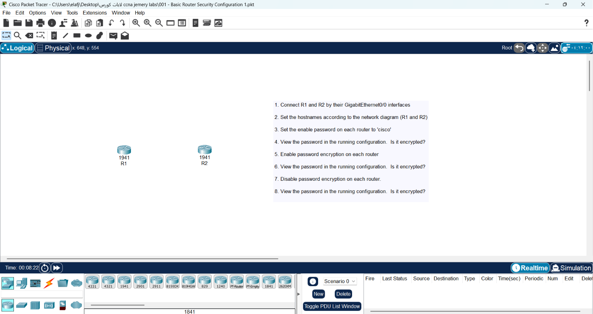
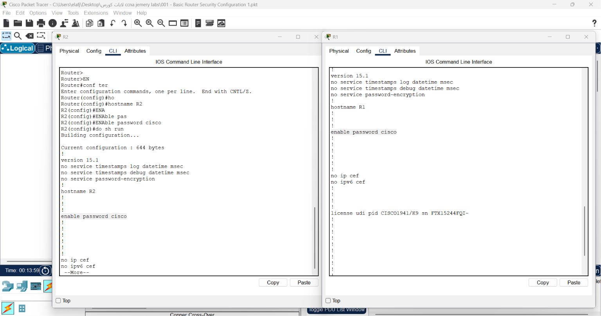
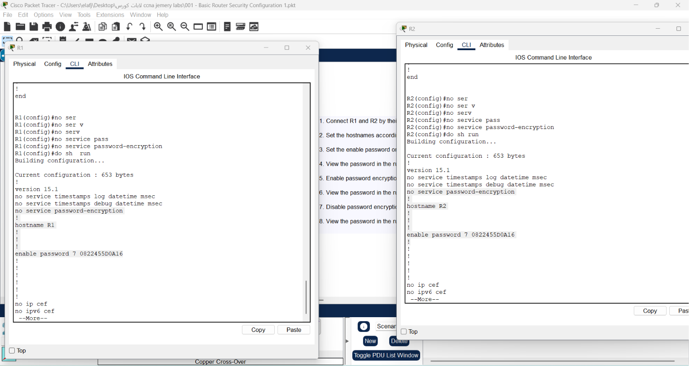

# Lab 001: Basic Router Security Configuration

## 📌 Topology & Scenario Overview
This lab focuses on the fundamentals of device identity (Hostname) and the basic behavior of password storage within Cisco IOS. It explores how the `service password-encryption` command acts on plaintext passwords and how the router behaves when this service is disabled.



---

## 🛠️ Step-by-Step Configuration & Technical Deep-Dive

### Step 1: Physical Connectivity
* **Action:** Connect **R1** and **R2** using a cable between their `GigabitEthernet0/0` interfaces.

### Step 2: Device Identification
Configure the hostnames on both devices to match the topology diagram.
* **Commands for R1:**
  ```text
  Router> enable
  Router# configure terminal
  Router(config)# hostname R1
  R1(config)#
  ```
* **Commands for R2:**
 ```text
Router> enable
Router# configure terminal
Router(config)# hostname R2
R2(config)#
```
### Step 3: Configuring the Enable Password
Set the standard privileged mode password to cisco.
* Commands (Apply on both R1 & R2):
``` text
R1(config)# enable password cisco
```

## Step 4: Verification (First Check)
* Command: `R1# show running-config`

* Question: Is the password encrypted?

* Answer: No. You will see the line `enable password cisco` in plain text. This is highly insecure because anyone with access to the configuration file can read the password immediately.




### Step 5: Enabling Password Encryption
Activate the global password encryption service to obscure clear-text passwords.

Commands (Apply on both R1 & R2):
```text
R1(config)# service password-encryption
```
### Step 6: Verification (Second Check)
Command: `R1# show running-config`

Question: Is the password encrypted now?

Answer: `Yes`. The password will now appear as something like `enable password 7 0822455D0A16`. The 7 indicates it is encrypted using Cisco's proprietary Type 7 weak encryption algorithm.

### Step 7: Disabling Password Encryption
Turn off the global password encryption service.

Commands (Apply on both R1 & R2):
```text
R1(config)# no service password-encryption
```
### Step 8: Verification (Final Check)
* Command:`R1# show running-config`

* Question: Is the password still encrypted?

* Answer: `Yes`, it remains encrypted.


# 🧠 Core Engineering Insights (Why & How?)
Why did the password stay encrypted in Step 8?
The `service password-encryption` command is a one-way trigger for existing text. When enabled, it instantly encrypts all current and future plaintext passwords. When you type `no service password-encryption`, it simply stops the router from encrypting newly added passwords in the future. It does not decrypt what has already been encrypted.

### Security Warning (Type 7 vs Type 5):
The `enable password` command combined with `service password-encryption` uses a weak Type 7 cipher, which can easily be cracked online in seconds. In real enterprise environments, always use the `enable secret <password>` command instead, which automatically utilizes a strong hashing algorithm (Type 5 MD5 or newer SHA-256) by default without needing any external service commands.

# 📌 Important Technical Notes: Network Cabling & Auto-MDIX

Here is a summary of the foundational rules for network cabling, along with modern engineering insights regarding physical layer connectivity.

---

## 🔌 1. The Standard Cabling Rule (Strict Theory)

When connecting network devices, the choice of Ethernet cable depends entirely on the types of devices you are linking together:

* **Crossover Cable (Dashed line in Packet Tracer):** 
  Used to connect **similar devices** (devices of the same type).
  * *Examples:* Router to Router, Switch to Switch, PC to PC.
  * *Why?* Similar devices use the same pins for transmitting ($Tx$) and receiving ($Rx$) data. A crossover cable crosses the wires internally so that the transmit pin of one device connects directly to the receive pin of the other.

* **Straight-Through Cable (Solid line in Packet Tracer):** 
  Used to connect **dissimilar devices** (devices of different types).
  * *Examples:* Router to Switch, Switch to PC, Switch to Access Point.
  * *Why?* The internal pinouts of a switch are already mirrored compared to a router or a PC. Therefore, a straight-through cable is sufficient to properly align the transmit and receive lines.

---

## 🧠 2. Modern Engineering Insight: Auto-MDIX Technology

While the standard rule above is strictly enforced in academic exams (like CCNA) and legacy simulation environments, real-world modern networking is much more flexible due to a smart feature called **Auto-MDIX** (Automatic Medium-Dependent Interface Crossover).

* **What it does:** 
  Auto-MDIX is a technology embedded inside modern Network Interface Cards (NICs) and switch ports. It allows the physical port to **automatically sense** the cable type (straight-through or crossover) and the type of device connected on the other end.
* **How it handles errors:** 
  If you mistakenly connect two similar devices (e.g., two routers) using a straight-through cable, Auto-MDIX will detect that the transmission lines are conflicting. It will then automatically reverse its internal transmit ($Tx$) and receive ($Rx$) circuits electronically. 
* **The Result:** 
  The link will come up and function perfectly, eliminating the need to change the physical cable.

---

## 🎯 Summary for Practical Labs
* **In Packet Tracer / Testing:** Always stick to the classic rule. Use a **Crossover** cable for your Router-to-Router connection in Lab 001 to ensure the interface lights turn green.
* **In the Real World:** Modern devices will dynamically adapt even if the wrong cable type is used, thanks to Auto-MDIX.


