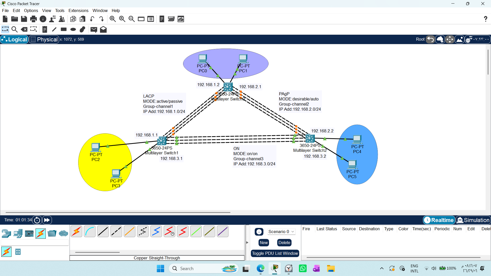

## LAYER 3 ETHERCHANNEL USING PAGP/LACP/ON MODES

1. Draw necessary topology, decorate and comment --- choose 3650 13sw
2. Power on the Multilayer switches.
3. Connect cables and enable IP routing on both the multilayer switches.
4. Identify and configure layer-3 interfaces to be used- use no switchport command.
5. Configure etherchannel using LACP/PAGP/ON modes to the desired ports.
6. Firstly, enter the interface range, create a channel group and mode then assign IP to the port channel.
7. Display etherchannel parameters on the switches
------------------------------------------------------------------------------------------------------------------------

This guide explains how to configure Layer 3 EtherChannel on Cisco switches, based on our recent labs and discussions.


## 1. Key Concepts
*   **Layer 2 EtherChannel:** Used for switching. It does not support IP addresses directly.
*   **Layer 3 EtherChannel:** Acts like a "Routed Port." You must use the `no switchport` command to allow the interface to handle IP packets.

## 2. Configuration Steps
To configure a Layer 3 EtherChannel, you must apply the `no switchport` command to both the physical ports and the logical port-channel interface.

### General Step (Enable Routing)
Always enable IP routing globally on the switch:
```text
Switch(config)# ip routing
```
### Protocol Configuration
### on switch1
Using LACP (Standard)
```text
Switch1(config)# interface range gi1/0/1-3
Switch1(config-if-range)# no switchport
Switch1(config-if-range)# channel-group 1 mode active
Switch1(config)# interface port-channel 1
Switch1(config-if)# ip address 192.168.1.1 255.255.255.0
```
Using ON Mode
```text
Switch1(config)# interface range gi1/0/4-6
Switch1(config-if-range)# no switchport
Switch1(config-if-range)# channel-group 3 mode on
Switch1(config)# interface port-channel 3
Switch1(config-if)# ip address 192.168.3.1 255.255.255.0
```
### on switch2
Using ON Mode
```text
Switch2(config)# interface range gi1/0/1-3
Switch2(config-if-range)# no switchport
Switch2(config-if-range)# channel-group 3 mode on
Switch2(config)# interface port-channel 3
Switch2(config-if)# ip address 192.168.3.2 255.255.255.0
```
Using PAgp Mode
```text
Switch2(config)# interface range gi1/0/4-6
Switch2(config-if-range)# no switchport
Switch2(config-if-range)# channel-group 2 mode desirable
Switch2(config)# interface port-channel 2
Switch2(config-if)# ip address 192.168.2.2 255.255.255.0
```
### on switch0
Using LACP (Standard)
```text
Switch0(config)# interface range gi1/0/1-3
Switch0(config-if-range)# no switchport
Switch0(config-if-range)# channel-group 1 mode active
Switch0(config)# interface port-channel 1
Switch0(config-if)# ip address 192.168.1.2 255.255.255.0
```
Using PAgp Mode
```text
Switch0(config)# interface range gi1/0/4-6
Switch0(config-if-range)# no switchport
Switch0(config-if-range)# channel-group 2 mode desirable
Switch0(config)# interface port-channel 2
Switch0(config-if)# ip address 192.168.2.1 255.255.255.0
```
# 3. Verification Commands
Use these commands to check your work:
```text
Switch#show etherchannel port-channel
```
this command displays detailed status information for **all** existing Port-channel interfaces on the switch 
including their specific physical member ports and current operational status.


