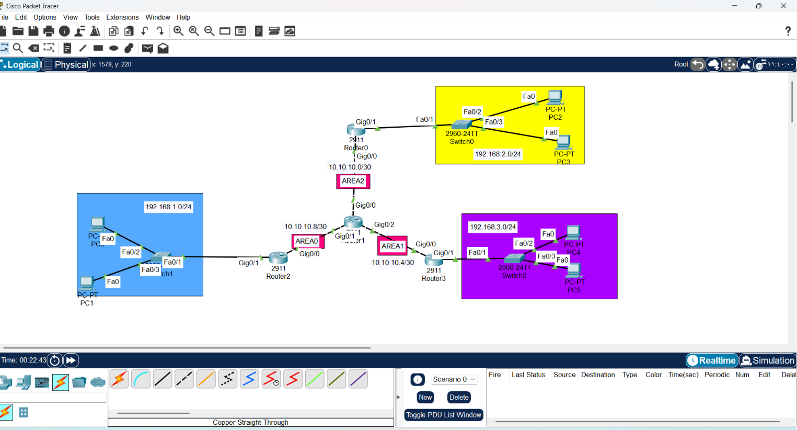
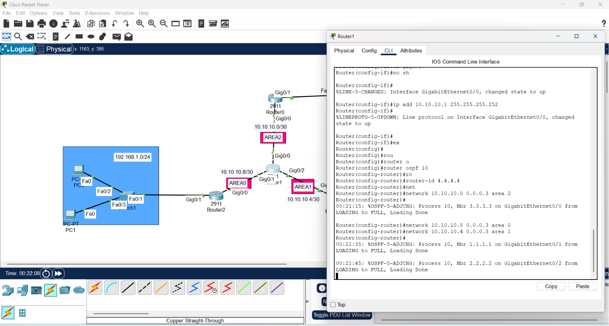
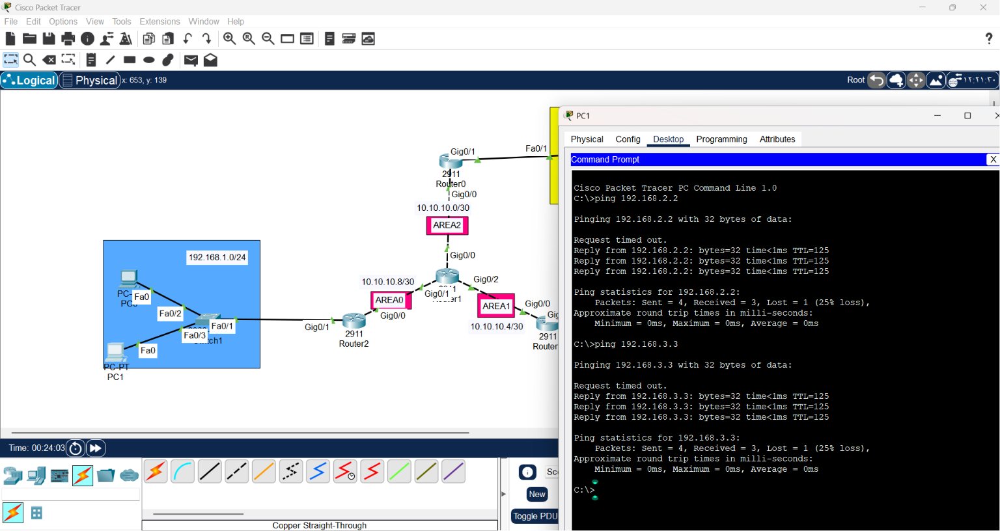
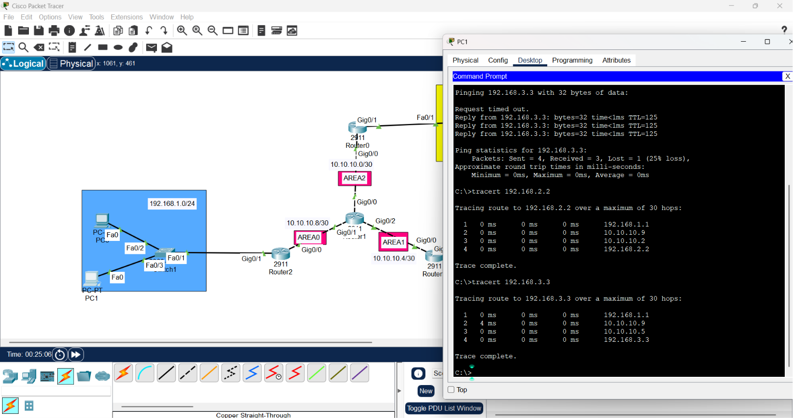

# Network Routing Mastery: EIGRP & OSPF Lab Guide

1. Draw necessary topology, decorate and comment I
2. Configure IP addresses to the routers and hosts.
3. Configure OSPF in all the routers to advertise the directly connected networks.
4. Traceroute the path and ping the hosts.

 

This repository documents the implementation, theoretical foundations, and engineering best practices for professional network routing. 

## 1. Protocol Philosophy: EIGRP vs. OSPF

Choosing the right protocol is a critical engineering decision:

| Feature | EIGRP | OSPF |
| :--- | :--- | :--- |
| **Logic** | Trust-based (Neighbor gossip) | Map-based (Global Topology) |
| **Compatibility** | Cisco-Proprietary | Open Standard (Vendor Neutral) |
| **Metric** | Bandwidth + Delay | Cost (Bandwidth) |
| **Database** | Topology Table (Local view) | LSDB (Global view) |

---

## 2. OSPF Core Engine: The "Mapping" Logic
OSPF does not rely on hearsay; it builds an objective model of the network.

* **LSA (Link State Advertisement):** The "Status Report." Every router shares its local link status, costs, and neighbor information.
* **LSDB (Link State Database):** The "Common Map." Every router collects these LSAs to build an **identical database**. Consensus in the LSDB ensures consistent routing decisions across the entire area.

* **SPF Tree (Dijkstra Algorithm):** The "Mathematical Path." The router uses the Dijkstra algorithm to place itself at the center of the map and calculate the lowest-cost path to every destination.

---

## 3. Advanced Engineering Concepts

### The Router-ID: The Digital Identity
The `router-id` is the unique "ID card" of the router. 
* **Engineering Best Practice:** Always set it manually (e.g., `router-id 1.1.1.1`). This prevents identity changes during interface failures, which avoids unnecessary network re-convergence.

### Precision with Wildcard Masks
Instead of declaring broad networks, we use **Wildcard Masks** (`255.255.255.255 - Subnet Mask`) for **Granular Control**. This secures the network by binding OSPF only to specific interfaces, preventing routing leaks.

### Multi-Area OSPF: Scalability & Containment
For large networks, we move beyond Single-Area OSPF to **Multi-Area OSPF**:
* **Area 0 (Backbone):** The core transit area.
* **Benefits:** * **Scalability:** Reduces the burden on the LSDB.
    * **Containment:** If a link fails in a local area, the LSDB update is contained, preventing unnecessary SPF calculations across the entire enterprise.
    * **ABR (Area Border Router):** The specialized router that bridges different areas to the backbone.

---

## 4. Professional Configuration Template
* on every router:
```bash
# Enter OSPF configuration mode
Router(config)# router ospf 10
Router(config-router)# router-id [router-id]
Router(config-router)# network [IP] [Wildcard] area [Area_ID]

* on Area Border Router:
Router(config)# router ospf 10
Router(config-router)# router-id 4.4.4.4
Router(config-router)# network 10.10.10.0 0.0.0.3 area 2
Router(config-router)# network 10.10.10.4 0.0.0.3 area 1
Router(config-router)# network 10.10.10.8 0.0.0.3 area 0
```
 


## 5. Troubleshooting:
When you face `Destination host unreachable`:

* Neighbor Audit: `show ip ospf neighbor`. Is the status FULL?

* LSDB Audit: `show ip ospf database`. Do you see reports from other routers?

* Routing Table Audit: `show ip route`. Look for the 'O' flag.

* Physical Audit: Verify that physical interfaces are `Up/Up`.

## 6. Traceroute the path and ping the hosts
 
 

## 7. Conclusion:
A professional engineer understands why a protocol works, not just how to type the commands. By mastering the LSDB (common map), Wildcard Precision (security), and Multi-Area Hierarchy (scalability), you ensure a stable, robust, and industry-standard network architecture.


