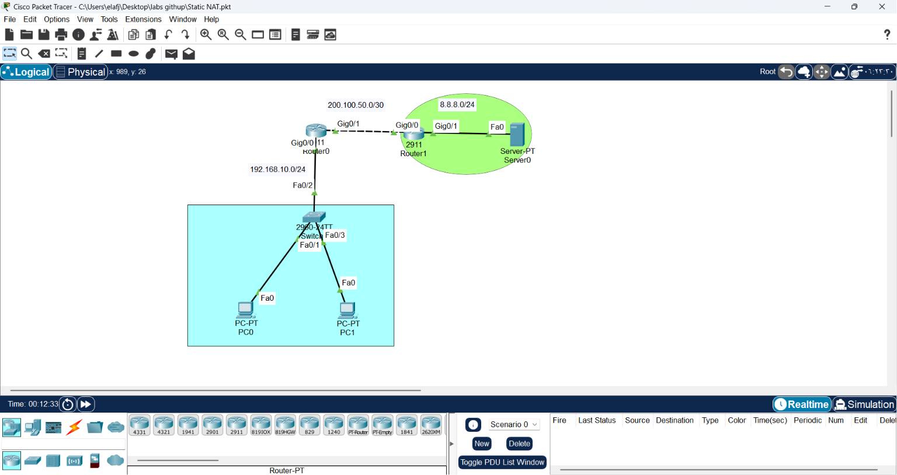
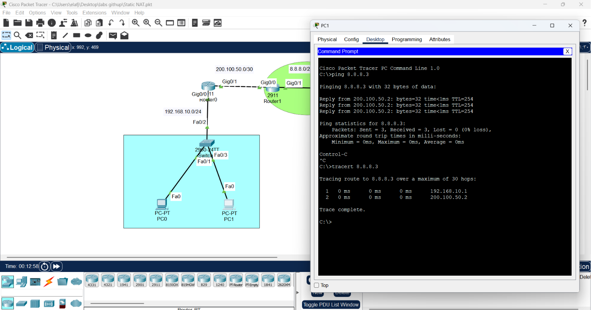
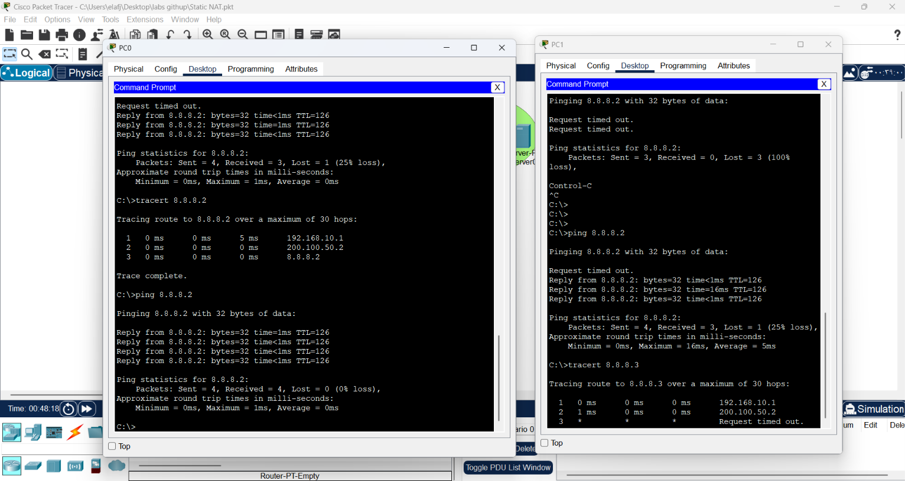
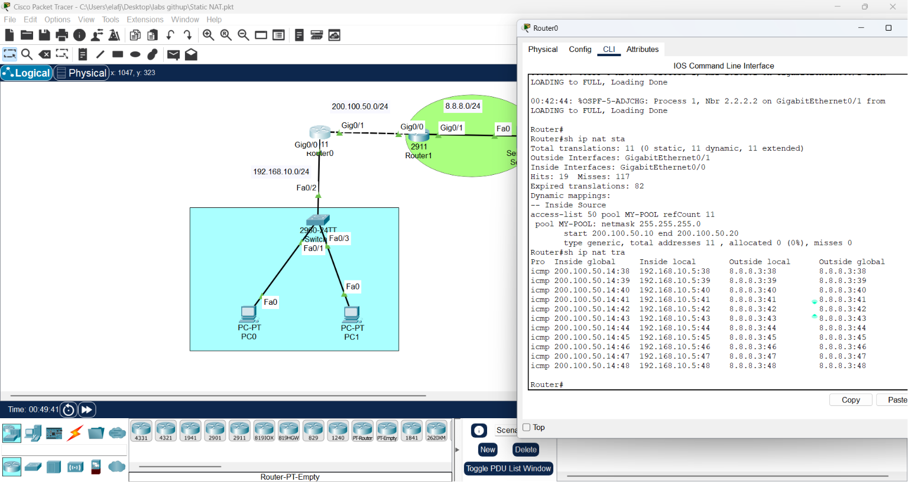

### CONFIGURING DYNAMIC NAT #######

1. Draw necessary topology, decorate and comment
2. Configure IP addresses to the routers and hosts, and configure ospf.
3. Ping the Google server, traceroute the paths, and check if there are any translations.
4. Create a standard ACL to permit the inside subnet and Configure a dynamic NAT to do n-n translation
5. Bind ACL to the NAT pool and configure interfaces as NAT inside and outside.
6. Ping again, traceroute the paths, and check if there are any translations ..

# Network Engineering: Dynamic NAT Implementation


Dynamic NAT provides an automated way to map a large number of internal private IP addresses to a smaller pool of public IP addresses. This is critical for scaling enterprise networks where public IPv4 addresses are limited.

---
* Ping the Google server, traceroute the paths, and check if there are any translations.



## 1. The Engineering Concept
Unlike Static NAT (one-to-one), **Dynamic NAT** uses a "Pool" (a group) of public addresses. The router assigns an available public IP from this pool to an internal host on a first-come, first-served basis.

### Why Dynamic NAT?
* **Scalability:** Allows hundreds of internal users to share a small number of public IPs.
* **Resource Conservation:** Reduces the need to purchase a public IP for every single device.
* **Efficiency:** Automates address assignment, minimizing administrative overhead.

---

## 2. Implementation Workflow
To configure Dynamic NAT, we must define the scope, the pool, and the link between them.

### Step 1: Define the Authorized Network
We use an Access Control List (ACL) to identify which internal hosts are permitted to use the NAT service.
```bash
# Allow the 192.168.10.0/24 subnet
Router(config)# access-list 50 permit 192.168.10.0 0.0.0.255
```
### Step 2: Create the Public IP Pool
Define the range of public IPs available for the translation.
```text
# Define pool name, start IP, end IP, and subnet mask
Router(config)# ip nat pool MY_POOL 200.100.50.10 200.100.50.20 netmask 255.255.255.0
```
### Step 3: Bind the ACL to the Pool
The final step tells the router to translate traffic matching our ACL using our defined pool.
```text
Router(config)# ip nat inside source list 50 pool MY_POOL
```


## 3. Static vs. Dynamic NAT
| Feature | Static NAT | Dynamic NAT |
| :--- | :--- | :--- |
| **Mapping** | Permanent (1:1) | Temporary (On-demand) |
| **Best For** | Servers (Publicly reachable) | Internal Hosts (Users/PCs) |
| **Security** | Higher risk (Consistent IP) | Higher obscurity (Variable IP) |
| **Scalability** | Low | High |

## 4. Troubleshooting Checklist
| Issue | Potential Cause | Fix |
| :--- | :--- | :--- |
| **No traffic translation** | Pool is empty (All IPs in use) | Check `show ip nat statistics` to verify pool usage. |
| **Access list incorrect** | Unauthorized subnet | Verify the network ID in `access-list 1`. |
| **Router not translating** | Inside/Outside interfaces misconfigured | Verify `ip nat inside` and `ip nat outside` commands. |

* To monitor the translation process in real-time, always use:
```text
Router# show ip nat translations
Router# show ip nat statistics
```
These commands reveal which internal IP is currently using which public IP from your pool.


## Conclusion:
Dynamic NAT is the backbone of efficient network connectivity. It balances the need for internet access with the reality of IPv4 scarcity. For robust architecture, always use Dynamic NAT for user traffic and Static NAT for mission-critical services, ensuring each is complemented by proper security policies.


