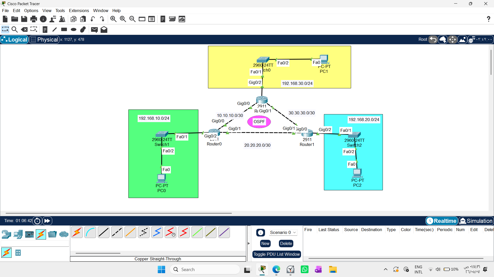
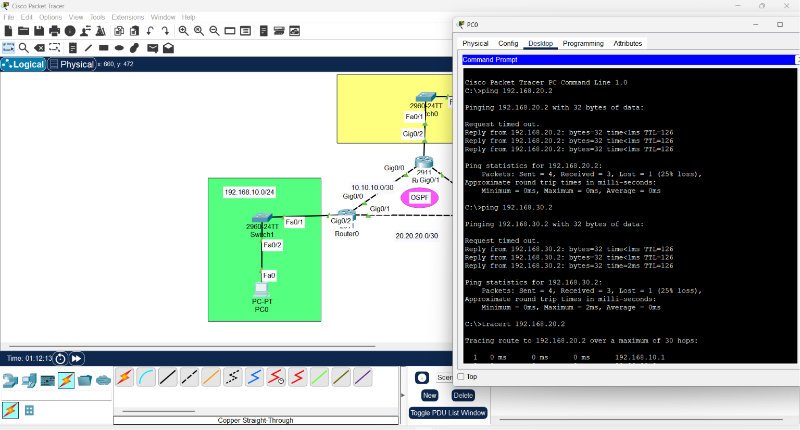
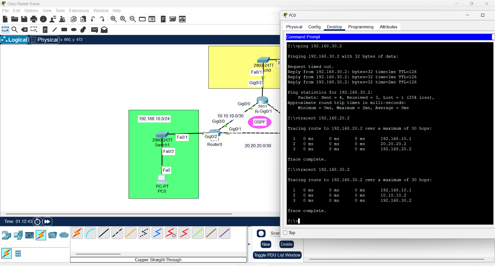

# OSPF Routing Lab: From Theory to Implementation

1. Draw necessary topology, decorate and comment
2. Configure IP addresses to the routers and hosts.
3. Configure OSPF in all the routers to advertise the directly connected networks.
4. Traceroute the path and ping the hosts.
 

This repository serves as a comprehensive technical guide for implementing and understanding the **OSPF (Open Shortest Path First)** routing protocol. It focuses not just on "how to configure," but on "why it works," which is the hallmark of a professional network engineer.

## 1. Why OSPF? (Engineering Logic)
OSPF is an **Open Standard** protocol, meaning it is vendor-neutral. Unlike proprietary protocols (like EIGRP), OSPF ensures that routers from different manufacturers can communicate. It is the industry standard for large, scalable enterprise networks.

## 2. The OSPF "Mapping" Architecture
Unlike Distance-Vector protocols that rely on "neighbor gossip," OSPF builds an objective, reliable map of the entire network.

### The Three Pillars of OSPF Intelligence:
1. **LSA (Link State Advertisement):** The "Status Report." Every router generates LSAs describing its local links, costs (bandwidth), and neighbors.
   - *Key Contents:* Router ID, connected networks, link costs, and sequence numbers (to ensure freshness).
2. **LSDB (Link State Database):** The "Common Map." Every router in an area collects all received LSAs to build an **identical database**. Because everyone has the same map, routing decisions are mathematically consistent.
3. **SPF Tree (Dijkstra Algorithm):** The "Mathematical Path." The router uses the **Dijkstra algorithm** to place itself at the center of its map and calculate the fastest path (lowest cost) to every destination.


---

## 3. Engineering Best Practices

### Precision with Wildcard Masks
Never use `network` commands blindly. We use **Wildcard Masks** to enforce **Granular Control**:
- **Calculation:** `255.255.255.255 - Subnet Mask = Wildcard Mask`.
- **Engineering Benefit:** This allows us to bind the OSPF process to specific interfaces, preventing routing information from leaking into unauthorized user-facing ports—a critical **Security** requirement.

### Hierarchy: The Role of Area 0
- OSPF is hierarchical. All traffic between different network areas must flow through **Area 0 (The Backbone)**. This prevents routing loops and ensures stability.

### The Router-ID: The Router's Digital Identity
In OSPF, the router-id is the unique "ID card" of the router.

* Why it matters: Because OSPF builds a map (LSDB), it needs a way to uniquely identify each node. Without a stable router-id, if a physical interface (that the router was using as an ID) goes down, the router's identity would change, forcing the entire network to recalculate its map (Re-convergence), which causes temporary network instability.

* Best Practice: Always set the router-id manually (e.g., router-id 1.1.1.1). This ensures the router’s identity remains constant, regardless of physical interface status, keeping your network map rock-solid.
 
---

## 4. Configuration Template

```bash
# Enter OSPF configuration mode (1 is the Process ID)
Router(config)# router ospf 1

# Advertise networks with precision
# Syntax: network [IP] [Wildcard] area [Area_ID]
Router(config-router)# network 192.168.1.0 0.0.0.255 area 0
```

## 5. Troubleshooting Checklist (The Engineering Mindset)
When faced with Destination host unreachable:

1-Neighbor Audit:` show ip ospf neighbor`. Is the status FULL? If not, adjacency failed due to mismatched timers or Area IDs.

2-LSDB Audit: `show ip ospf database`. Do you see entries from other routers? If not, the LSA "flooding" is blocked.

3-Routing Table Audit: `show ip route`. Look for the 'O' flag. If it's missing, the network isn't being learned.

 

### OSPF vs. EIGRP: The Final Comparison

| Feature | EIGRP | OSPF |
| :--- | :--- | :--- |
| **Logic** | Trust-based (Neighbor gossip) | Map-based (Global Topology) |
| **Compatibility** | Cisco-Proprietary | Open Standard (Vendor Neutral) |
| **Metric** | Bandwidth + Delay | Cost (Bandwidth) |
| **Database** | Topology Table (Local view) | LSDB (Global view) |

## Conclusion:
OSPF is the robust, standardized choice for modern enterprises. By maintaining an identical LSDB across all routers, the network guarantees that every decision is based on verified, accurate, and consistent topological data.
