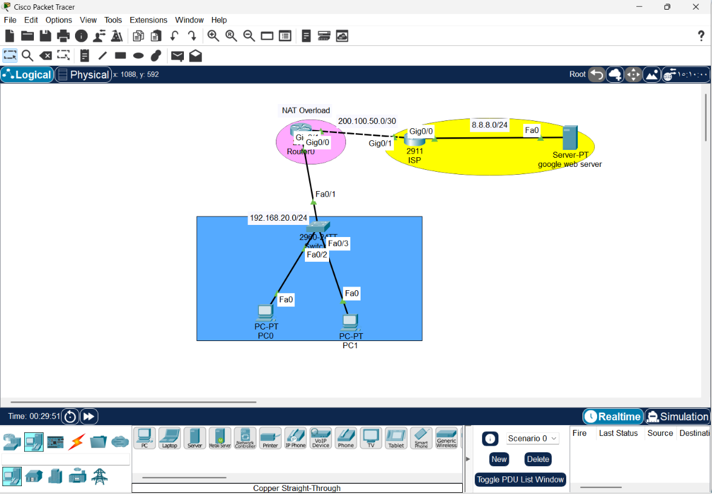
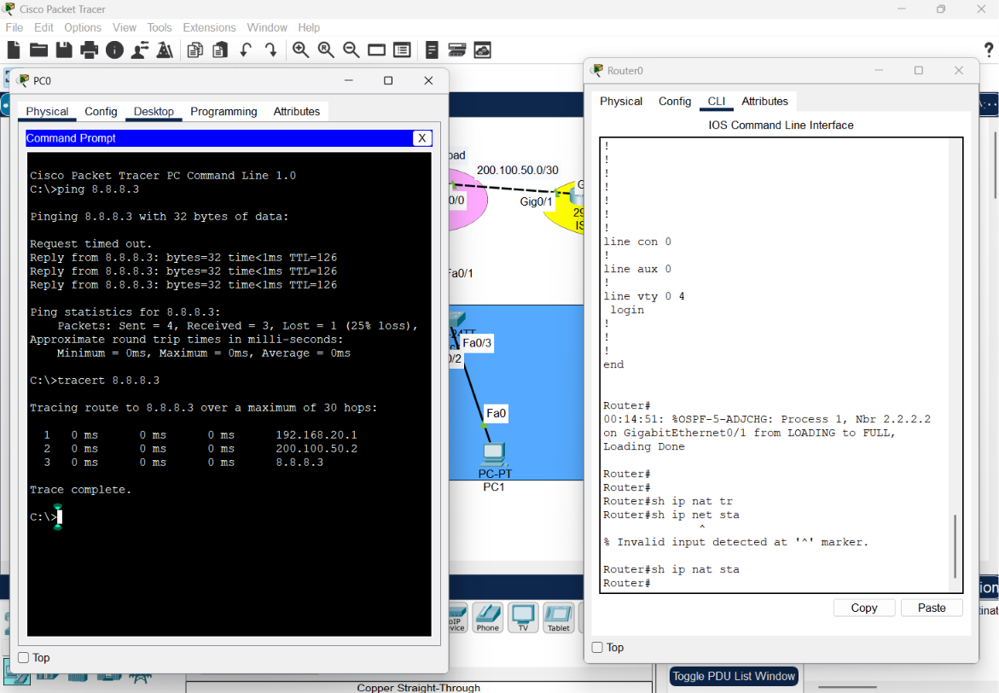
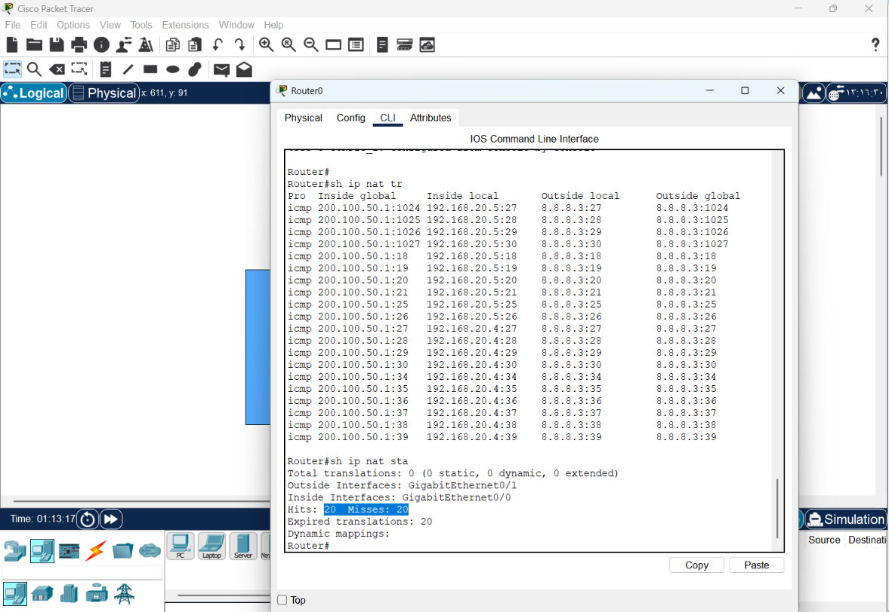

# CONFIGURING PAT 

1. Draw necessary topology, decorate and comment
2. Configure IP addresses to the routers and hosts, and configure ospf.
3. Ping the Google server, traceroute the paths, and check if there are any translations.
4. Create a standard ACL to permit the inside subnet
5. Configure PAT to refer to the ACL created for translations.
6. Ping again, traceroute the paths, and check if there are any translations ..


# Network Infrastructure: PAT (NAT Overload) Implementation
 
This repository documents the deployment of **PAT (Port Address Translation)**, also known as **NAT Overload**. PAT is the standard architectural solution for enabling multiple internal private devices to access the internet using a single public IP address.

---

## 1. Engineering Overview
In modern network design, public IPv4 addresses are a scarce resource. **PAT** solves this by mapping multiple internal private IP addresses to a single public interface address by utilizing unique **port numbers**.

### Key Advantages:
* **Scalability:** Allows an entire local network to share one public IP.
* **Cost-Efficiency:** Eliminates the need for multiple public IP subscriptions.
* **Security (Obfuscation):** Internal IP structures are hidden from the internet, as all outgoing traffic originates from the router’s public IP.

---

## 2. Network Topology & Logic
The network consists of a local LAN (Private 192.168.20.0/24) connected to an ISP gateway. The router serves as the translation boundary.


* **Inside Interface:** Faces the internal network (where translation is initiated).
* **Outside Interface:** Faces the ISP (where translation is applied).
---
* Ping the Google server, traceroute the paths, and check if there are any translations.



## 3. Configuration Steps

### Step 1: Define Internal Subnet
We identify the internal traffic authorized for translation.
```bash
Router(config)# access-list 1 permit 192.168.20.0 0.0.0.255
```
### Step 2: Configure PAT on the External Interface
We map the internal ACL to the ISP-facing interface using the `overload` keyword.
```text
# Applying NAT inside/outside roles
Router(config)# interface gig0/0
Router(config-if)# ip nat inside
Router(config)# interface gig0/1
Router(config-if)# ip nat outside

# Applying PAT
Router(config)# ip nat inside source list 1 interface gig0/1 overload
```
* Best Practice: We bind the translation to the interface rather than a hardcoded IP. This ensures the configuration remains functional even if the ISP dynamically changes the public IP.

## 4. Verification & Troubleshooting
To confirm the implementation is successful, use the following commands:
| Command | Purpose |
| :--- | :--- |
| `show ip nat translations` | View real-time mapping (Internal IP:Port → Global IP:Port). |
| `show ip nat statistics` | Monitor translation hits and active interface usage. |
| `traceroute` | Verify the path from the local host to the internet. |



## 5. Conclusion
PAT/NAT Overload is a fundamental component of enterprise network architecture. By implementing this, I have successfully demonstrated the ability to optimize public address usage while maintaining a secure and functional gateway for internal host connectivity.


