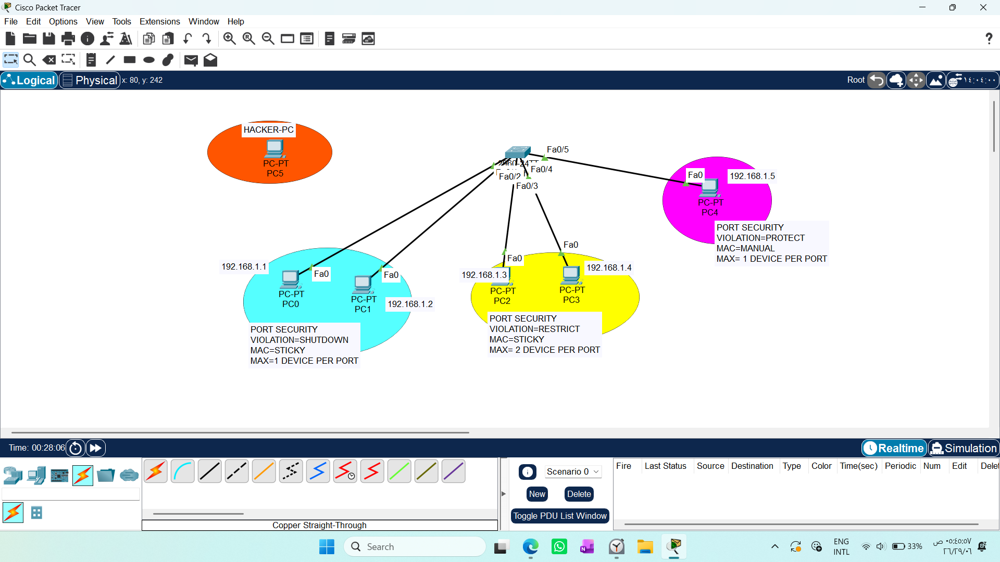
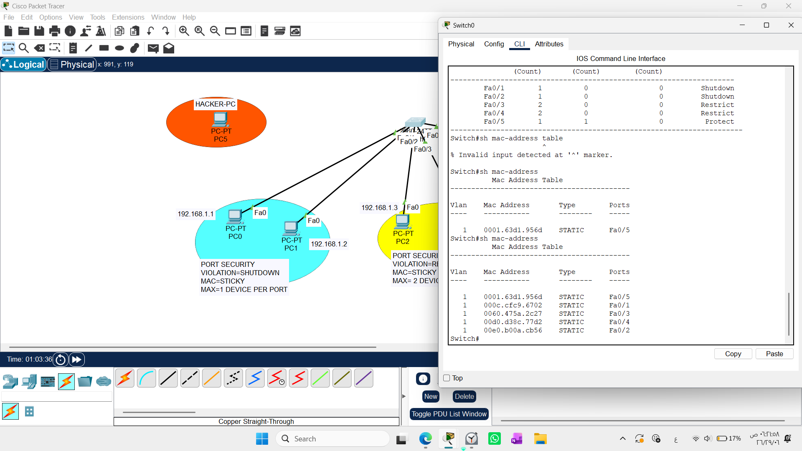
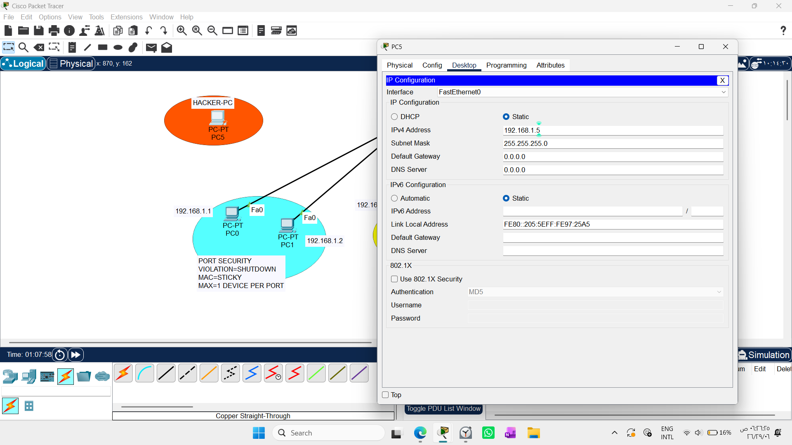
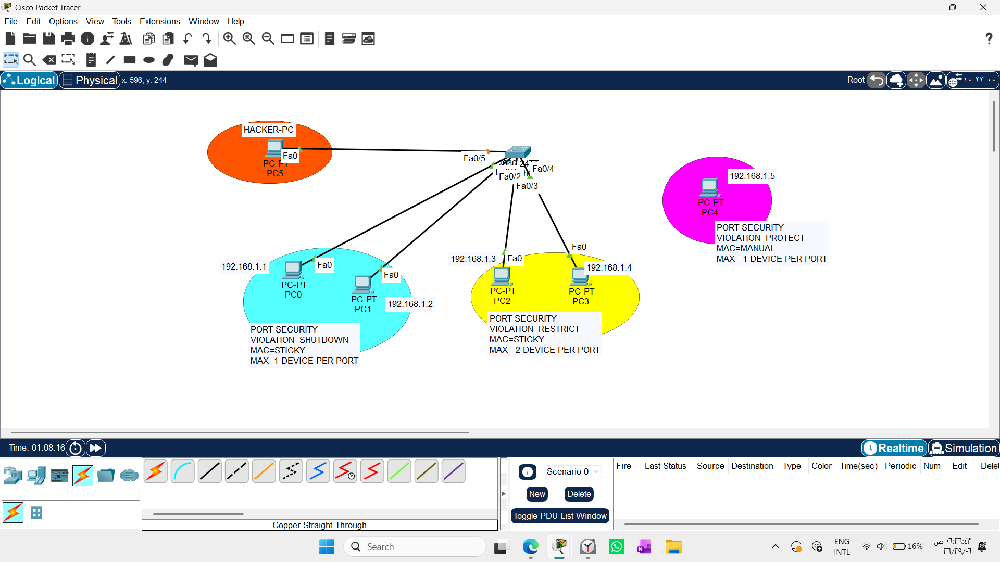
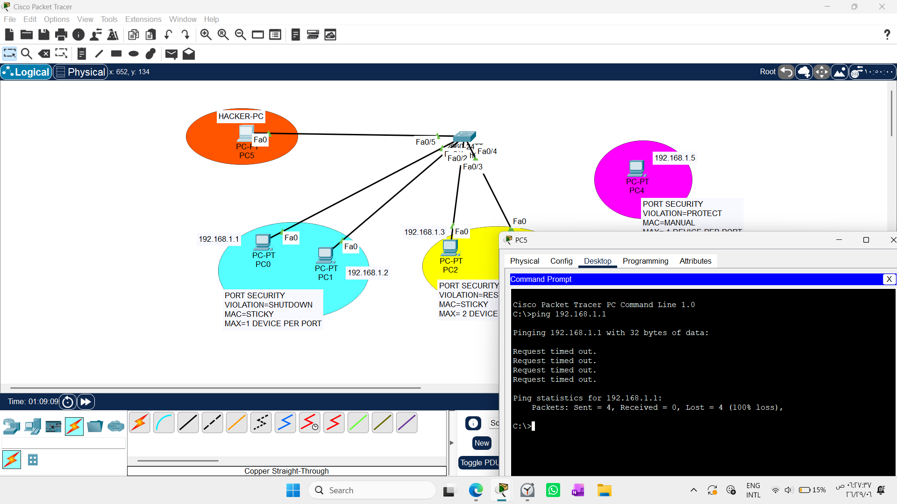

# Physical Layer Hardening: Port Security Implementations and Violation Architectures

1. Draw necessary topology, decorate and comment
2. Configure IP Addresses to all the PC.
3. Identify ports to configure port-security, max number of devices per port, violation mode,
and method of obtaining MAC addr
4. Configure 1st batch with port-security violation mode of shutdown, 1 device per port, and
method to obtain MAC address to be sticky
5. Configure 2nd batch with port-security violation mode of retrict, 2 device per port, and
method to obtain MAC address to be sticky
6. Configure 3rd batch with port-security violation mode of protect, 1 device per port, and
method to obtain MAC address to be manual.
7. First test ping and bring hacker-PC and plug to any port configured to acces only one devices
--------------------------------------------------------------------------------------------------------------

## 1. Executive Summary & Core Philosophy

While advanced logical security protocols (like DHCP Snooping, DAI, and IPSG) safeguard the network from protocol-level spoofing, **Port Security** operates as the primary hardware-level physical guard at the network access layer. It protects the physical switch ports from direct physical intrusion—such as an unauthorized person unplugging a legitimate corporate desktop to connect a rogue laptop.

### Core Distinctions: CAM Table vs. Secure MAC Table
An essential engineering distinction must be understood regarding how a switch handles hardware addresses:
1. **Standard MAC Address Table (CAM Table):** This is a purely operational, temporary directory used for frame forwarding. It has zero security properties. If an employee's PC is disconnected and a hacker plugs in their machine, the switch dynamically overwrites the CAM table entry, welcoming the hacker into the broadcast domain without warning.
2. **Secure MAC Table (Port Security Registry):** This is an administrative lock mechanism. It binds specific MAC addresses to specific interfaces, designating them as the **exclusive owners** of those physical channels. Any unmapped MAC address attempting transmission triggers instant mitigation based on the assigned violation policy.

---

## 2. Lab Topology Diagram

The topology map below outlines the strict physical partitioning of user segments into distinct administrative protection batches, alongside the isolated threat zone.



---

## 3. Deployment Framework: The Three Security Batches

To comprehensively evaluate Port Security behaviors, the switch interfaces are partitioned into three distinct groups, each utilizing a unique blend of learning methods and violation constraints.

### Port Security Violation Modes Comparison

| Action Feature | Shutdown | Restrict | Protect |
| :--- | :---: | :---: | :---: |
| **Data Frame Dropping** | **Yes** (Drops rogue traffic) | **Yes** (Drops rogue traffic) | **Yes** (Drops rogue traffic) |
| **Physical Link State** | **Down/Down** (`err-disabled`) | **Up/Up** (Operational) | **Up/Up** (Operational) |
| **Syslog Alert Issued** | **Yes** (Generates loud warnings) | **Yes** (Generates loud warnings) | **No** (Remains silent) |
| **Violation Counter** | No (Interface drops instantly) | **Yes** (Increments per frame) | No (Stays at zero) |
| **Recovery Mechanism** | Manual `shutdown` / `no shutdown` | Automatic upon rogue removal | Automatic upon rogue removal |


### Batch 1: Maximum Strictness Scope (Shutdown Mode)
* **Target Interface Scope:** `FastEthernet 0/1 - 2`
* **Network Parameters:** Maximum 1 device per port, learned via dynamic **Sticky** anchoring, violation penalty set to **Shutdown** (Default Behavior).

### Batch 2: Flexible Access Scope (Restrict Mode)
Target Interface Scope: FastEthernet 0/3 - 4

Network Parameters: Maximum 2 devices per port (ideal for environments running an IP Phone and a PC on a single line), learned via Sticky anchoring, violation penalty set to Restrict.

### Batch 3: High-Value Infrastructure Scope (Protect Mode)
Target Interface Scope: FastEthernet 0/5

Network Parameters: Maximum 1 device per port, learned via explicit administrative Manual binding, violation penalty set to Protect.

```text
Switch0(config)# interface range fastEthernet 0/1 - 2
Switch0(config-if-range)# switchport mode access
Switch0(config-if-range)# switchport port-security
Switch0(config-if-range)# switchport port-security maximum 1
Switch0(config-if-range)# switchport port-security violation shutdown
Switch0(config-if-range)# switchport port-security mac-address sticky

Switch0(config)# interface range fastEthernet 0/3 - 4
Switch0(config-if-range)# switchport mode access
Switch0(config-if-range)# switchport port-security
Switch0(config-if-range)# switchport port-security maximum 2
Switch0(config-if-range)# switchport port-security violation restrict
Switch0(config-if-range)# switchport port-security mac-address sticky

Switch0(config)# interface fastEthernet 0/5
Switch0(config-if)# switchport mode access
Switch0(config-if)# switchport port-security
Switch0(config-if)# switchport port-security maximum 1
Switch0(config-if)# switchport port-security violation protect
Switch0(config-if)# switchport port-security mac-address 0060.2F5A.BC34
```

### Architectural Deep-Dive: The Silent Elegance of Protect Mode
A common initial observation is to assume that Protect mode is the weakest option because it does not lock down ports or alert network administrators. However, in enterprise engineering, Protect mode represents the quietest and smartest operational approach under specific circumstances.

Why use Protect mode?
Zero Operational Overhead: In highly public areas (such as conference rooms, visitor desks, or open reception jacks) where various corporate devices connect intermittently, using Shutdown mode causes massive operational problems. A single unauthorized connection would completely kill the line, forcing a network engineer to manually log in and cycle the interface every time. Protect silently discards unauthorized packets without disrupting legitimate operations.

CPU and Logging Control: During a rapid, automated MAC flooding attack, an interface set to Restrict mode floods the monitoring infrastructure with millions of Syslog alerts and SNMP traps. This can easily exhaust switch CPU resources or crash the central logging server. Protect drops unauthorized traffic directly within the underlying hardware ASIC switching engine silently, requiring zero CPU processing time and creating zero logging noise.

--------------------------------------------------------------------------------------------------------------------------------------------

### Cisco IOS Technical Artifacts: The Default Configuration Behavior
When reviewing the running configuration on a Cisco Switch via show running-config, a common point of confusion arises: Why does the violation shutdown command disappear from Batch 1 interfaces?

This is an intentional characteristic of Cisco IOS design. To save NVRAM space and simplify text outputs, Cisco IOS suppresses the display of default factory values. Since Shutdown is the global default mitigation behavior for any port security violation, the CLI engine hides the keyword. Toggling to a non-default behavior (like Restrict) immediately forces the line to appear in the active config outputs.

To see the active enforcement state regardless of running-config suppression, the precise operational verification command must be executed:
```text
Switch1# show port-security interface fastEthernet 0/1
```
Alternatively, to view the live dashboard summarizing all configured ports, access limits, current active addresses, and total violation counters across the entire chassis at a single glance, run:
```text
Switch1# show port-security
```
------------------------------------------------------------------------------------------------------------------------------------------------------
### Troubleshooting Empty CAM Tables
During lab verification, executing the standard show mac-address table command initially reveals an empty or incomplete table, displaying only the statically/manually assigned hosts.

Core Root Cause
Cisco switches learn MAC addresses passively by examining the source field of incoming frames. If end hosts are connected but remaining silent (idle), the switch cannot populate its volatile CAM table or resolve its configured sticky anchors.

Correct Engineering Solution
To actively populate the database and bind the ports, an administrative sweep must be simulated. Forcing the client machines to generate traffic—such as initiating a standard ICMP network Ping across the subnet—forces the frames out, building the secure MAC address architecture instantly across the table.



-----------------------------------------------------------------------------------------------------------------------------------------------------------
### IP Spoofing vs. Hardware MAC Validation
During the final phase of validation, a critical security experiment was conducted to verify the precision of Port Security boundaries when dealing with Layer 3 identity spoofing.

The Attack Scenario
The Hacker-PC was explicitly configured with a static IP address matching a legitimate network node (192.168.1.5 belonging to PC4), attempting to trick the switch into thinking it was an authorized asset.
```text
Hacker-PC Static Configuration:
IP Address: 192.168.1.5
Subnet Mask: 255.255.255.0
```


The Link Relocation Test:

The link cable from the legitimate PC4 host was physically unplugged, and the Hacker-PC was connected directly into the newly modified topology port Fa0/5 (which was explicitly secured under Batch 3 with Manual binding to PC4's genuine MAC address).



Penetration Results and Analysis:

When the Hacker-PC initiated outbound ICMP traffic (ping 192.168.1.1), every packet timed out with 100% data loss.

Key Architectural Lesson Learned:

This experiment proves that Port Security operates strictly at Layer 2 (Data Link Layer). It makes enforcement decisions based solely on the physical MAC address burned into the network interface card (NIC). Because the switch compares the incoming frames against its hardened administrative secure MAC registry, it instantly detects the unrecognized physical address.

Since Fa0/5 was running in Protect mode, the switch maintained an Up/Up operational link state, but silently dropped 100% of the hacker's packets at the hardware ASIC layer without generating log overhead or disabling the connection. Layer 3 IP spoofing is completely useless against Layer 2 hardware authentication.




