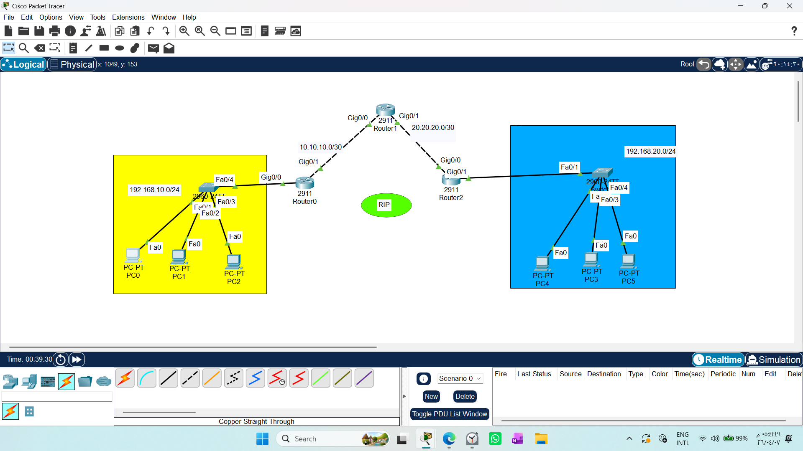
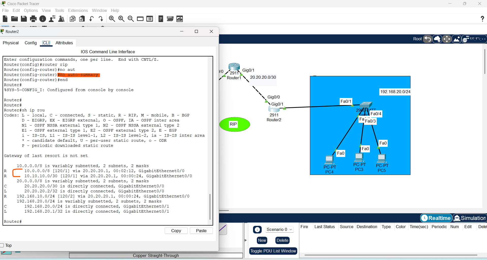
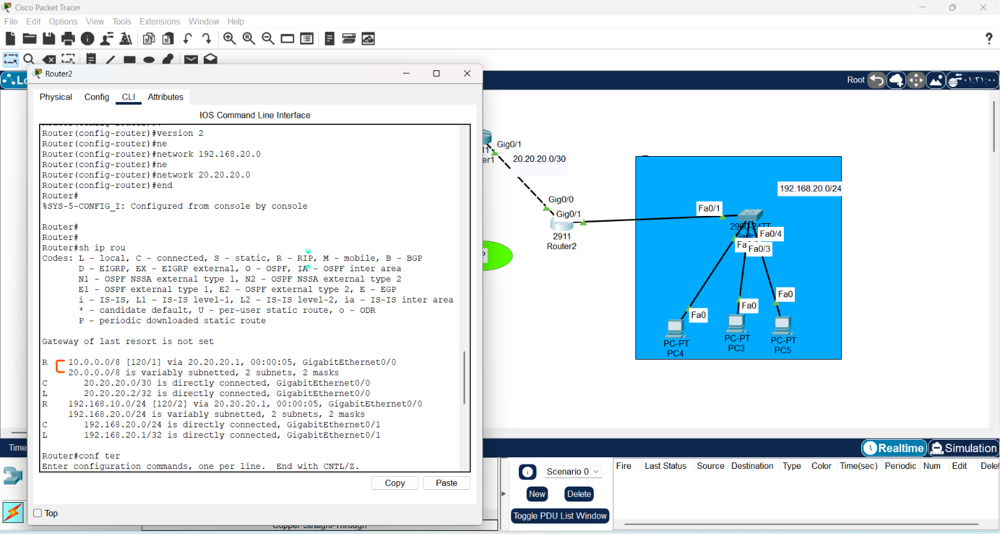
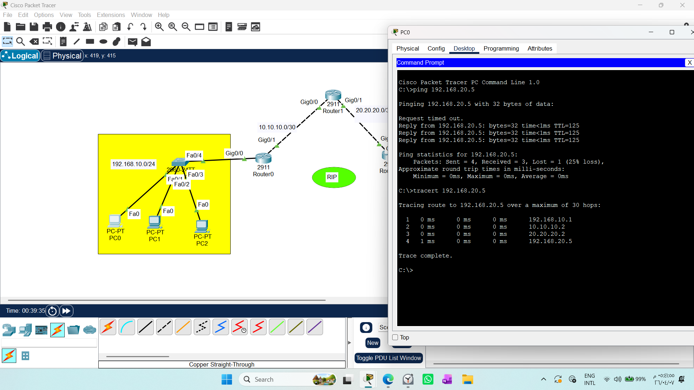

# Network Lab Report: Routing Information Protocol (RIP)

1. Draw necessary topology, decorate and comment
2. Configure IP addresses to the routers and hosts.
3. Configure default RIP in all the routers to avertise the directly connected networks.
4. Traceroute the path and ping the hosts.
---------------------------------------------------------------------------------
## 1. RIP Basics & Dynamic Routing
## 2. Configuration Steps
## 3. Key Concepts (Activation, Advertisement, no auto-summary)
## 4. Troubleshooting (show ip route, ping, traceroute)
## 5. Professional Analysis/Comparison
 


This document provides a comprehensive guide to implementing **Routing Information Protocol (RIPv2)** in Cisco Packet Tracer. It is designed to help students and junior engineers understand dynamic routing, automatic path discovery, and network convergence.

---

## 1. Concept: Why RIP?
Static routing is excellent for control but fails when networks grow. **RIP (Routing Information Protocol)** automates the process. Instead of manually configuring every path, routers use RIP to:
1. **Discover** their neighbors.
2. **Advertise** their directly connected networks.
3. **Learn** about remote networks dynamically.

### Core Architecture Concepts
* **Activation:** We identify specific interfaces (`network` command) to send and receive routing updates.
* **Advertisement:** The router tells its neighbors about its locally connected networks.
* **Convergence:** The process where all routers reach a consensus on the network topology.

---

## 2. Professional Configuration Template
To configure RIPv2 on a router:

```bash
# Enter global configuration
Router(config)# router rip

# Use version 2 (Supports VLSM and Multicast)
Router(config-router)# version 2

# Disable auto-summary for precision (Prevents route collapsing)
Router(config-router)# no auto-summary

# Advertise locally connected networks ONLY
Router(config-router)# network [Network_IP_1]
Router(config-router)# network [Network_IP_2]
```
### Note: 
We disable auto-summary to ensure that the routing protocol advertises the exact subnet mask of each network. This is critical in modern networks that utilize VLSM, as it prevents the router from collapsing subnets into classful boundaries, thereby avoiding routing loops and ensuring precise packet delivery."
 
 

## 3. Verification & Troubleshooting
A professional engineer proves the network works through empirical data:

### 1- Routing Table Audit:
Run show ip route. You should see routes marked with 'R'. This confirms the route was learned dynamically via RIP.

### 2- Connectivity Testing:

Use `ping` to verify host-to-host reachability.

Use `tracert` to visualize the path. You will notice the route is selected based on the lowest Hop Count.
 

### 3- Physical Layer Check:
Ensure all interfaces are active by using no shutdown. Without this, the physical link stays down (RED light), regardless of routing configuration.

## 4. Engineering Analysis: Static vs. Dynamic Routing

| Feature | Static Routing | RIP (Dynamic) |
| :--- | :--- | :--- |
| **Configuration** | Manual (High Effort) | Automated (Low Effort) |
| **Scalability** | Poor | Good for small/mid networks |
| **Convergence** | Immediate | Slower (Periodic updates) |
| **Security** | High (Controlled) | Moderate (Needs authentication) |

### Conclusion: 
"Unlike Static Routing which offers absolute control but is hard to scale, RIP provides Scalability and Automation at the cost of some overhead (bandwidth consumption due to updates). It is the foundational step toward understanding more advanced protocols like OSPF and EIGRP."


