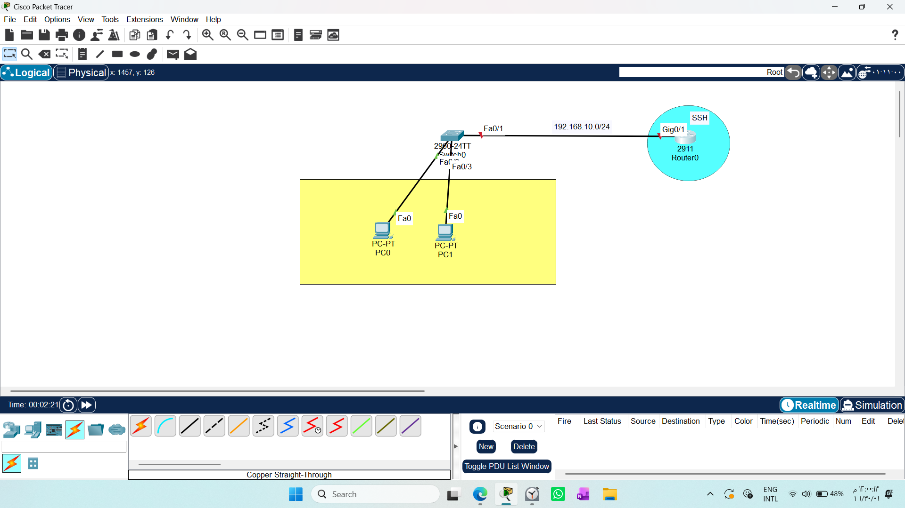
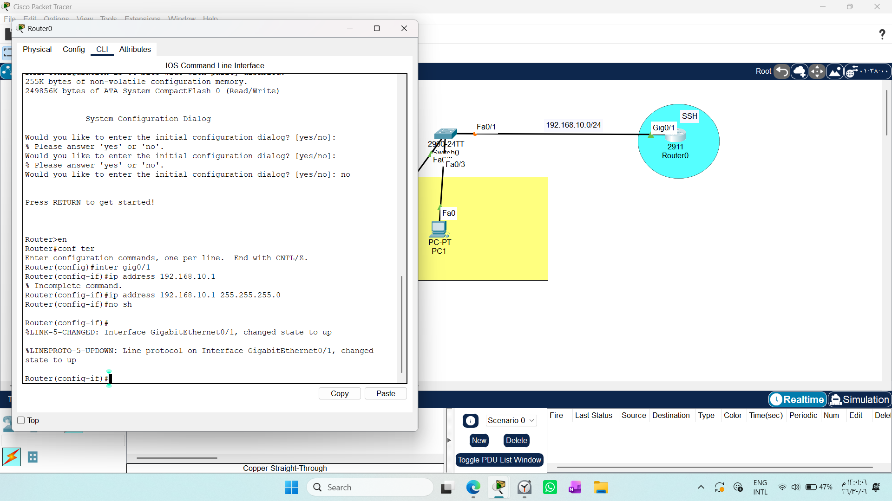
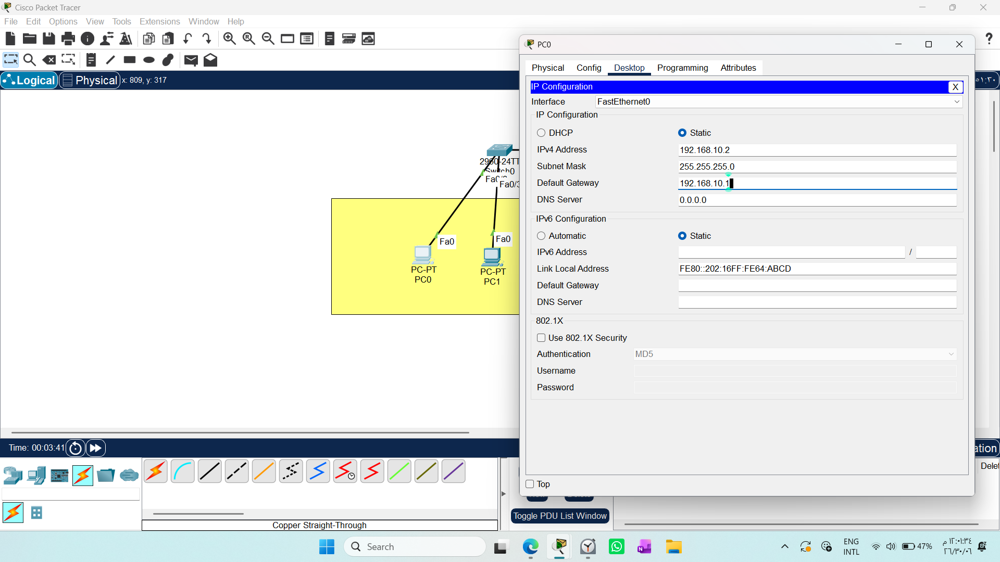
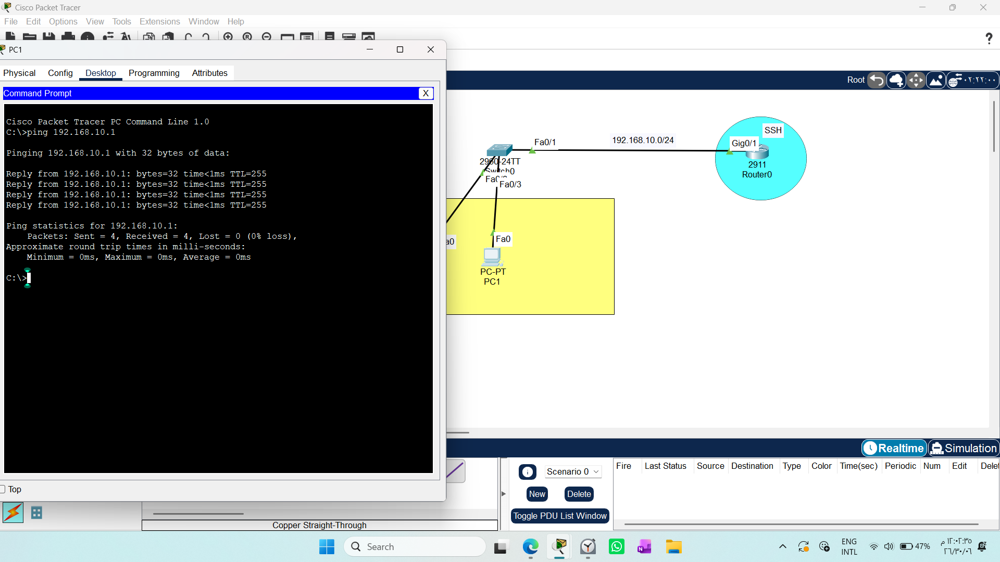
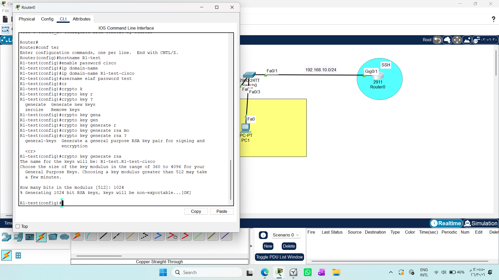
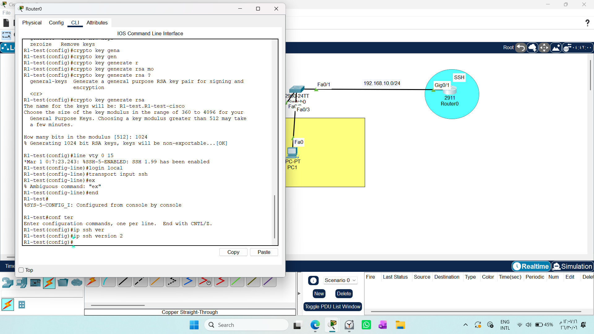
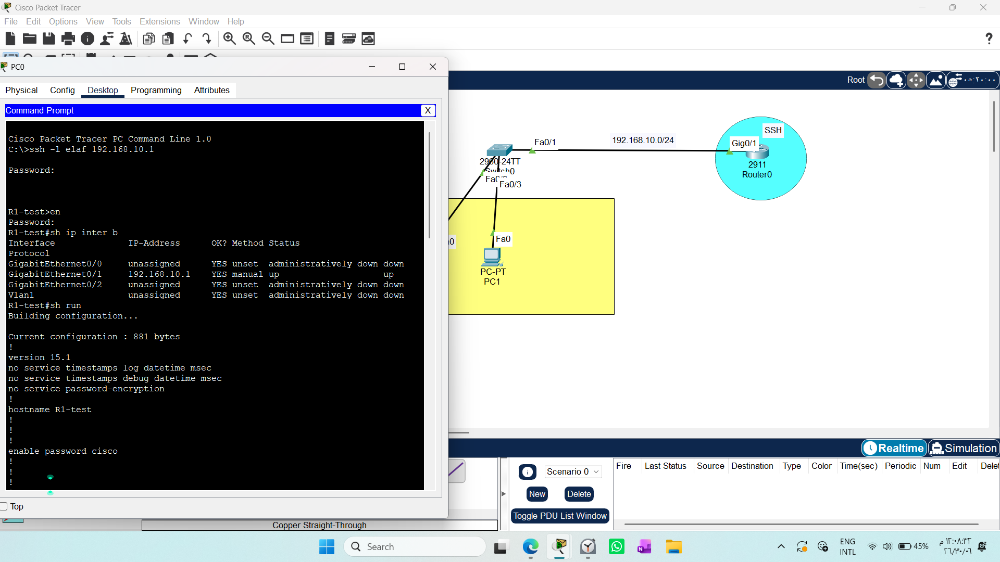

# CONFIGURING SSH ON A ROUTER
1. Draw necessary topology, decorate and comment

2. Configure IP addresses to the router interface and PCs- make sure to configure default gateway on the Pcs.

3. Test ping from the PC to the router interface.

4. Configure hostname, enable password, domain name, username and password on the router.

5. Generate crypto keys using RSA with key length of 1024

6. Login to line vty and make it to use local database for authentication then finally allow only SSH.

7. Enable SSH version 2

8. Test SSH using this command ssh -1 username 192.168 ..

# 1. Objective
The goal of this lab is to configure remote management access to a Cisco router.

Telnet: A basic remote access protocol (for educational purposes).

SSH (Secure Shell): The industry standard for secure, encrypted remote administration.
# 2. Network Topology

# 3. Configuration Steps
### Configure IP addresses to the router interface and PCs
 

### Connectivity Verification
Ensure basic communication between the PC and the Router interface using the ping 

### Router Security Setup
Configure the following identity settings on the router:

* SSH requires encryption keys:
Generate RSA Keys

### Secure the VTY Lines:

* Enable SSH v2

# 4. Testing & Verification
Testing SSH Access
From the PC Command Prompt, initiate the secure connection:

