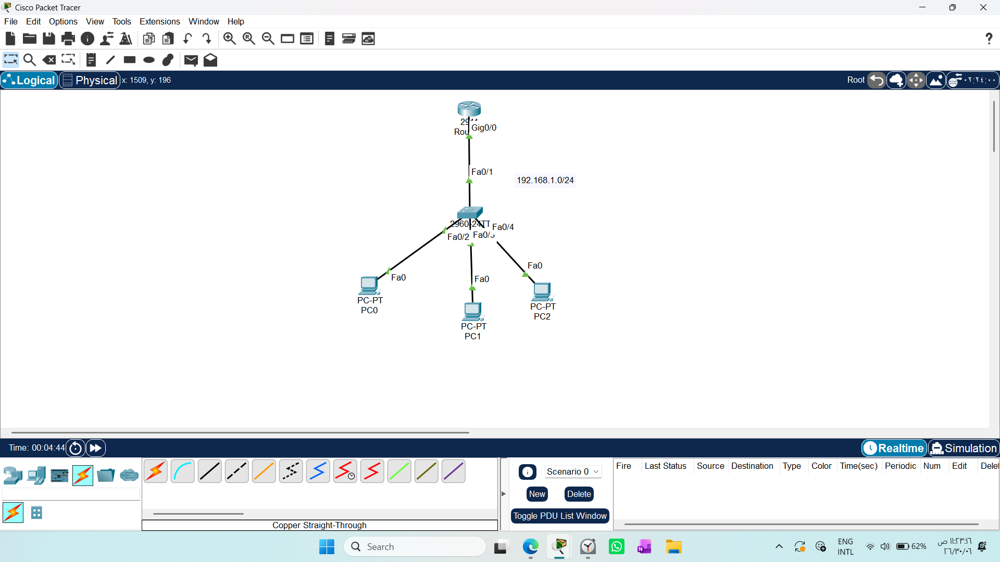
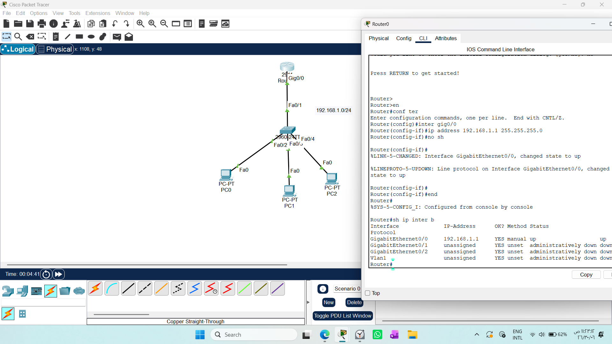
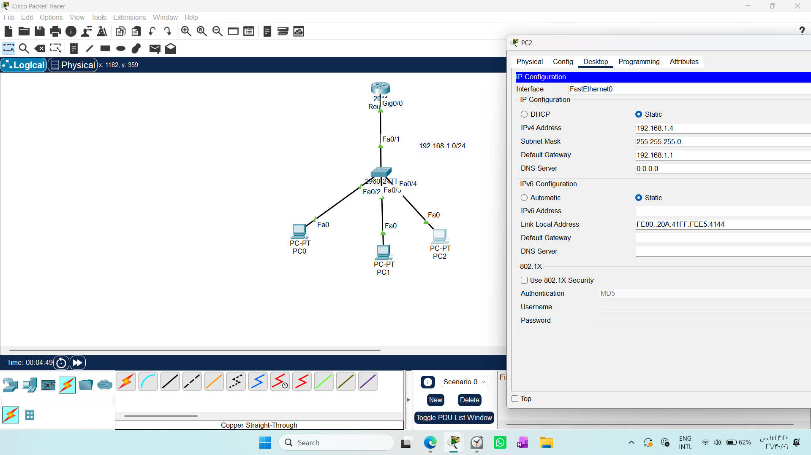
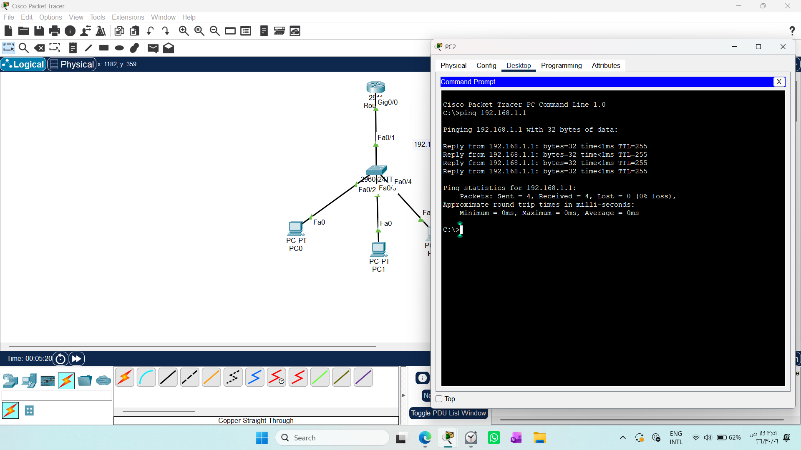
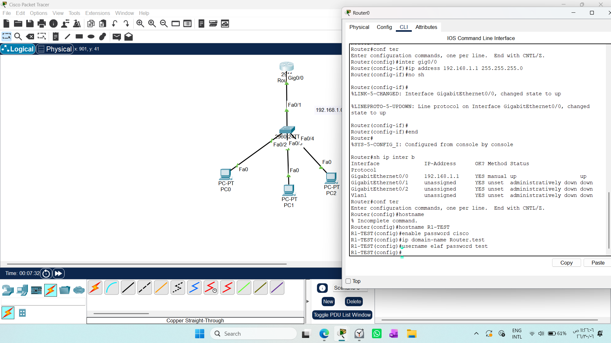
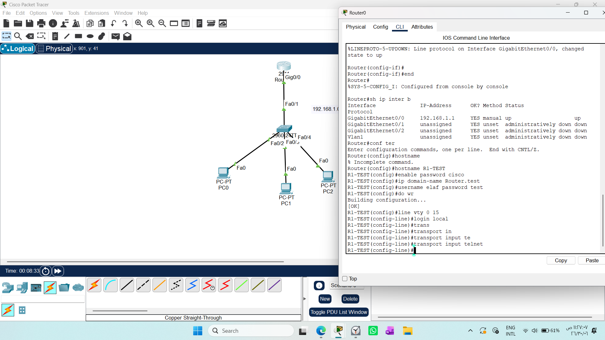
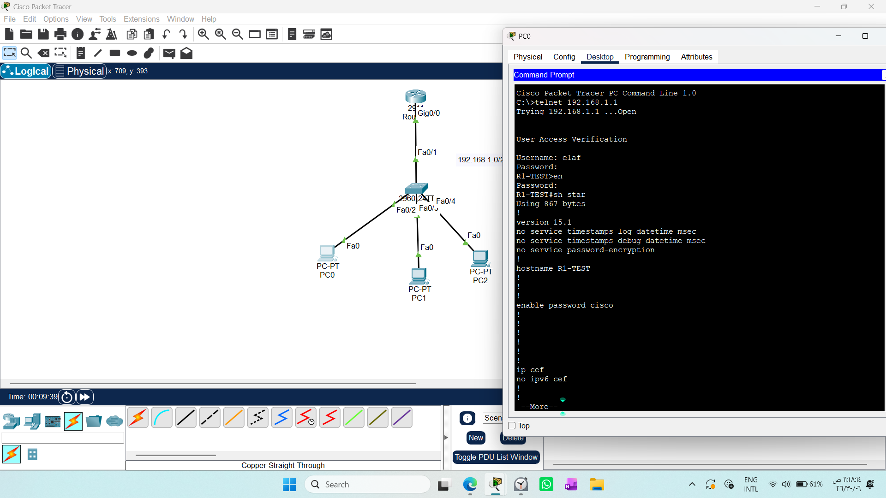

# CONFIGURING TELNET ON A ROUTER

1. Draw necessary topology, decorate and comment
2. Configure IP addresses to the router interface and PCs- make sure to configure default gateway on the Pc
3. Test ping from the PC to the router interface.
4. Configure hostname, enable password, domain name, username and password on the router.
5. Login to line vty and make it to use local database for authentication then finally allow only TELNET.
6. Test telnet using this command telnet 192.168 ..

## 1. Objective
The goal of this lab is to enable remote administration of a Cisco router using the Telnet protocol. 
This allows network engineers to manage the router's configuration securely (via authentication) from any PC connected to the same network without a physical console connection.

## 2. Network Topology


## 3. Configuration Steps
A. Basic Connectivity
Configure IP addresses to the router interface and PCs



B.Verify connectivity using the ping command:
```text
ping 192.168.1.1
```

Successful ping is required before proceeding to Telnet configuration.

## 4. Router Security Setup
Execute the following commands on the Router:


## 5. VTY Line Configuration
Configure the virtual lines to enforce local authentication and restrict access to Telnet only:


## 6. Verification
To test the remote access, open the Command Prompt on the PC and enter:
```text
telnet 192.168.1.1
```
Upon success, the router will prompt for the username and password created in step 4




## Important Security Note
While Telnet is excellent for learning the fundamentals of remote management, it is unencrypted (plain text) 
In production environments, SSH (Secure Shell) is the standard because it encrypts the entire management session.


