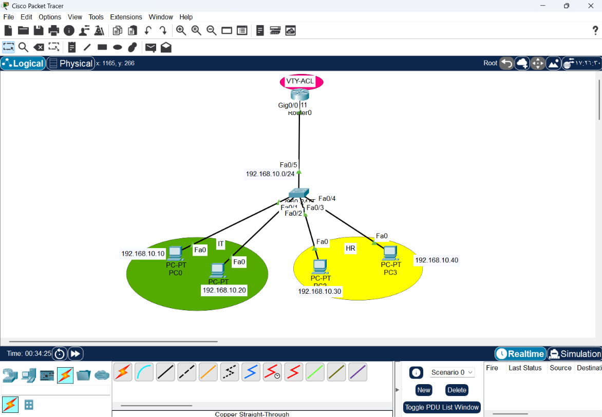
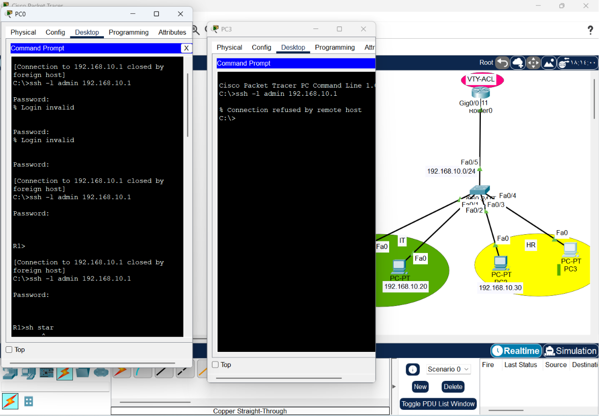

# CONFIGURING ACL FOR VTY

1. Draw necessary topology, decorate and comment
2. Configure IP addresses to the routers and hosts.
3. Configure remote access on the router and test SSH on both depts.
4. Configure a standard ACL to only permit the two IT PCs to remotely access the router.
5. Bind the ACL created on the VTY interfaces.
6. Test SSH again from both depts.

# Network Security: Securing Remote Access (VTY ACLs)


 
This guide documents the implementation of **VTY (Virtual Terminal) Access Control Lists**. While standard ACLs protect data traffic, VTY ACLs are essential for securing the "Control Plane"—restricting who can remotely manage the network device itself (via SSH or Telnet).

---

## 1. The Concept
VTY lines are the virtual "gateways" for remote administration. Without security, any device on the network can attempt to connect to the router's management interface. By applying an ACL to these lines, we ensure that only authorized IP addresses (e.g., IT management stations) can initiate an SSH session.

### Why Standard ACL for VTY?
We use a **Standard ACL** here because:
* **Efficiency:** We only need to filter based on the *Source IP*.
* **Resource Optimization:** It minimizes router CPU/Memory usage compared to Extended ACLs.
* **KISS Principle:** Keeps the configuration simple and reduces the chance of human error in security policies.

---

## 2. Implementation Steps

### Step 1: Configure remote access on the router and test SSH on both depts.
```text
Router(config)#hostname R1
Router(config)#username user1 password 1234
Router(config)#ip domain-name cisco.ssh
Router(config)#crypto key generate rsa 
---> 1024
Router(config)#line vty 0 15
Router(config-line)#login local
Router(config-line)#transport input ssh
```
### Step 2: Define the Security Policy
Create a Standard ACL that permits only authorized management PCs.
```bash
# Permit specific IT workstations
Router(config)# access-list 50 permit host 192.168.10.10
Router(config)# access-list 50 permit host 192.168.10.20
```
### Step 3: Bind to VTY Lines
Apply the ACL to the virtual terminal lines using the access-class command (specific for VTY).
```bash
Router(config)# line vty 0 15
Router(config-line)# access-class 50 in
```
* Note: The in keyword applies the filter to incoming traffic attempting to access the router.

## 3. Best Practices & Verification
* Remote Access Configuration: Ensure SSH is fully configured (hostname, domain-name, crypto keys, and local user) before applying VTY ACLs.

* Testing: From an authorized IP: You should successfully access the router via SSH.
From an unauthorized IP (HR department): The connection should be immediately "Refused" or "Timed Out".

* Audit: Use show access-list 50 to verify that the "Matches" counter increases when the authorized PC attempts an SSH connection.
## 4. Troubleshooting Checklist

| Issue | Potential Cause | Fix |
| :--- | :--- | :--- |
| SSH still accessible from anywhere | ACL not bound to VTY lines | Ensure `access-class 50 in` is inside the `line vty` config. |
| Authorized PC locked out | Wrong IP in ACL / ACL logic | Verify the PC IP matches the `access-list` entry exactly. |
| Router unreachable | VTY lines locked by wrong ACL | Access via console port and use `no access-class 50 in` to recover. |



## Conclusion:
Securing the VTY lines is a fundamental step in Control Plane Security. By restricting management access to known, trusted devices, we significantly reduce the attack surface of our network infrastructure.


