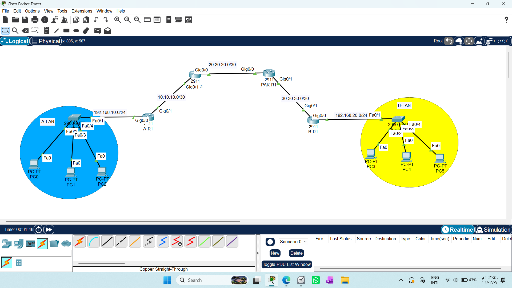
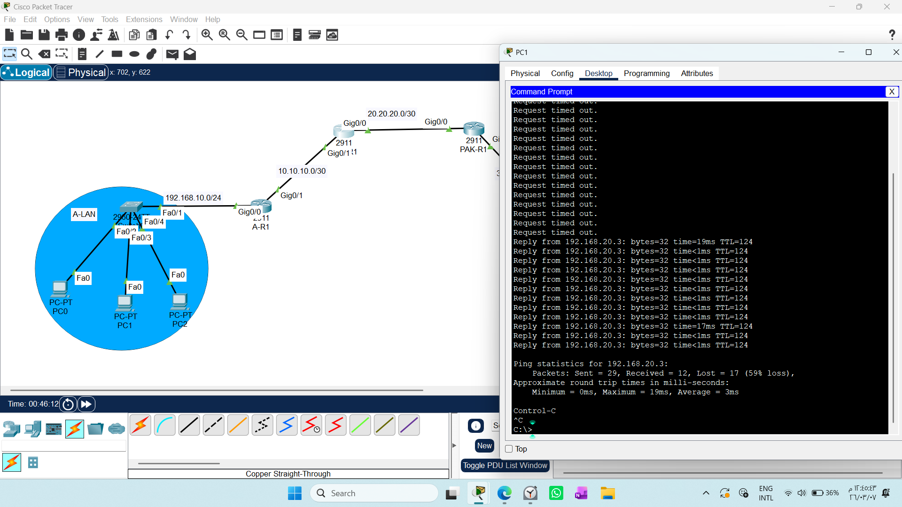
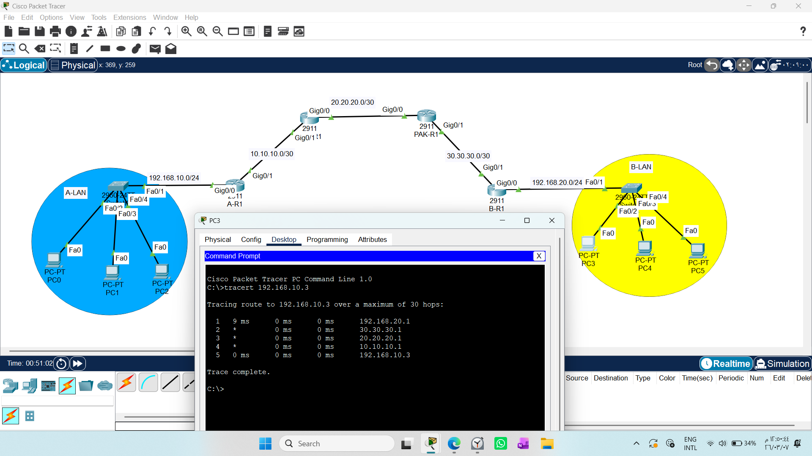

# CONFIGURING STATIC ROUTES 

1. Draw necessary topology, decorate and comment
2. Configure IP addresses to the routers and hosts.
3. Configure forward and backward static routes from A-LAN to B-LAN.
N/B Make sure to configure forward route to use the outgoing router interface.
N/B Make sure to configure backward route to use the IP add of the next hop.
4. Disconnect ENG-R1 and test communication from Kenya to India, traceroute the path.

# Lab Report: Static Routing Configuration

This lab guide focuses on connecting separate networks using **Static Routing**. Unlike internal services (like DHCP or DNS) that run within a single network, routing allows us to connect distant networks, which is the foundational building block of the internet.

---

## 1. Concept: What is Static Routing?
Static Routing is the process of manually configuring the path for data packets. 
* **The "Manual" Approach:** As a network engineer, you define exactly where a packet should go to reach a distant network.
* **Why Static?** It remains fixed until you manually change it.
* **Security & Control:** Because it doesn't automatically update, it is highly secure—no one can "trick" your router into learning fake paths (unlike dynamic protocols).

---

## 2. Router Decision Process: The Routing Hierarchy
To understand how a router selects the "best path," it follows a strict decision hierarchy:

1.  **Longest Prefix Match:** The router prefers the path that matches the destination network most precisely (the longest subnet mask).
2.  **Administrative Distance (AD):** If two paths exist for the same network, the router trusts the path with the *lower* AD value. 
    * *Example:* Static Route (AD 1) is trusted more than OSPF (AD 110).
3.  **Metric:** If the protocol is the same, the router calculates the cost (Metric). The **lower metric is always better**.
    * *OSPF* calculates cost based on bandwidth.
    * *RIP* calculates cost based on the number of hops (routers) passed.
4.  **Load Balancing:** If all criteria (AD and Metric) are equal, the router splits traffic between paths to improve redundancy and efficiency.

---

## 3. Configuring Static Routes
To connect `A-LAN` to `B-LAN`, we need to configure routes on every router in the path.

### Forward Route (A-LAN to B-LAN)
**Requirement:** Use the outgoing router interface.
* **Command Example:**
  `Router(config)# ip route [Destination_Network] [Subnet_Mask] [Outgoing_Interface]`

### Backward Route (B-LAN to A-LAN)
**Requirement:** Use the next-hop IP address.
* **Command Example:**
  `Router(config)# ip route [Destination_Network] [Subnet_Mask] [Next_Hop_IP]`

---

## 4. Engineering Best Practices

### Verification
Always verify your configurations using these commands:
* **`show ip route`**: Check for the **'S'** code in the routing table. This confirms your static route is active.
* **`tracert [Destination_IP]`**: Use this to visualize the path your packet takes. If you see asterisks (`*`), there is a connectivity issue in the routing table or a misconfigured interface.

### Security Perspective
As a security student, remember that routing is not just about connectivity—it is about **control**. By defining static routes, you force traffic through specific paths, which allows you to inspect data using Firewalls or IDS/IPS systems at specific points in the network.

---

## 5. Summary Table
| Concept | Definition | Security Value |
| :--- | :--- | :--- |
| **Static Route** | Manual path configuration | Prevents path-hijacking |
| **AD** | Reliability of the routing source | Ensures trusted paths are used |
| **Metric** | Efficiency of the path | Optimizes traffic flow |
| **`show ip route`** | Routing table view | Essential for auditing paths |
