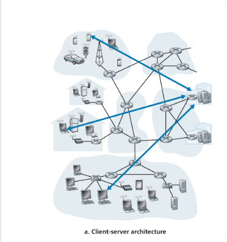

# Understanding Client-Server Architecture

This document serves as a comprehensive guide to the **Client-Server Architecture**, a fundamental paradigm in modern network applications. This guide is tailored for students and junior engineers looking to master the core principles of how applications interact over a network.

---

## 1. Architectural Distinction
Before diving into code, it is critical to distinguish between two levels of network design:
* **Network Architecture:** The fixed, underlying infrastructure (e.g., the 5-layer Internet model) that provides basic communication services.
* **Application Architecture:** The high-level design created by the **developer** to define how the application is structured across various end systems (Hosts).

## 2. The Client-Server Paradigm
In a Client-Server architecture, the system is divided into two distinct roles:

### The Server
* **Definition:** An "always-on" host that waits for and processes requests.
* **Key Characteristic:** It possesses a fixed, well-known IP address, allowing clients to locate it reliably at any time.

### The Client
* **Definition:** A host that initiates communication by requesting services.
* **Key Characteristic:** Clients do not communicate directly with each other (e.g., two web browsers do not talk directly to each other; they both talk to the server).

## 3. Scaling: The Role of Data Centers
A single server host is often incapable of handling millions of concurrent requests. To address this, developers use **Data Centers**:
* **Virtual Server:** A cluster of hundreds of thousands of servers acting as a single, powerful unit.
* **Global Distribution:** Large services (like Google, Facebook, or Amazon) distribute their data centers globally to reduce latency and ensure service availability.
* **The Cost of Scale:** Maintaining these centers requires significant investment in:
    * Power and cooling.
    * Ongoing maintenance and hardware upgrades.
    * Interconnection and bandwidth costs.

## 4. The Developer’s Role
As a developer, your role extends beyond coding; you are a **Systems Architect**. Your responsibilities include:
1.  **Paradigm Selection:** Deciding between Centralized (Client-Server) or Decentralized (P2P) architectures based on project needs.
2.  **Defining Protocols:** Establishing the rules of "language" (e.g., TCP vs. UDP) for how clients and servers exchange data.
3.  **Handling Complexity:** Building robust logic to manage connection failures, security, and scalability.
4.  **Application Logic:** Writing the code that sits at the Application Layer, solving user problems while relying on the network infrastructure to transport data.

## 5. Classic Examples
* **Web Applications:** Browsers (Client) requesting objects from Web Servers (Server).
* **Email:** Outlook/Gmail clients communicating with Mail Servers.
* **FTP (File Transfer Protocol):** Client software requesting files from a storage server.

---
