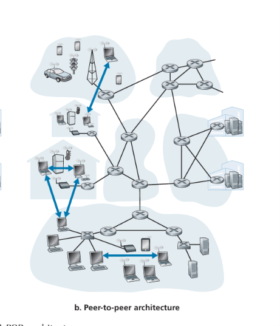

# Network Application Architectures: Client-Server vs. P2P

This document provides a technical comparison between the two predominant architectural paradigms in modern networking: **Client-Server** and **Peer-to-Peer (P2P)**.

---

## 1. Client-Server Architecture (Centralized)
A design where service is centralized in a dedicated, high-availability system.

* **Core Logic:** A powerful "always-on" server processes requests from many "client" hosts.
* **Key Characteristics:**
    * **Fixed Addressing:** The server has a permanent, well-known IP address.
    * **Direct Communication:** Clients never talk to each other; they only communicate with the server.
    * **Scaling:** Handled via **Data Centers**—clusters of servers that provide virtualized, high-capacity resources.
* **Pros:** High control, easier security management, and predictable performance.
* **Cons:** High infrastructure, power, and maintenance costs; creates potential bottlenecks.

---

## 2. Peer-to-Peer (P2P) Architecture (Decentralized)
A design that treats all nodes as equals, minimizing or eliminating reliance on central servers.

* **Core Logic:** Direct communication between "peers"—hosts that act as both client and server simultaneously.
* **Key Characteristics:**
    * **Functional Symmetry:** Every peer requests data (client) and distributes it (server).
    * **Intermittent Connectivity:** Peers are often home or university devices that may disconnect, making the system dynamic.
    * **Self-Scalability:** The most compelling feature; as more users join the system, the total service capacity increases because every new peer adds more bandwidth and storage.
* **Pros:** Cost-effective (no massive data centers required), robust scaling, and fault tolerance.
* **Cons:** High complexity in security, performance, and reliability due to the lack of central oversight.

---

## 3. Comparative Analysis

| Feature | Client-Server | Peer-to-Peer (P2P) |
| :--- | :--- | :--- |
| **Control** | Centralized (Service Provider) | Distributed (End Users) |
| **Scaling** | Vertical/Horizontal (Data Centers) | Self-Scalable (Increases with users) |
| **Infrastructure Cost** | High (Servers, Power, Bandwidth) | Low (Leverages existing end-hosts) |
| **Security** | Easier (Centralized control) | Complex (Highly decentralized) |
| **Reliability** | High (Managed uptime) | Variable (Nodes disconnect) |

---

## 4. The Developer’s Role as an Architect
When designing an application, you must weigh the trade-offs:

1.  **Use Client-Server when:** You require strict security, data integrity, and centralized management (e.g., Banking, Enterprise Email, E-commerce).
2.  **Use P2P when:** You need to distribute massive amounts of data with minimal infrastructure costs and high scalability (e.g., File Sharing like BitTorrent).

*Note: As an engineer, you must handle the security risks associated with P2P's decentralized structure and the performance bottlenecks that can arise in Client-Server designs.*

---
*Reference Guide for Network Application Paradigms.*
