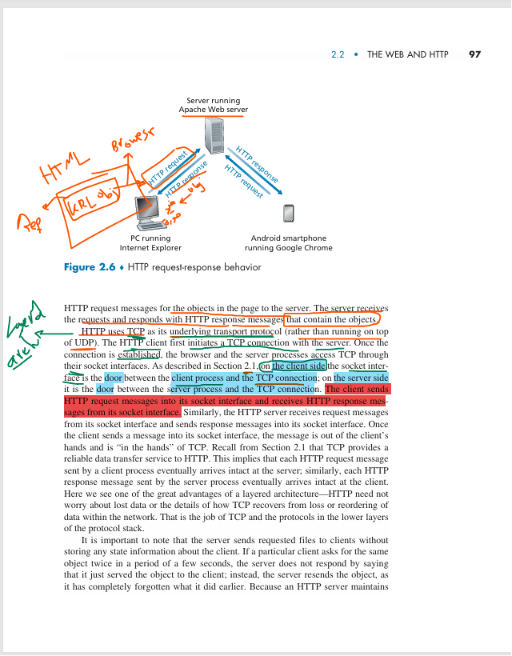

# Web Engineering & Security Analysis: From Theory to Practice

This guide provides a professional engineering perspective on how the World Wide Web functions, shifting from user-centric viewing to infrastructure-level analysis.

## 1. The Engineering Evolution: Access to Service
In the early 1990s, the Internet was primarily an academic **"Access Tool"** for remote file transfers.
* **The Paradigm Shift:** The Web transformed the Internet into a **Universal Service Platform**.
* **Security Implication:** Moving from a closed academic network to an open global platform exponentially increased the **Attack Surface**, necessitating advanced defensive layers.

## 2. Operational Philosophy: The "On-Demand" Model
* **Traditional Broadcast:** Content providers push data on their schedule.
* **Web On-Demand:** The user acts as the "driver," initiating a **Client-Server Architecture**.
* **Engineering Insight:** The server remains in a `Listening` state, waiting for client-initiated requests. Modern security protocols are built around managing these specific client-server interactions (Sessions).

## 3. The Web as a Platform
Applications like Gmail and Instagram are not isolated entities; they are built upon Web protocols.
* **Low-Cost Publishing:** Anyone can publish content. 
    * *Security Concern:* This introduces **Untrusted Content**, requiring rigorous **Input Sanitization** and validation to prevent attacks like Cross-Site Scripting (XSS).
* **Interactive Elements:** The use of JavaScript, Forms, and media creates potential vulnerabilities for malicious **Code Execution** within the user's browser.

---

## 4. Engineering Analysis: "Under the Hood" of HTTP
When a browser loads a site, it is not just fetching visuals; it is performing a structured text exchange.

### The HTTP Request
The client sends a structured request to the server:
```http
GET /index.html HTTP/1.1
Host: [www.example.com](https://www.example.com)
User-Agent: Mozilla/5.0
Accept-Language: en-us
```
* GET (Method): The action required.

* Path: The specific resource location.

* HTTP/1.1: The communication version.

* Host/User-Agent: Metadata ensuring proper routing and device compatibility.

###  The HTTP Response
The server responds with a status and the requested payload:
```http
HTTP/1.1 200 OK
Date: Fri, 10 Jul 2026 14:00:00 GMT
Content-Type: text/html
Content-Length: 1024

<html>... (Content) ...</html>

```
* Status Code (200 OK): Confirms success; contrast with errors like 404 Not Found.

* Content-Type: Instructs the browser on how to interpret the payload (e.g., rendering as HTML).

## 5. Professional Presentation Strategy
When discussing this with technical peers or professors, frame your understanding as follows:

"From a packet-level perspective, HTTP is a Structured Text Exchange. The interaction involves a request defining a Method and Path, followed by a response containing Status Codes and the payload.

As security engineers, we move beyond opening ports. We perform Deep Packet Inspection on the headers and payload to identify anomalies—such as credential spoofing or malicious injection—within these requests. Our role is to ensure these interactions remain secure at the Application Layer, rather than just relying on perimeter defenses."

### Security Engineering Checklist
To think like a pro, stop looking at the UI and start analyzing:

1- Data Exchange: How are the request/response payloads structured?

2- Risk Vectors: Where is user input allowed? Is there potential for code injection?

3- Protocol Role: HTTP is the transport; HTTPS (TLS) is the security mechanism required to ensure data integrity and confidentiality.


# The Web: Key Drivers of Global Adoption

This section analyzes the factors that transformed the World Wide Web from a simple academic tool into the primary digital platform for humanity. We categorize these factors into three core engineering pillars:

## 1. On-Demand vs. Broadcast (Data Delivery Model)
* **Traditional Broadcast:** Follows a **Push Model**, where the content provider dictates the schedule. Users are passive recipients who must tune in at specific times.
* **The Web (On-Demand):** Operates on a **Pull Model**. The user acts as the driver, requesting specific data exactly when needed. 
* **Engineering Impact:** This shifts the burden of timing and flow control to the client-server interaction, enabling personalized, user-centric experiences.

## 2. Democratization of Publishing
* **The Shift:** Historically, publishing information (newspapers, books) required significant infrastructure and capital.
* **The Web Advantage:** It enables anyone to become a publisher at near-zero marginal cost.
* **Engineering Impact:** This led to an exponential explosion of data on the network, shifting the challenge from "acquiring information" to "managing Big Data."

## 3. Advanced Navigation and Interactivity
To prevent users from being overwhelmed by the "ocean of information," the Web introduced critical navigation and interaction tools:
* **Navigation (Hyperlinks & Search Engines):** These act as the "compass" of the Internet, allowing efficient retrieval of resources within a vast, decentralized structure.
* **Dynamic Interactivity:** The Web evolved from static pages into a **Platform** through:
    * **Forms:** Facilitating data input and user-side contribution.
    * **JavaScript:** Enabling client-side execution, which transforms pages into responsive, application-like interfaces.
* **The Result:** The Web is no longer just a collection of documents; it is a robust platform supporting complex applications like Gmail, Instagram, and Google Maps.

---

### Professional Summary for Discussion
> "The Web's dominance is not accidental; it is the result of architectural choices. By moving from a **Push-based Broadcast model** to an **On-Demand Pull model**, and by democratizing content creation through **dynamic, interactive tools**, the Web successfully transitioned from a static document repository into a global, scalable application platform."


# 2.2.1 Overview of HTTP

# Web Engineering & Security: HTTP Deep Dive

This README serves as your professional reference guide for understanding the HyperText Transfer Protocol (HTTP), web object retrieval, and how to analyze these interactions using network diagnostic tools like Wireshark.

---

## 1. The Engineering Paradigm: Web Pages as "Objects"
To think like a network engineer, you must move beyond viewing a website as a "single page." Instead, view it as a **Logical Collection of Objects**.

* **What is an Object?** Any file (HTML, JPEG, JS, CSS, Video) addressable by a unique URL.
* **The Structural Rule:** A Web Page = **Base HTML File** + **Referenced Objects**.
* **The Retrieval Process:** Browsers do not fetch a page in one go. They request the `Base HTML` first, then programmatically request each referenced object individually.


---

## 2. Anatomy of a URL & HTTP Request
The URL is your roadmap. It tells the network exactly where to go and what to fetch:
* **Hostname (`www.someSchool.edu`):** Identifies the target server.
* **Path Name (`/someDepartment/picture.gif`):** Identifies the specific resource location on that server.

### The Request-Response Cycle
* **Client (Browser):** Initiates the communication by sending an `HTTP Request`.
* **Server:** Processes the request and sends back an `HTTP Response` (containing either the data or an error code).

---

## 3. Wireshark Traffic Analysis: Practical Steps
When analyzing web traffic, do not just look at the visuals—look at the packets.

### How to Analyze HTTP Streams:
1.  **Filter:** Use the `http` filter in Wireshark.
2.  **Identify the Base:** The first packet will be a `GET / HTTP/1.1` request for the HTML foundation.
3.  **Trace the Chain:** You will see subsequent `GET` requests for images, CSS, or scripts. 
4.  **Validate:** Check the `Host` field to ensure they all point to the same server, and observe the `Path` for each unique object.

> **Professional Tip:** If you see 5 images on a webpage, you should expect to see 1 request for the `HTML` file and 5 additional `GET` requests for those images.

---

## 4. The HTML "Reference" Concept
Why does the `Base HTML` file contain references (URLs)?
* **Separation of Concerns:** The HTML defines the structure, while other objects (images, styles) remain external assets.
* **Efficiency:** The server does not send everything in one massive packet. It sends the "map" (HTML) first, allowing the browser to fetch only what it needs, when it needs it.

---

## 5. NOTE

*"From a packet-level perspective, a web page is a logical structure of referenced objects. HTTP acts as the transport layer for these objects. The browser performs a **Parsing** process on the Base HTML to extract unique URLs, which triggers an **Automated Request Chain**. This modular approach allows for efficient resource management and is why we see multiple HTTP requests for a single page load."*

### Security :
* **Look for Anomalies:** Use Wireshark to verify if the URLs being requested are expected or suspicious.
* **Understand the Flow:** Recognize that each object is requested individually—this is why **Deep Packet Inspection (DPI)** is vital for security professionals to detect anomalies, data leakage, or injection attempts within those specific requests.

---


# HTTP, TCP & Socket Mechanics

This document provides a technical breakdown of how the HTTP protocol interacts with the transport layer, focusing on reliability, connection establishment, and the role of the Socket Interface.

---

## 1. The Transport Foundation: Why HTTP over TCP?
HTTP operates at the Application Layer, but it requires a reliable transport service. It uses **TCP (Transmission Control Protocol)** rather than UDP for the following reasons:
* **Reliability:** HTTP requires "Reliable Data Transfer." Every byte (HTML, images, scripts) must arrive intact and in order.
* **Error Recovery:** TCP automatically handles retransmission if packets are lost or arrive out of order, shielding the HTTP protocol from network-level complexities.
* **Layered Architecture:** This design follows the principle of **Separation of Concerns**. HTTP focuses on the "What" (Request/Response), while TCP handles the "How" (Reliable Delivery).

---

## 2. Connection Lifecycle: The TCP Handshake
Before any data is exchanged, a connection must be established:
1. **The Setup:** The HTTP client initiates a **Three-way Handshake** (SYN, SYN-ACK, ACK) with the server.
2. **Establishment:** Once the connection is "established," the path is secure and ready for data transfer.
3. **Data Exchange:** Only after this handshake does the browser begin sending HTTP requests.

---

## 3. The Socket Interface: The Logical Door
The **Socket Interface** is the software "door" or boundary between the application process (Browser/Server) and the TCP connection.

* **Client Side:** The browser writes the `HTTP Request` into its socket. Once the message passes through this door, it is "in the hands of TCP."
* **Server Side:** The server receives the request from its socket, processes it, and writes the `HTTP Response` back into its socket.
* **Abstraction:** The browser and server processes do not interact with physical cables or routing tables. They only interact with the Socket, which abstracts the complexity of the network stack.


---

## 4.  Summary

> "The interaction between HTTP and TCP is a prime example of **Layered Architecture**. By using the **Socket Interface** as a logical boundary, the browser delegates all reliability concerns—such as packet loss recovery and data reordering—to TCP. 
> 
> As security engineers, we view this setup as critical: the Socket serves as the inspection point where we perform **Deep Packet Inspection (DPI)**. By monitoring the request-response flow at this interface, we can detect anomalies, data leakage, or injection attempts (e.g., SQLi/XSS) that occur during the data exchange phase."

---

## 5. Quick Reference Table
| Component | Responsibility | Engineering Metaphor |
| :--- | :--- | :--- |
| **HTTP** | Application Logic | The Passenger / The Message |
| **TCP** | Transport Reliability | The Carrier / The Delivery Service |
| **Socket** | Logical Interface | The Door / The Mailbox |

---
# Network Protocols & Architecture: A Technical Brief

This document serves as a technical reference for understanding the core principles of HTTP, TCP, and the Socket interface. It emphasizes the "Engineering Mindset"—focusing on modularity, security, and scalability.

## 1. The Layered Architecture (The "Separation of Concerns")
In networking, we apply the principle of "not reinventing the wheel" by using layers:

*   **Application Layer (HTTP):** The "Business Logic." It only cares about **what** data is requested (e.g., HTML, Images). It is agnostic of network conditions.
*   **Transport Layer (TCP):** The "Professional Shipping Company." It ensures **how** data arrives. It handles Flow Control, Retransmission, and Packet Ordering.

**Engineering Value:** This abstraction allows us to perform precise troubleshooting. 
- *Application error?* Check HTTP logs. 
- *Connection drop?* Check TCP/Network infrastructure (Firewalls, Load Balancers).

## 2. The Socket Interface: The "Point of Hand-off"
The Socket is the bridge between software processes and the TCP/IP stack.

*   **Boundary:** The socket defines the end of the application's responsibility. Once data is pushed into the socket (`send()`), the Operating System handles the complex transmission.
*   **Operational Visibility:** Engineers use tools like `netstat` and `ss` to track socket states (`LISTEN`, `ESTABLISHED`, `TIME_WAIT`). Monitoring these is the standard way to detect performance bottlenecks or hidden malware activity.

## 3. The Stateless Nature of HTTP
HTTP is a **Stateless Protocol**, meaning the server treats every request as a "first-time meeting."

| Advantage | Engineering Explanation |
| :--- | :--- |
| **Scalability** | No need to store session data in RAM; servers can handle more concurrent users. |
| **Load Balancing** | Requests can be routed to any server in a cluster without needing local state synchronization. |
| **Fault Tolerance** | If a server fails, the next one can handle the request immediately since it doesn't need to "remember" the client's past. |

**Security Note:** While statelessness limits session-hijacking of local server memory, it relies heavily on token-based authentication (e.g., JWT). Securing these tokens in transit is your top priority.

## 4. Professional Best Practices for Engineers
1.  **Always Think in Layers:** When debugging, identify which layer is failing first.
2.  **Monitor Everything:** Use `netstat`/`ss` regularly to understand your system's network health.
3.  **Design for " Statelessness":** Whether you are a developer or a security architect, stateless systems are more resilient and easier to secure.

---
